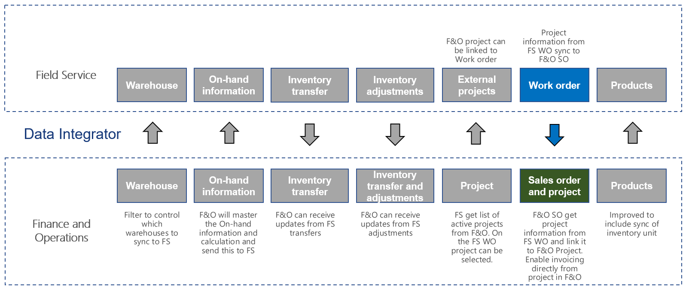

# Synchronize work orders with project from Field Service to Supply Chain Management

[!include[banner](../../../finance/includes/banner.md)]

This article discusses the templates and underlying task that are used to synchronize work orders with a project number from Dynamics 365 Field Service to Dynamics 365 Supply Chain Management.

The used **Work Orders with Project (Field Service to Supply Chain Management)** template is based on the **Work Orders (Field Service to Supply Chain Management)** template. For more information, see [Synchronize work orders in Field Service to sales orders in Supply Chain Management](/dynamics365/unified-operations/supply-chain/sales-marketing/field-service-work-order).

This article only describes the differences between the two templates:
- **Work Orders with Project (Field Service to Supply Chain Management)**
- **Work Orders (Field Service to Supply Chain Management)**

The main difference is that this template includes mapping of the project number assigned to the Work order in Field Service, ensuring that the Sales order created in Supply Chain Management include the project number and that invoicing can happen on the related project. Besides this the template use Advanced Query and Filtering.

## Templates and tasks

**Name of the template in Data integration:**

- Work Orders with Project (Field Service to Supply Chain Management)

**Name of the task in the Data integration project:**

- WorkOrderHeader
- WorkOrderHeaderProject
- WorkOrderProduct
- WorkOrderService

## Field Service CRM solution
The **External Project** field has been added to the Work Order entity. This field is a lookup and buy tagging your Work Order with a project the Sales Order will then be connected to a Project within Supply Chain Management. When the **System Status** changes from Open – In Progress(690,970,000) to a higher status, the **External Project** field will be locked and you can't add, remove, or change the value.

## Template mapping in Data integration

The following illustrations show the template mapping in Data integration.

### Work Orders with Project (Field Service to Supply Chain Management): WorkOrderHeader

### Work Orders with Project (Field Service to Supply Chain Management): WorkOrderHeaderProject

### Work Orders with Project (Field Service to Supply Chain Management): WorkOrderProduct

### Work Orders with Project (Field Service to Supply Chain Management): WorkOrderService

[!INCLUDE[footer-include](../../../includes/footer-banner.md)]
