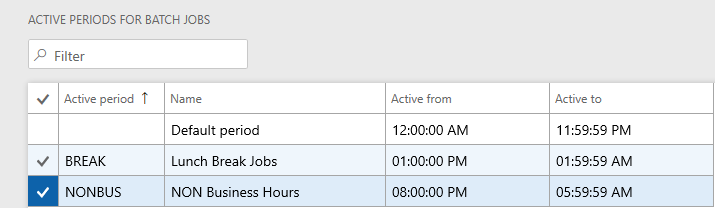
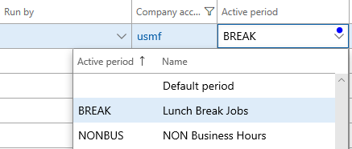

# Active batch periods

[!include [banner](../includes/banner.md)]

With the release of Platform update 21, an additional level of control over when batch jobs execute is now available. Previously, it was only possible to schedule a batch job to execute every hour for a specified number of hours or until a given date. Administrators can now provide information for an additional active period, such as in the following scenarios:
- Specifying time ranges during which jobs within a batch group can start execution. 
- Selecting to run batch jobs outside of office hours only. 
- Setting the recurrence for anytime within the active period. For example, you administrator might select to run the batch jobs every hour, but only between the hours of 6:00 PM and 8:00 AM.

> [!NOTE] 
> This feature is available as of Platform update 21.

## Set up active periods for batch jobs 

1.	Go to **System administration** > **Setup** > **Active periods for batch jobs**.
2.	Enter the name of the batch job, and specify start and end dates that the batch job is active. 
4.	Click **Save**.

## Assign active periods to batch jobs

1.	Go to **System administration** > **Inquiries** > **Batch jobs**.
2.	Select the batch job that you want to assign a period to, and click **Edit**.
3.	In the **Active period** field, select the active period that you want to assign, and then click **Save**.

 

[!INCLUDE[footer-include](../../../includes/footer-banner.md)]