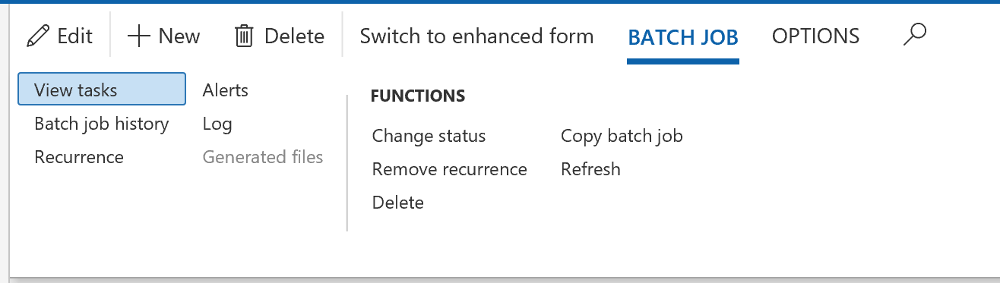

---
# required metadata

title: Set up alerts
description: This article explains how to set up alerts for batch jobs.
author: hasaid
ms.date: 03/12/2019
ms.topic: article
ms.prod: 
ms.technology: 

# optional metadata

# ms.search.form: 
# ROBOTS: 
audience: IT Pro
# ms.devlang: 
ms.reviewer: sericks
# ms.tgt_pltfrm: 
ms.assetid: 6135bcf7-bf8f-42ae-b2c6-458f6538e6a4
ms.search.region: Global
# ms.search.industry: 
ms.author: hasaid
ms.search.validFrom: 2019-03-08
ms.dyn365.ops.version: Platform update 25

---

# Set up alerts

[!include [banner](../includes/banner.md)]

Alerts form a notification system for critical events in finance and operations. You can use alerts to stay informed about events that you want to track during the workday. You can set up a set of alert rules so that you're alerted when a batch job ends, ends in error, or is canceled. You can select whether the alerts are emailed to you or appear as notifications in the Action center. Alerts can be set up per batch job and per user.

## Set up alerts for batch enhanced forms

Follow these steps to set up alerts for batch enhanced forms.

1. Go to **System administration** \> **Inquiries** \> **Batch jobs**.
2. Select a batch job in the list, and then, on the Action Pane, select **Alerts**.
3. In the **Batch job alerts** dialog box, configure the alerts, and then select **OK**.

     

4. Check the Action center for alert notifications.

    

## Set up alerts for batch legacy forms

Follow these steps to set up alerts for batch legacy forms.

1. Go to **System administration** \> **Inquiries** \> **Batch jobs**.
2. Select a batch job in the list, and then, on the Action Pane, on the **Batch job** tab, select **Alerts**.

     

3. In the **Batch job alerts** dialog box, configure the alerts, and then select **OK**.

> [!NOTE] 
> To receive email notifications, in the **Batch job alerts** dialog box, set the **Email** option to **Yes**.

[!INCLUDE[footer-include](../../../includes/footer-banner.md)]
