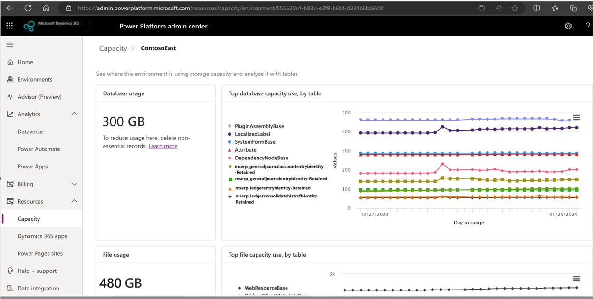

# Archive data in Dynamics 365 finance and operations apps with Dataverse

This article describes how to archive data in Microsoft Dynamics 365 finance and operations apps. Finance and operations apps support custom retention policies for securely archiving and retaining unlimited data for the long term in a cost-efficient way. Finance and operations apps set no limit on active data and therefore support your business growth. Nevertheless, you might want to consider moving historical, inactive data that's required for compliance and regulatory reasons to Dataverse long term retention.

> [!NOTE]
> This feature doesn't limit the total number of records that can be archived. However, the current limitation in the initial synchronization of data replication to Dataverse is limited to a maximum of 500 million records in the largest table. Prior to testing this feature, it's recommended to trim any tables that have more than 500 million records. 

## Business application data lifecycle

The business application data lifecycle has three stages:

1. Active data
1. Transitions to historical, inactive data that's required for compliance and regulatory reasons
1. Transitions to deleted data

Finance and operations apps enable organizations to achieve the following benefits through archiving:

- Secure historical, inactive application data for the long term to meet audit, legal, and regulatory requirements.
- Reduce the size of the application database and the capacity that consumed, to potentially improve application performance that's associated with very large tables.

## Finance and operations data types that can be archived with Dataverse long term retention

This feature currently supports archiving the following types of finance and operations data with Dataverse long term retention:

- Dynamics 365 Finance General ledger
- Dynamics 365 Finance Tax transactions
- Dynamics 365 Supply Chain Management Inventory transactions
- Dynamics 365 Supply Chain Management Inventory journals
- Dynamics 365 Supply Chain Management Sales orders

Support for additional data types is planned in future releases.

## How archiving of finance and operations data works

Application administrators can schedule archival jobs and specify criteria for supported functional scenarios. The data from the tables for the functional scenarios is archived in Dataverse long term retention.

When an archival job is initiated from the Finance and operations archive workspace, it has the following stages:

 -  Data from the live application tables in the functional scenario that's being archived is replicated to Dataverse long term retention.
 -  Data that meets the archival criteria is marked as ready for archiving in the live finance and operations application tables.
 -  The live table records are marked as retained (archived) in Dataverse long term retention.
 -  A reconciliation process verifies that all the live application table records that were previously marked as ready for archiving are available in Dataverse long term retention.
 -  Live application data that was previously marked as ready for archiving is moved to history tables in the finance and operations apps database and deleted from the live application tables. Specific inquiry pages in Dynamics 365 finance and operations apps can access this history table data. Data from history tables can be either restored to the live table or permanently purged. The permanently purge functionality will be supported in a future release.

## Restoring data from history tables to live tables

Data from history tables can be restored back to live tables from the archive workspace. When data is restored back from history tables to live tables, the corresponding archived data in Dataverse long term retention also goes through a status change from inactive to active, as the data is no longer considered to be archived. 

## Customization

The archival framework includes custom fields and custom tables in supported functional scenarios. Therefore, customers can build their own archival scenario for custom tables. Customers must configure the table customizations before they initiate an archival job.

> [!NOTE]
> During archiving, no data is archived from tables outside the functional scenario, even if it's related. For example, when inventory transaction tables are archived, the sales tables aren't automatically archived.

> [!IMPORTANT]
> - The long term-retained data is read-only.
> - The X\+\+ delete action isn't honored when a data archival policy is run to move data out of the live finance and operations database
> - Finance and operations attachments aren't currently supported
> - The archival process for scenarios that involve Dataverse long term retention has multiple stages that run sequentially in the background. The process can take up to 14 days.
> - The archived data in Dataverse long term retention can't be moved back to the live application table
> - The archived data in Dataverse long term retention is secured through Dataverse security that's backed by Microsoft Entra ID
> - Customers who use a self-managed encryption key (bring your own key \[BYOK\]) in Dataverse should be aware that long term-retained data is encrypted through a Microsoft-managed key. Customers should consider migrating to a customer-managed key. For more information, see [Migrate bring-your-own-key environments to customer-managed key](/power-platform/admin/cmk-migrate-from-byok)

## Understanding Dataverse storage costs for archived data

On average, every gigabyte (GB) that's moved from the finance and operations apps to Dataverse long term retention consumes 50 percent less database capacity. Live application data is compressed in Dataverse long term retention. Savings can vary, depending on the table data. You might notice savings that are more than or less than 50 percent. Savings might be more evident when higher volumes of data (hundreds of GBs) are retained.

Archived data is made available in the history tables by allowing access through an inquiry page in finance and operations apps. History tables that have no indexes consume on average 30 percent (or more) less capacity than the live tables, depending on the table and indexes. If in-app access to archived data isn't required, permanently delete the data from the history tables to achieve full savings.

## Storage capacity reports

Administrators can view the storage size in the existing Power Platform admin center reports for both finance and operations tables and Dataverse long term retention.

### View the storage that's consumed by the archived data in Dataverse long term retention

To view the storage that's consumed by archived data, follow this step.

- Go to the [Power Platform admin center reports for Dataverse](/power-platform/admin/capacity-storage).

On the **Dataverse database storage** report, the archived finance and operations tables that have the "\-Retained" suffix provide a logical view of the storage capacity that's consumed by the finance and operations archived data in Dataverse long term retention.

For example, when the administrator views the **Dataverse database storage** report, the General ledger tables are shown as **\<*tablename*\>-Retained**. These tables provide a logical view of the storage capacity that's consumed by the Finance table that's archived in Dataverse long term retention. In the example of the report in the following illustration, the mesrp\_generaljournalentrybientity-Retained table is a Finance General ledger functional scenario table that has been archived. If the \<*tablename*\>-Retained table isn't visible on the report, download the report to Excel for viewing.

To view the storage that's consumed by finance and operations data, follow these steps.

1. Go to the [Power Platform admin center reports for finance and operations apps](/power-platform/admin/finance-operations-storage-capacity).
1. Select **Capacity** \> **Finance and operations**.
1. The administrator can view details of both the finance and operations application tables and the history tables. History tables that have no indexes consume less capacity than live application tables.

The live table consumes the highest capacity, followed by the history table, and then the \<*tablename*\>-Retained table in Dataverse long term retention.

To get maximum capacity savings in production, consider purging data from the history tables.

To understand the capacity reduced savings, compare the table data for the live, history, and \<*tablename*\>-Retained tables from the reports after an archival policy run.

> [!NOTE]
> 1. After archiving, the automatic tuning process can take up to seven days before the reduced capacity is reflected in the history table. It can take up to a day before the archived data capacity for \<*tablename*\>-Retained tables is reflected in the Dataverse database capacity.
>   
> 2. Purge from history table is not yet supported.
