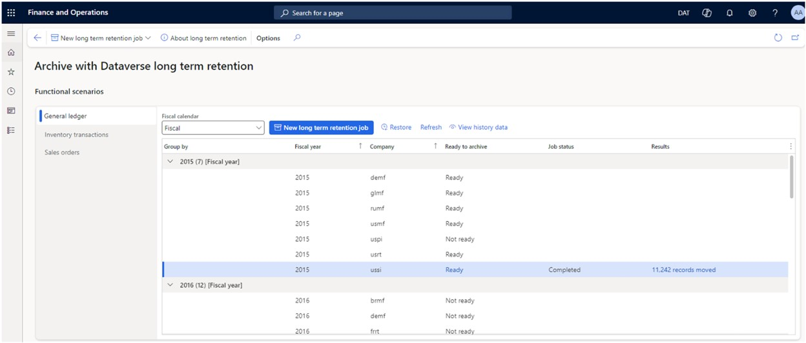
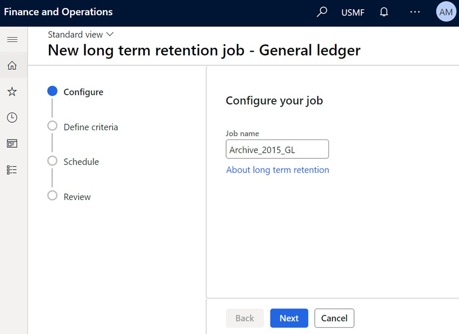
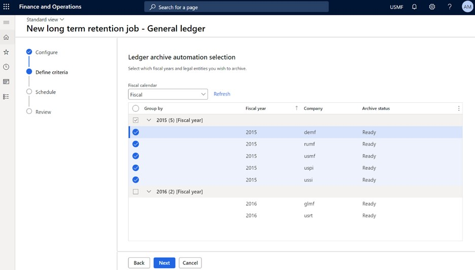

# Archive Dynamics 365 Finance General ledger data

This article explains how to archive Microsoft Dynamics 365 Finance General ledger data.

> [!IMPORTANT]
> - General ledger archiving can occur only for fiscal years that the year-end close process has been run for.
> - The archive jobs for different years must be run in chronological order. For example, 2020 General ledger data must be archived before 2021 General ledger data.

## Prerequisites

The following prerequisites must be met before you archive General ledger transactions:

- No periods for a fiscal year and the company can be open.
- Year-end close must be run for the fiscal year for the company.
- General ledger transactions for the previous fiscal year for the company must be archived.

## Set up an archival job

To set up an archival job, follow these steps.

1. Go to **System administration** \> **Archive with Dataverse long term retention** to open the **Archive with Dataverse long term retention** workspace.
2. Select **General Ledger functional scenario**.
3. Select **Refresh** to populate the General ledger fiscal years and company dataset to archive.

    > [!NOTE]
    > Run the refresh after you do period and year-end close on the General ledger data for the fiscal years and the companies. The **Ready to archive** state must be **Ready** before you can schedule a new long term retention job.

4. Select **New long term retention** to open a wizard that you can use to schedule a new General ledger long term retention job.

   
6. Enter a name for the job, and then select **Next**.

    New long term retention jobs can be scheduled for one or more companies at a time. Execution of these jobs is sequential.

  

8. On the **Define criteria** page, select the combination of fiscal years and companies to archive General ledger data for.
9. Select **Next**.
10. Select the type of scheduling. Two types are supported:

    - **Single run** – long term retention and saving to history run continuously until both processes are completed. Data is always archived in Dataverse long term retention first. Then the save to history tables occurs.
    - **Daily during allotted time** – The long term retention runs continuously until it's completed. The **Save to history** process runs only during the specified start and stop archiving time.

11. Select **Finish** to schedule the archive job for the selected fiscal years and the companies.
12. Select **View progress** to view the detailed logs.

## View historical data from the history table

To view the historical transactional details, follow this step.

- Go to **General ledger** \> **Inquiries and reports** \> **Voucher transactions history**.

> [!IMPORTANT]
> The view of archived data shows trial balance data in summary form. However, if you drill into transactional details, a blank window is shown. The data was moved to Dataverse long term storage and the local history copy.

## Capacity reports

The Finance application tables that are moved to Dataverse long term retention appear in the [Power Platform admin center](https://admin.powerplatform.microsoft.com/), under the database storage capacity reports.The live and history tables are available in the **Finance** section of the Power Platform admin center capacity reports.

