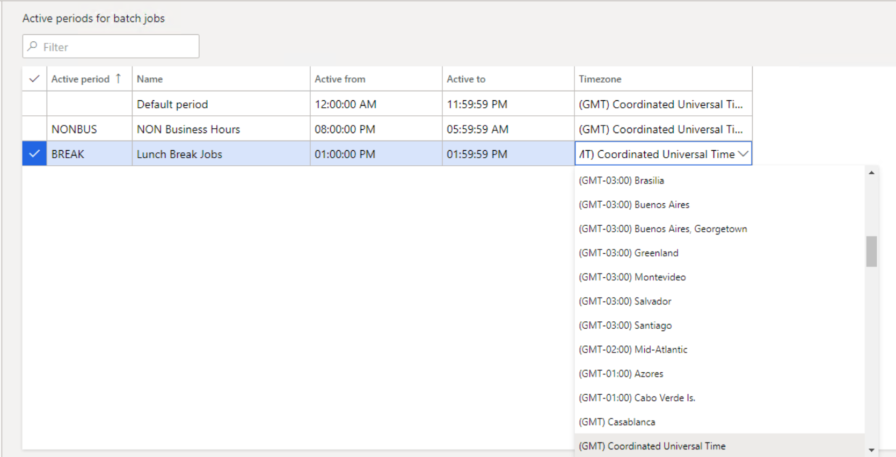

# Daylight saving time support for active batch periods

[!include [banner](../includes/banner.md)]

Microsoft Dynamics 365 Finance version 10.0.12 includes a **Daylight Saving Time support for batch job active periods** feature that can be turned on in [Feature management](../../fin-ops/get-started/feature-management/feature-management-overview.md). This feature introduces daylight saving time (DST) support for the [active periods for batch jobs](activeperiod.md) and lets users associate their active periods with different time zones.

> [!NOTE] 
> This feature is a one-way feature. In other words, it can't be turned off after it's turned on.

When this feature is turned on, the following changes occur:

- On the **Active periods for batch jobs** page, a **Timezone** field is added for each active period. This field specifies the time zone that the active period uses. By default, every active period initially uses the Coordinated Universal Time (UTC) time zone.

    

- The start and end times of existing active periods are adjusted according to the UTC time zone. 'Although the active periods will continue to start and end at the same times that they previously started and ended, the times that are shown might change if the user's preferred time zone isn't UTC.
- Active periods will follow the DST adjustments of the time zones that they are associated with.

[!INCLUDE[footer-include](../../../includes/footer-banner.md)]
