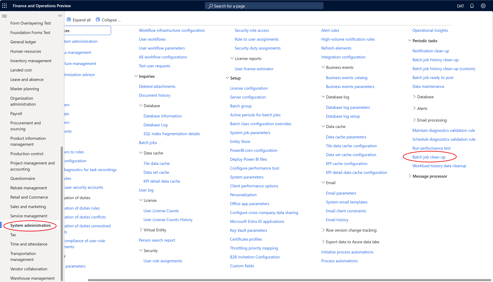
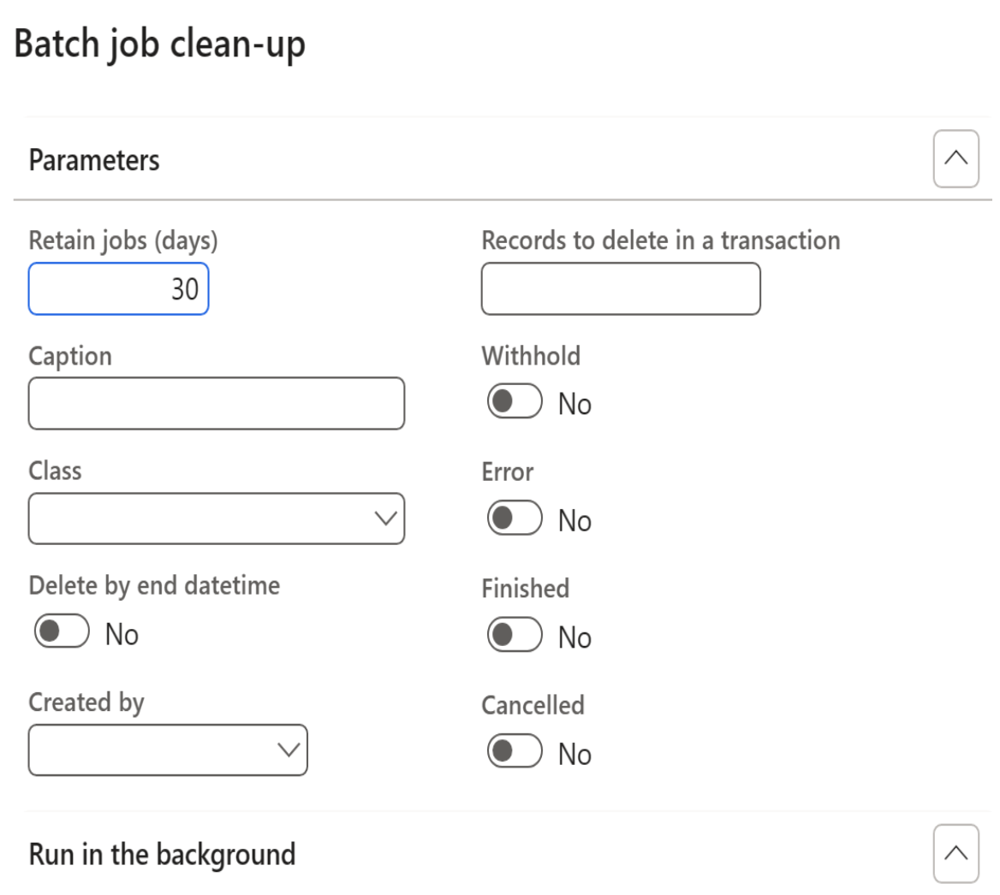

---
# required metadata

title: Clean up the batch job records 
description: This article provides information about how to clean up the batch job records.
author: snagamalla
ms.date: 12/12/2023
ms.topic: article
ms.prod: 
ms.technology: 

# optional metadata

# ms.search.form: 
# ROBOTS: 
audience: IT Pro
# ms.devlang: 
ms.reviewer: 
# ms.tgt_pltfrm: 
ms.assetid:
ms.search.region: Global
# ms.search.industry: 
ms.author: snagamalla
ms.search.validFrom: 2023-12-18
ms.dyn365.ops.version: Platform update 63

---

# Clean up the batch job records

[!include [banner](../includes/banner.md)]

Many orphaned or unused Batch jobs exists in system due to recreation of Batch jobs, new Batch jobs creation on certain user actions everytime, one time executed jobs etc. This would eventually grow the Batch Job and related tables and can negatively affect the performance of other jobs.

Batch job table clean-up page have been added to the **System administration** module make it easy to clean up the batch job table:

> [!NOTE]
> We recommend that you regularly clean up the batch job table, and that you do this cleanup outside of business hours.

## Batch job clean-up

Follow these steps to quickly clean up the Batch job table records based on options provided as below.

1. On the **Periodic tasks in System administration** module, select **Batch job clean-up**.
2. In the **Retain jobs (days)** field, specify the number of days to keep the records of batch jobs.
3. In the **Records to delete in a transaction** field, specify the no of records (1 - 200 records) to delete in a transaction.
4. In the **Caption** field, specify the caption of Batch job to delete.
5. In the **Class** field, specify the class name of a batch task whose respective Batch job to delete.
6. In the **Delete by end datetime** field, enable this flag to specify if batch jobs to be deleted based on End date time of last execution, else by default it considers the Created date time to delete the jobs.
7. In the **Created by** field, specify the userId who have created the job.
8. In **Withhold**, **Error**, **Finished** and **Cancelled** terminal status fields, select atleast one option to delete the batch jobs.
9. Select **OK**.

[!INCLUDE[footer-include](../../../includes/footer-banner.md)]