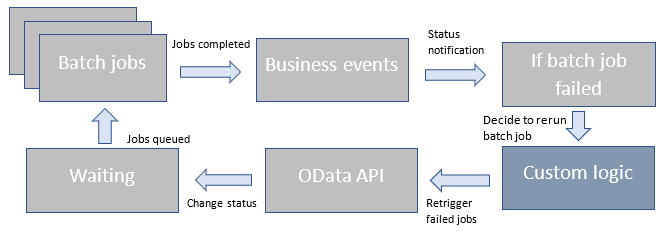

---
# required metadata

title: Batch OData API
description: This topic provides information about the Batch OData application programming interface (API) and explains how you can use Open Data Protocol (OData) to reschedule a job.
author: matapg007
ms.date: 01/06/2022
ms.topic: article
audience: Developer, IT Pro
ms.reviewer: sericks
ms.search.region: Global
ms.author: matgupta
ms.search.validFrom: 2021-10-21
---

# Batch OData API

[!include[banner](../includes/banner.md)]

This topic provides information about the Batch OData application programming interface (API) and explains how you can use Open Data Protocol (OData) to reschedule a job.

In the existing Finance and Operations [batch processing](batch-processing-overview.md) functionality, if some types of job errors can be retried (either with or without any changes, based on the interpretation of the error), they must be manually rerun from the batch. For jobs that are scheduled to be run during off-peak times to avoid active business hours for customers, monitoring failures and re-triggering the jobs requires either 24/7 support or a wait time until users resume work during normal business hours.

## Current available automation (business events integration)

Business event capabilities enable customers to configure notifications about changes in state (started, failed, finished, or canceled) for batch jobs. Integration with [Microsoft Power Automate](../business-events/business-events-flow.md) lets customers capture information about affected jobs without having to sign in to the system. However, manual intervention is required if any action must be taken based on the business events.

For information about how to configure batch events, see [Batch business events](../business-events/system-business-events.md).

## End-to-end automation

In version 10.0.22, the batch functionality now exposes an OData API that can be used to requeue batch jobs. Customers can use the OData endpoint to requeue batch jobs that are in a terminal state. This feature can be integrated with any automation by using Power Automate, custom APIs, and so on.



## Automate requeuing of failed batch jobs by using OData API

The Batch OData endpoint lets users consume and automate the end-to-end process to reschedule a batch job by using Power Automate or custom API. It supports updates of the batch job status from a started, failed, finished, or canceled state to a waiting state, based on business requirements.

- **Service endpoint:** `https://<org url>/data/BatchJobs/Microsoft.Dynamics.DataEntities.SetBatchJobToWaiting`
- **Method type:** POST
- **Header:**

    - **Authorization:** Bearer \<Bearer token for authentication\>
    - **Content-Type:** application/json

- **Body:**

    ```json
    {
        "batchJobId":<BatchJobId>
    }
    ```

- **Sample response:**

    ```json
    {
        "ResponseStatusCode":200,
        "IsSuccess":true,
        "Batch JobId":<BatchJobId>,
        "ExceptionDetails":"",
        "reponseMessage":"Status of supplied BatchJobId: *********** is Successfully updated to waiting state"
    }
    ```

    Here is an explanation of the elements of the response output:

    - **ResponseStatusCode** – A standard HTTP response code, based on the execution of the action.
    - **IsSuccess** – A Boolean value that indicates overall success or failure.
    - **BatchJobId** – The ID of the input batch job.
    - **ExceptionDetails** – Details about any exception that occurred during execution.
    - **ReponseMessage** – The success message.
