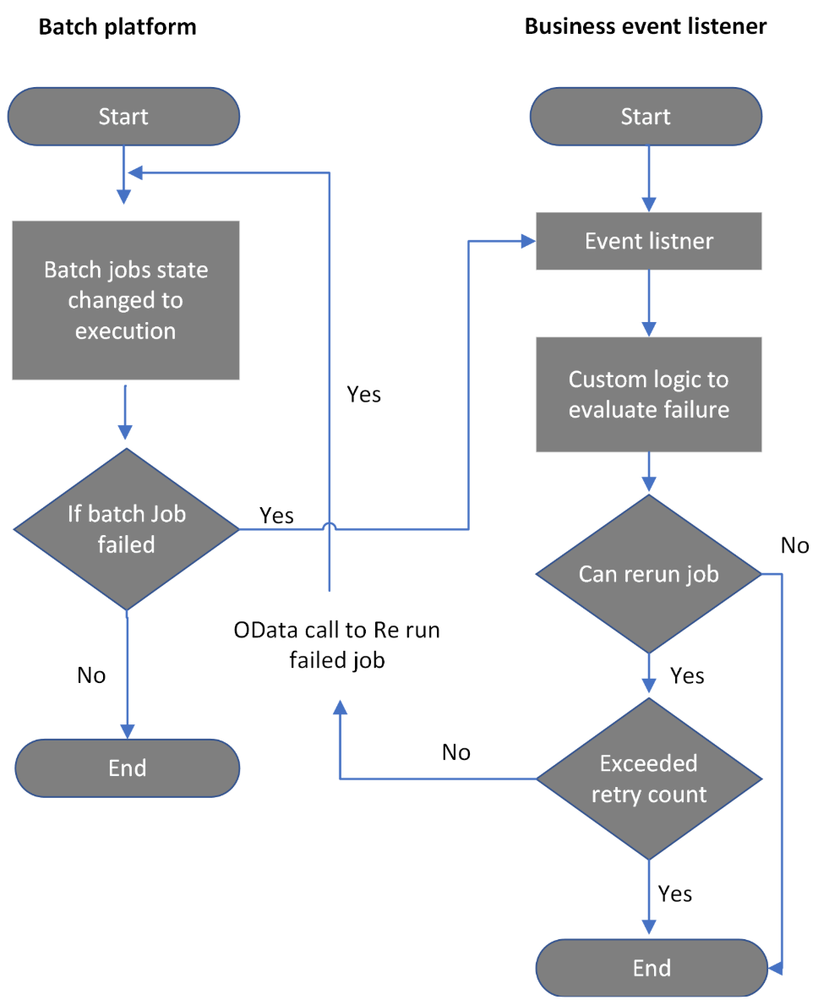
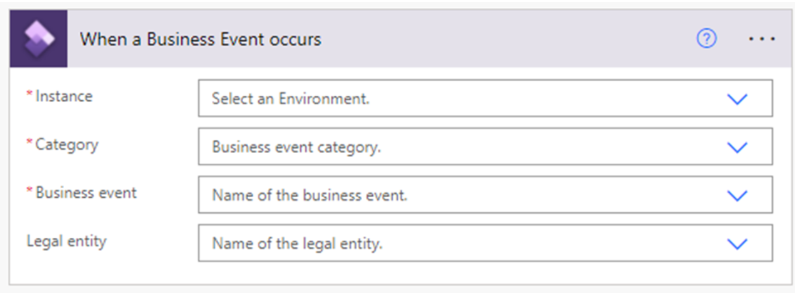

# Batch OData API

[!include[banner](../includes/banner.md)]

This article provides information about the batch Open Data Protocol (OData) application programming interface (API) and explains how you can use OData to reschedule a job.

In the existing [batch processing](batch-processing-overview.md) functionality, if some types of job failures have to be retried, either with or without any changes, based on the interpretation of the error, they must be manually retried. For jobs that are scheduled to be run during off-peak times to avoid active business hours for customers, monitoring failures and re-triggering the jobs requires either 24/7 support or a wait time until users resume work during normal business hours.

## Integration of business events with batch functionality

Business event capabilities enable customers to configure notifications about changes in state (started, failed, finished, or canceled) for batch jobs. Integration with [Microsoft Power Automate](../business-events/business-events-flow.md) lets customers capture information about affected jobs without having to sign in to the system. However, manual intervention is required if any action must be taken based on the business events.

For information about how to configure batch events, see [Batch business events](../business-events/system-business-events.md).

## End-to-end automation

In version 10.0.22, the batch functionality now provides an OData API that can be used to requeue batch jobs. Customers can use the OData endpoint to requeue batch jobs that are in a terminal state. This feature can be integrated with any automation by using Power Automate, custom APIs, and so on.




## Automate requeuing of failed batch jobs by using the OData API

The batch OData endpoint lets users consume and automate the end-to-end process to reschedule a batch job by using Power Automate or custom APIs. It supports updates of the batch job status from a started, failed, finished, or canceled state to a waiting state, based on business requirements.

Follow these steps to automate requeuing of failed batch jobs by using Power Automate.

1. Sign in to the [Power Automate portal](https://flow.microsoft.com), and create a flow by following the instructions in [Create a cloud flow in Power Automate](/power-automate/get-started-logic-flow).
2. Specify an event in finance and operations apps to start the flow. Enter the environment details, a business event category, a business event (such as **Batch Job Failed**), and an appropriate legal entity.

    

3. On the **Actions** tab, add a new step to select an operation that is named **Parse JSON with schema** to parse the JavaScript Object Notation (JSON) request. For more information about how to download a JSON schema, see [Business events catalog](../business-events/home-page.md#business-event-catalog).
4. Add custom logic by including a logical condition that uses the job ID to determine whether the event is from the target batch job.

    

5. If the condition is evaluated as true, add an action by selecting an operation in finance and operations apps, and then selecting **Execute action** to trigger the batch OData action to set the job back for execution.

    1. Enter the finance and operations apps instance.
    2. Select the **BatchJobs-SetBatchJobToWaiting** action.
    3. Select the job ID to rerun the failed job.

    


6. Save the flow.

The flow that you just configured will listen to the batch events. If the configured batch jobs fail, the flow will set the job back for execution. As a best practice, we recommend that you add custom logic (see the previous example) to perform validation before batch jobs are retried. In this way, you help prevent unnecessary load on the system. We also recommend that you specify a limit on the maximum number of times that a batch can be retried. (The recommended number of retries is 5.)

There are other ways to subscribe to business events. For more information, and for information about how to configure batch events, see [Batch business events](../business-events/system-business-events.md).

## Batch API endpoint and sample response

- **Service endpoint:** `https://<org url>/data/BatchJobs/Microsoft.Dynamics.DataEntities.SetBatchJobToWaiting`
- **Method type:** POST
- **Header:**

    - **Authorization:** Bearer \<Bearer token for authentication\>
    - **Content-Type:** application/json

- **Body:**

    ```json
    {
        "batchJobId":<BatchJobId>
    }
    ```

- **Sample response:**

    ```json
    {
        "ResponseStatusCode":200,
        "IsSuccess":true,
        "Batch JobId":<BatchJobId>,
        "ExceptionDetails":"",
        "reponseMessage":"Status of supplied BatchJobId: *********** is Successfully updated to waiting state"
    }
    ```

    Here is an explanation of the elements of the response output:

    - **ResponseStatusCode** – A standard HTTP response code, based on the execution of the action.
    - **IsSuccess** – A Boolean value that indicates overall success or failure.
    - **BatchJobId** – The ID of the input batch job.
    - **ExceptionDetails** – Details about any exception that occurred during execution.
    - **ReponseMessage** – The success message.

