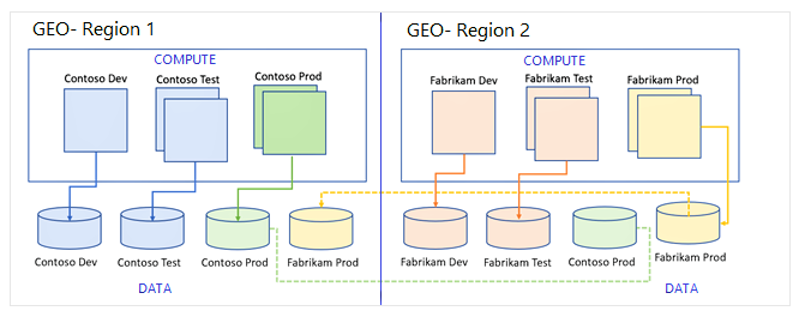

---
# required metadata

title: Business continuity and disaster recovery
description: This article describes the business continuity and disaster recovery that Microsoft provides for production instances of Microsoft Dynamics 365 SaaS applications if an Azure region-wide outage occurs.
author: MicroSri
ms.date: 03/23/2023
ms.topic: article
audience: IT Pro
ms.reviewer: sericks
ms.search.region: Global
ms.author: sriknair
ms.search.validFrom: 2021-07-31
---

# Business continuity and disaster recovery

[!include[banner](../includes/banner.md)]

Microsoft provides business continuity and disaster recovery for production instances of Dynamics 365 software as a service (SaaS) applications if a Microsoft Azure region-wide outage occurs.

Customers who have purchased the appropriate licenses can deploy a production instance of a finance and operations app. For more information, see [Cloud deployment overview](../deployment/cloud-deployment-overview.md).

For production environments, replicas of the different storage services (Azure SQL Database and file storage) are established in the secondary region at the time of deployment. These replicas are known as *geo-secondaries*.

The geo-secondary replicas are kept synchronized with the primary instance through continuous data replication. There's a small replication latency, or lag, between the primary data sources and their corresponding geo-secondary replicas. For more information, see [Business continuity and disaster recovery (BCDR): Azure Paired Regions](/azure/best-practices-availability-paired-regions).

For more information about data protection in non-production environments, see [Database movement operations home page](../database/dbmovement-operations.md).

As the preceding illustration shows, compute infrastructure, like data storage services, is provisioned in both regions in such a way that it can handle the traffic volume in the event of an environment-level or region-level failover. To provide region-level resiliency, Azure Virtual Machine Scale Sets is configured with five-level fault domains. In this way, it can handle transient issues that are caused by faulty hardware and other factors, and automatically load balance the traffic. The result is an experience where customers barely notice that there's any issue and experience no data loss. The following sections describe the different types of failovers that are possible and how Microsoft manages service continuity in both these situations.

Finance and operations apps adhere to the Microsoft Business Continuity and Disaster Recovery (BCDR) standard. This standard requires that a BCDR plan is reviewed, updated, and tested at least once a year for every online service. The Microsoft Cloud Business Continuity and Disaster Recovery Plan Validation Report is available to customers in [Service Trust Portal](https://servicetrust.microsoft.com/).

If the outage is caused by issues with underlying services, because of factors such as faulty hardware or network outage, and if Microsoft has determined that the region won't become available within a reasonable amount of time, Microsoft will notify customers and switch over the traffic so that it's routed to the secondary region instances.

In the event of an unanticipated region-wide outage, such as a natural disaster that affects the whole Azure region, and if Microsoft has determined that the region won't become available within a reasonable amount of time, Microsoft will notify customers and switch over the traffic so that it's routed to the secondary region instances. In these cases, customers might experience up to 15 minutes of data loss, also known as Recovery Point Objective (RPO), depending on the nature and timing of the outage. The recovery time objective (RTO) could vary from four to 10 hours.

If a failover occurs, the applicable service will work in limited mode. Update maintenance can't be triggered in failover mode.

## Failback 

When Microsoft determines that the primary region is back online and fully operational, it will notify customers and switch the environments back so that they work out of the primary region. Users who are connected to the systems will experience a brief interruption of up to a few minutes, and the batch service might be unavailable for up to 25 minutes. The service, including all non-production instances, will be fully restored. There will be no data loss during the failback process.

> [!IMPORTANT]
> While the environment is operating out of the secondary region, the finance and operations app environment will have reduced functionality. Financial Reporting and Power BI reporting won't be available. If Financial Reporting is critical for a customer during the disaster, the customer can request restoration of the service to Microsoft through a support ticket.
>
> Additionally, there might be service degradation of non-production instances. Deployments of new non-production environments might be blocked.

## Responsibilities for disaster recovery 

The following table describes responsibilities for disaster recovery.

| Microsoft's responsibilities | Customer's responsibilities |
|------|------|
| Microsoft enables geo-redundancy and automatic backup of SQL and Azure storage when the primary production instance is deployed. | None |
| Microsoft has Application Object Server (AOS) images available from a regional repository to restore compute. We maintain the compute infrastructure to meet RTO. | None |
| 
If an outage occurs, and Microsoft determines that a region failover must be done, we don't require customer consent, because there will be no data loss. However, if a cross-region failover must be done for the customer, there might be dataloss up to 15 mins. For more information, see [Azure SQL Database Geo-Restore](https://azure.microsoft.com/blog/azure-sql-database-geo-restore/).

In the event of data loss, Microsoft will contact the customer to request its sign-off on a failover.
 | In the event of data loss, the customer must provide written sign-off to trigger the failover. |
| If a failover occurs, the applicable service works in limited mode. Update maintenance can't be triggered in failover mode. | The customer can't request package deployments or other regular maintenance requests in failover mode. |
| When the datacenter becomes operational, Microsoft fails back to the production instance in the primary Azure region. Normal operations are resumed. A notification will be published to customers. Although customers might experience brief interruptions or disconnections during this window, they won't have to take a full downtime. | None |
| None | The customer should plan disaster recovery for resources that aren't provisioned by Microsoft as part of the service. This includes resources that run independently, as well as ones that are hosted in customer subscriptions in Azure. |

