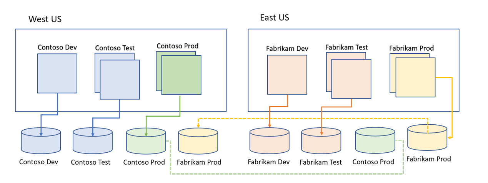

---
# required metadata

title: Business continutiy and disaster recovery
description: Microsoft provides business continuity and disaster recovery for production instances of Dynamics 365 SaaS applications, in the event of an Azure region wide outage. 
author: tonyafehr
ms.date: 07/12/2021
ms.topic: article
audience: IT Pro
ms.reviewer: sericks
ms.search.region: Global
ms.author: tfehr
ms.search.validFrom: 2021-07-31
---

# Business continutiy and disaster recovery

[!include[banner](../includes/banner.md)]

Microsoft provides Business Continuity and Disaster Recovery for production instances of the Dynamics 365 SaaS applications, in the event of an Azure region wide outage. This article is going to cover...

## Dataverse and Dynamics 365 for customer engagement apps 
Dynamics 365 for customer engagement apps run on Dataverse platform. Tenant admins can deploy a production instance of Dynamics 365 for customer engagement and/or Dataverse with the purchase of appropriate licenses. For more information, see [Create and manage environments in the Power Platform admin center](/power-platform/admin/create-environment).

For production environments, a replica of the different storage services (Azure SQL and File storage) is established in the secondary region for each environment, at the time of deployment. For more information, see [Environments](/power-platform/admin/environments-overview). These replicas are referred to as geo-Secondary replicas. The geo-secondary replicas are kept synchronized with the primary instance through continuous data replication. There is a small replication latency or lag, typically less than a few minutes , between the primary data sources and their corresponding geo-secondary replicas. For more information, see [Ensure business continuity amd disaster recovery (BCDR): Azure Paired Regions](/azure/best-practices-availability-paired-regions).

As seen in the preceding diagram, similar to data storage services, compute infrastructure is also provisioned in both regions in such a way that it can handle the traffic volume in case of an environment or region level failover. See following sections on the different types of failovers that are possible and how Microsoft manages service continuity in either of these situations.

To learn more about data protection in non-production environments, see [Back up and restore environments](/power-platform/admin/backup-restore-environments).

### Unplanned failover
Dataverse is built for high availability and reliability which ensures that in event of underlying Azure platform issues affecting, the platform automatically leverages resources in other zones within the same regions to ensure availability isn’t impacted. More details on Azure availability zones, see [Regions and Availability Zones in Azure](/azure/availability-zones/az-overview).

However, in the event of an unanticipated region wide outage – for e.g., natural disaster or rare glitch in underlying Azure Infra which affects the entire Azure region , and Microsoft determines the region will not become available within a reasonable amount of time, Microsoft will notify the customers and switch over the traffic to route to the secondary instances. In this case, it possible that customers may experience a data loss of up to 15 minutes, depending on the nature and timing of the outage. 

### Planned failover
In the event Microsoft determines there is a risk to the availability of the primary Azure region – for e.g. via an impending hurricane, Microsoft will notify the customers and switch over the traffic to route to the secondary replicas instances. Users connected to the Dynamics 365 for Customer Engagement, Dataverse applications at the time of the failover will experience a brief disruption. There will be no data loss as both Azure regions are online and data is replicated fast enough on the secondary replica.

> ![Important]
> During the time the environment is operating out of the secondary region, there may be service degradation of non-production instances. It is possible that deployments of new non-production environments will also be affected.

### Failback
Microsoft will notify customers and switch back the environments to operate out of the primary region, when it determines the primary region is back online and is fully operational. Users connected to the systems will experience a brief interruption of up to 1 minute. The service is fully restored including all non-production instances. There is no data loss.

Dataverse for Teams environments do not support secondary replicas and hence this feature of providing business continuity is not available until such Dataverse for teams environments are converted to Dataverse production instances using the upgrade process described in [Upgrade process](/power-platform/admin/about-teams-environment#upgrade-process).

[About the Microsoft Dataverse for Teams environment](/power-platform/admin/about-teams-environment)

## Finance and Operations apps
Customers can deploy a production instance of Dynamics 365 for Finance and Operations apps with the purchase of appropriate licenses. For more information, see [Cloud deployment overview](../deployment/cloud-deployment-overview.md).

For environments of type production, replicas of the different storage services (Azure SQL and File storage) are established in the secondary region, at the time of deployment. These replicas are called the Geo-Secondaries. 

The geo-secondaries are kept synchronized with the primary instance through continuous data replication. There is a small replication latency or lag, <=15 minutes, between the geo-secondary and primary. For more information, see [Business continuity and disaster recovery (BCDR): Azure Paired Regions](/azure/best-practices-availability-paired-regions).

  
To learn more about data protection in non-production environments, see [Database movement operations home page](../database/dbmovement-operations.md).

### Planned failover
In the event Microsoft determines there is a risk to the availability of the primary Azure region – for e.g. via an impending hurricane, Microsoft will notify the customers and switch over the environment to operate out of the secondary region. There will be a short outage while the environment is configured to the secondary region. There will be no data loss as both Azure regions are online and the replication will be caught up.

### Unplanned failover
In the event of an unanticipated region wide outage – for e.g. caused by a natural disaster such as an earthquake, and Microsoft determines the region will not become available within a reasonable amount of time, Microsoft will notify the customers and switch the environment to operate out of the secondary region. In this case, it possible that customers may experience a data loss of up to 15 minutes, depending on the nature and timing of the outage.

> ![Important]
> During the time the environment is operating out of the secondary region, the Finance and Operations apps environment will operate with reduced functionality. Financial Reporting, Power BI reporting will not be available. In the event, the timing of the disaster is such that Financial Reporting is critical for the customer, they can request the restore of the service to Microsoft through a support ticket.
> 
> Additionally, there may be service degradation of non-production instances. It is possible that deployments of new non-production environments will be blocked.

### Failback
Microsoft will notify customers and switch back the environments to operate out of the primary region, when it determines the primary region is back online and is fully operational. The service is fully restored including all non-production instances. There is no data loss.

