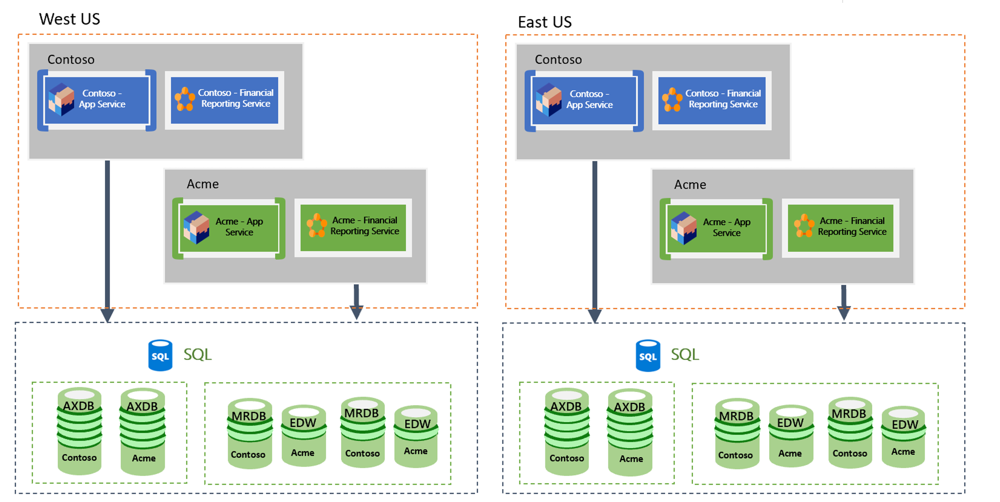

---
# required metadata

title: Business continutiy and disaster recovery
description: Microsoft provides business continuity and disaster recovery for production instances of Dynamics 365 SaaS applications, in the event of an Azure region wide outage. 
author: MicroSri
ms.date: 07/13/2021
ms.topic: article
audience: IT Pro
ms.reviewer: sericks
ms.search.region: Global
ms.author: sriknair
ms.search.validFrom: 2021-07-31
---

# Business continutiy and disaster recovery

[!include[banner](../includes/banner.md)]

Microsoft provides business continuity and disaster recovery for production instances of Dynamics 365 software-as-a-service (SaaS) applications, in the event of an Azure region wide outage. 

Customers can deploy a production instance of a Finance and Operations app with the purchase of appropriate licenses. For more information, see [Cloud deployment overview](../deployment/cloud-deployment-overview.md).

For production environments, replicas of the different storage services (Azure SQL and file storage) are established in the secondary region at the time of deployment. These replicas are called geo-secondaries. 

The geo-secondaries are kept synchronized with the primary instance through continuous data replication. There is a small replication latency or lag, up to 15 minutes, between the geo-secondary and primary. For more information, see [Business continuity and disaster recovery (BCDR): Azure Paired Regions](/azure/best-practices-availability-paired-regions).

  
To learn more about data protection in non-production environments, see [Database movement operations home page](../database/dbmovement-operations.md).

## Planned failover
In the event that Microsoft determines there is a risk to availability of the primary Azure region, for example if there is an impending hurricane, Microsoft will notify customers and switch over the environment to operate out of the secondary region. There will be a short outage while the environment is configured to the secondary region. There will be no data loss as both Azure regions are online and the replication will be caught up.

## Unplanned failover
In the event of an unanticipated region-wide outage, for example, a natural disaster such as an earthquake--and Microsoft determines the region will not become available within a reasonable amount of time--Microsoft will notify customers and switch the environment to operate out of the secondary region. In this case, it possible that customers may experience a data loss of up to 15 minutes, depending on the nature and timing of the outage.

> ![Important]
> During the time the environment is operating out of the secondary region, the Finance and Operations app environment will operate with reduced functionality. Financial Reporting and Power BI reporting will not be available. In the event, the timing of the disaster is such that Financial Reporting is critical for the customer, they can request the restore of the service to Microsoft through a support ticket.
> 
> Additionally, there may be service degradation of non-production instances. It is possible that deployments of new non-production environments will be blocked.

## Failback
Microsoft will notify customers and switch back the environments to operate out of the primary region when it determines the primary region is back online and is fully operational. The service is fully restored including all non-production instances. There is no data loss.
