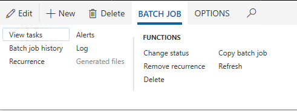
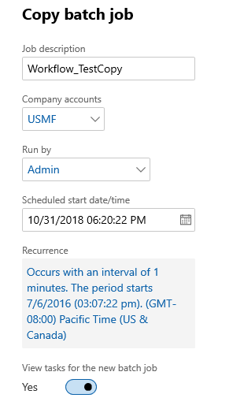

---
# required metadata

title: Copy a batch job
description: This article provides information about copying a batch job and batch tasks.
author: Peakerbl
ms.date: 10/25/2018
ms.topic: article
ms.prod: 
ms.technology: 

# optional metadata

# ms.search.form: 
# ROBOTS: 
audience: IT Pro
# ms.devlang: 
ms.reviewer: sericks
# ms.tgt_pltfrm: 
ms.assetid: 6135bcf7-bf8f-42ae-b2c6-458f6538e6a4
ms.search.region: Global
# ms.search.industry: 
ms.author: peakerbl
ms.search.validFrom: 2018-08-15
ms.dyn365.ops.version: Platform update 20

---

# Copy a batch job

[!include [banner](../includes/banner.md)]

When you want to create the same jobs for different legal entities, you can use the copy batch job functionality to copy an existing batch job and the batch tasks, including recurrences.

You can set the description, company, schedule start date and time, the recurrence, and the run by account at the same time. When you copy the batch job, any alerts and dependencies from the source job will also be copied. 

>[!NOTE] 
>This feature is available as of Platform update 20.

## Copy a batch job
Complete the following steps to copy a batch job.

1.	Click **System administration** > **Inquiries** > **Batch jobs**.
2.	Select the job that you want to copy, and on the Action Pane, click **Batch Job** > **Copy batch job**.

 
 
4.	Enter or add any changes. If you set **View tasks** to **Yes**, when you click **OK** you will go directly to the **Batch tasks** page for the copied job.

 

>[!IMPORTANT] 
>The copied batch job will be created with a **Withhold** status, so you will need to enable it. The **Run by** user can also be set to give this user the privilege to run the job without being a Sys Admin.

## Enable the batch job
Complete the following steps to enable a batch job.

1.	On the **Batch job** page, on the Action Pane, click **Batch job** > **Change status**.
2.	Select the **Waiting** status, and then click **OK**.

[!INCLUDE[footer-include](../../../includes/footer-banner.md)]