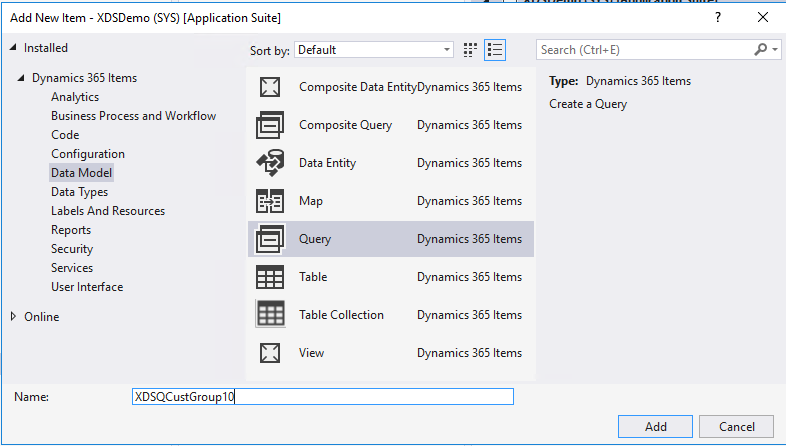
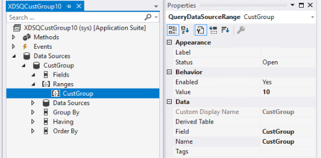
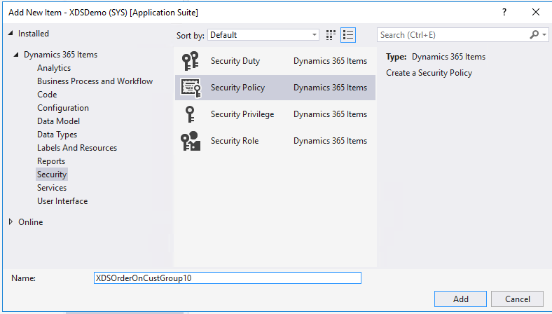
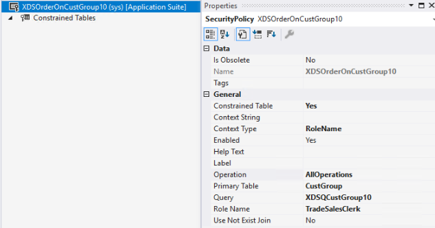
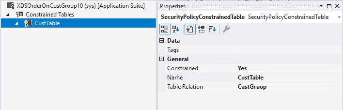

---
# required metadata

title: Create a security policy
description: This topic explains how to create a simple security policy that secures access to customers and customer groups, based on a range for a customer group.
author: Peakerbl
ms.date: 07/14/2020
ms.topic: article
ms.prod: 
ms.technology: 

# optional metadata

ms.search.form: 
audience: IT Pro
# ms.devlang: 
ms.reviewer: sericks
# ms.tgt_pltfrm: 
# ms.custom: NotInToc
ms.assetid: 
ms.search.region: Global
# ms.search.industry: 
ms.author: peakerbl
ms.search.validFrom: 2020-07-31
ms.dyn365.ops.version: 10.0.12

---

# Create a security policy
[!include [banner](../includes/banner.md)]

This topic explains how to create a simple security policy that secures access to customers and customer groups, based on a range for a customer group.

## Add a new query

1.  In Visual Studio, add a new query, such as XDSQCustGroup10, to your project/solution. The query will be used to restrict data access from the **Constraint** table.

    

2.  Right-click **Data Sources**, and the select **New Data Source**.

3.  In the **Table** field, enter the primary table name **CustGroup**.

4.  Right-click **Ranges**, and then select **New Range**.

5.  Set the **Enabled** field to **Yes**.

6.  In the **Data Source** field, enter the primary table name, in this case,
    ‘CustGroup’.

7.  In the **Value field**, enter **10** to restrict access to data where
    CustGroup has value of 10, by defining the Range for the CustGroup field.

    

## Add a new security policy

1.  Add a new security policy, such as XDSCustTableOnCustGroup10.

    

2.  Set **Constrained Table** to **Yes**. This will also secure access to the
    primary table. In this example this is the **CustGroup** table.

3.  Set the **Context Type** field to **RoleName**.

4.  Set the **Enabled** field to **Yes**.

5.  Set the **Operation** field to **AllOperations**. Other available values for
   **Operation** include **Select**, **Insert**, **Update**, **Delete**, and
    **InsertUpdateDelete**.

6.  Set **Primary Table** field to **CustGroup**.

7.  Set the **Query** field to the name of the query created above, for example
    ‘XDSQCustGroup10’.

8.  Set the **Role Name** field to ‘TradeSalesClerk’. Because **Context Type** is set
    to RoleName for this policy, it is required to enter the AOT name for a user
    role.

    

8.  Next, add constrained tables. In this simple example add one
    table.

    

    a.  Right-click **Constrained tables**, and then select **New \> Constrained
    Table**.

    b.  Set **Constrained** to **Yes**.

    c.  In the **Name** field, enter the Constrained table, for example ‘CustTable’.

    d.  In the **Table Relation** field, enter the relationship to the primary
    table, in this case ‘CustGroup’.

10.  As a final step, it is required that you build and synchronize the solution 
    to activate the policy.

[!INCLUDE[footer-include](../../../includes/footer-banner.md)]