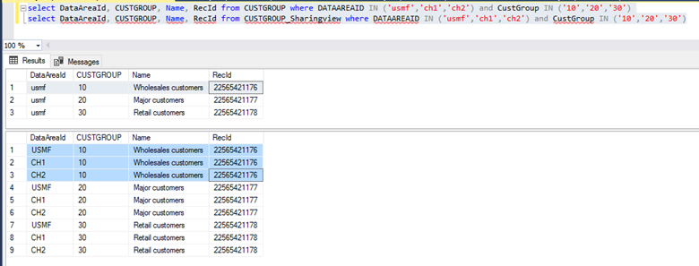

# Cross-company data sharing for developers

[!include [banner](../includes/banner.md)]

This article describes cross-company data sharing for developers. Cross-company data sharing is a mechanism for sharing reference and group data among companies in a deployment.

## Enable a table for cross-company data sharing 

Enabling a table for data sharing is a two-step process that requires updating the metadata
property for the table. To enable a custom table for cross-company data sharing, follow these steps: 

1.  Open the table properties and set the **Data Sharing Type** property to
    **Single** or **Duplicate**. **Single** stands for single record sharing (SRS) and
    **Duplicate** stands for duplicate record sharing (DRS).

2.  For each field on the table, you need to review 
    the **Single Data Sharing Type** metadata property. **Always** is the default value and implies the field is shared always. **Never** implies the field is never
    shared. Don’t choose **Optional** as there is currently no related logic.

> [!NOTE]
> -   When a table is set as **Duplicate**, it can participate in both DRS as well
    as SRS policies.
> - When a table is set to **Single**, it can participate in SRS policy only.
> - When a table property is set to **Duplicate**, it cannot be changed to
    **Single**. This would be seen as a breaking change as DRS policies using
    the table would no longer be valid.
> - When using SRS, fields set to **Never** will get the default value for the
    field’s type in all child companies. You cannot update these fields in a child company to contain another value. For example,
    integer/real will contain a value of 0, strings will be empty, enumerations
    will be non-deterministic based on whether they are extensible.

## How does it work?

When a table is enabled for data sharing, kernel logic auto-creates a view with
name "\<tablename\>_SharingView". This view should be used for non-kernel based access to the shared
data.

In the following example, the **CustGroup** table is enabled for data sharing and **USMF** is
selected as the master company, and **CH1** and **CH2** are the child companies.
The output will look like this when you read records from CustGroup (Physical) and
CustGroup_SharingView. (*View* illustrates kernel logic, but is only used for
non-kernel based scenarios)

## Guidelines to enable data sharing on tables
The ability to define or modify DRS or SRS settings applies to base tables provided by the current model. For example, it is not possible to modify existing data sharing table or field properties using an extension.

If a company-specific table has **Data Sharing Type = Single**, it means it has already been evaluated for SRS. You can’t revert it to **Duplicate** or **None**.

If a company-specific table has **Data Sharing Type = Duplicate**, it means it has already been evaluated for DRS. If you want to enable it for SRS, you need to evaluate its functional eligibility before changing the property to **Single**.

If a custom company-specific table has **Data Sharing Type = None**, but you want to enable data sharing, then the recommendation is to enable it for DRS whenever possible. Because a DRS table can participate in both DRS and SRS policies, it may not be possible for the sharing type to be DRS. Use the following information to determine the appropriate setting.

+ If a company-specific table has a unique index or alternate key, then apply DRS.
    +	If the table has a foreign key field and the corresponding table is set to **Data Sharing Type = None**, then set the **Single Data Sharing Type** property for that field to **Never**.
    +	If the table has a surrogate foreign key field, then set the **Single Data Sharing Type** property for that field to **Never**.
    +	If the table field is referencing any of the tables mentioned under the limitation section, then set the **Single Data Sharing Type** property to **Never**.

+ If a company-specific table doesn’t have a unique index or alternate key, then apply SRS.
    +	If the table has a foreign key field and the corresponding table is set to **Data Sharing Type = None**, then set the **Single Data Sharing Type** property for that key field to **Never**.
    +	If the table has a surrogate foreign key field, then set the **Single Data Sharing Type** property for that field to **Never**.
    +	If the table field is referencing any of the tables mentioned under the limitation section, then set the **Single Data Sharing Type** property to **Never**.

> [!NOTE]
> Cross-company shared policy simulator detects the eligibility of a table and its fields along with table references associated with each field.

After you have modified data sharing metadata properties, you need to do a full DB sync, which will create or update the _SharingView(s).

Data sharing is applicable for tables with the **Save data per company** property set to **Yes**. Tables with **Save data per company** set to **No**, are global and no additional sharing configuration is needed.

From a development perspective, it is not enough to look at the primary and alternate key of a table to determine the sharing type. Additional work may be required to enable sharing without causing data issues.

<table>
<thead>
<tr class="header">
<th>Method/Metadata</th>
<th>Description</th>
</tr>
</thead>
<tbody>
<tr class="1">
<td>Relationships
<ul>
<li>Alternate key</li>
<li>Foreign</li>
<li>Sharing Type (Table and fields)</li>
<li>DeleteActions (Restricted/Casacade)</li>
</ul>
</td>
<td><ul>Check the tables and fields and if they are required to be shared. Also, determine if there is impact of DRS versus SRS sharing for the table and field.</ul>
</td>
</tr>
<tr class="2">
<td>Validate methods
<ul>
<li>validateDelete</li>
<li>validateInsert</li>
<li>validateWrite</li>
<li>validateField</li>
<li>validateFieldValue</li>
</ul>
</td>
<td><ul>Logic might refer to table that is not shared such as transactions, therefore refactoring is required to handle the logic cross company.</ul>
</td>
</tr>
<tr class="3">
<td>Defaulting
<ul>
<li>initValue</li>
<li>defaultField</li>
</ul>
</td>
<td><ul>Check what logic is done in the defaulting, many places values are initialized from a non-shared table, resulting in records being initialized differently, depending on the company record that is created. </ul>

<ul>Are there data dependencies that are not modeled, such as fields shared between tables and used for validation. ProjCategory and ProjCategoryGroup have a CategoryType field. There is a code level validation that the value is the same for the project category and the group assigned. If the fields are not included in the policy update, the project category fails due to the validation check.</ul>
</td>
</tr>
<tr class="4">
<td>CRUD methods
<ul>
<li>delete</li>
<li>insert</li>
<li>update</li>
<li>write</li>
</ul>
</td>
<td><ul>Are there data dependencies not modeled?
Due to data model decisions, the table metadata, Save date company property, may be set to No.
<li>How are these tables related to data sharing tables?</li>
<li>The table contains DataAreaId as alternate field.
(example: InventItemGroupItem > InventItemGroup)</li>
<li>Code needs to handle populating tables like this cross company.</li>
 </ul>
</td>
</tr>
<tr class="5">
<td>Design patterns using overloaded field values.</td>
<td><ul>In some tables there exists the pattern of two paired fields to indicate relationships. The most common usage is posting profiles. There will be an enumeration field and then a field representing the alternate key from a referenced table. For example, the ProjPosting table has the field ProjCode derived from the enumeration TableGroupAll and an associated field ProjRelationship, which will store the natural key from ProjTable, ProjGroup, or it will be empty. 
Tables with this pattern may be shareable, but clear documentation will need to be provided as to all related tables and fields need to be included in the policy.</ul>
</td>
</tr>
    <tr class="6">
<td>LedgerDimensionDefaultAccount</td>
<td><ul>Tables using this are typically storing the reference to a main account value. These are not shareable.</ul>
</td>
</tr>
    <tr class="7">
<td>Number sequences</td>
<td><ul>Number sequences are typically set up per company. The defaulting logic fields using them will probably not work without code changes.</ul>
</td>
</tr>
</tbody>
</table>

The classes **SysDataSharingCrossCompanyValidator**, **SysDataSharingCrossCompanyValidatorQueryBuilder**, and methods on the table **SysDataSharingPolicy**, can be used to determine if a table is being used in a data sharing policy. These typically are used in the CRUD and logic default methods to handle table dependencies.
