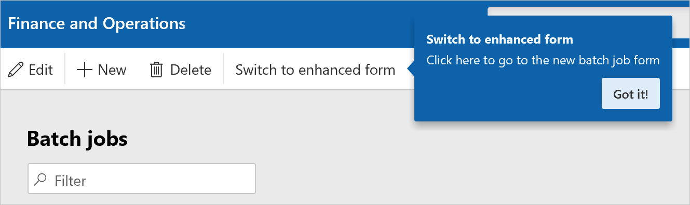
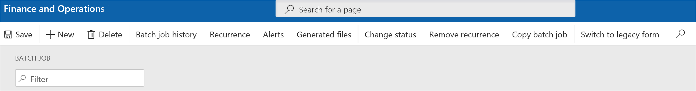

# Enhanced batch forms

[!include [banner](../includes/banner.md)]

You can open an enhanced detail transaction form by selecting the job ID for a batch job. The enhanced form provides a header and lines that summarize the batch tasks and constraints that are related to the selected batch job.

## Switch to the enhanced form

Follow these steps to switch to the enhanced form. 

1. Go to **System administration** \> **Inquiries** \> **Batch jobs**.

	You're notified about the enhanced form. The notification shows the location of the **Switch to enhanced form** button on the Action Pane.

    

2. Select **Switch to enhanced form**.

To switch back to the unenhanced form, select **Switch to legacy form** on the Action Pane of the enhanced form.

[!INCLUDE[footer-include](../../../includes/footer-banner.md)]