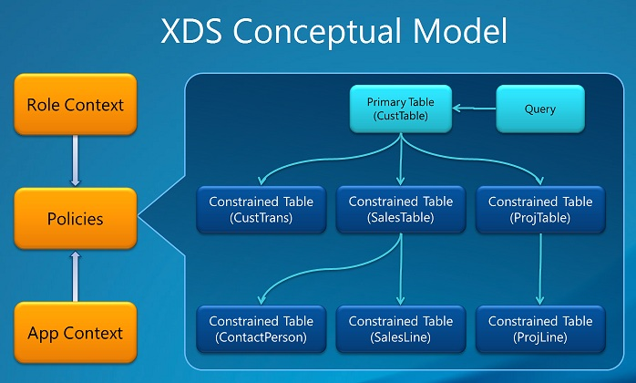

---
# required metadata

title: Extensible data security policies 
description: This article provides an overview of Extensible Data Security (XDS) policies in finance and operations apps.
author: pnghub
ms.date: 08/09/2023
ms.topic: article
ms.prod: 
ms.technology: 

# optional metadata

ms.search.form: 
audience: IT Pro
# ms.devlang: 
ms.reviewer: johnmichalak
# ms.tgt_pltfrm: 
# ms.custom: NotInToc
ms.assetid: 
ms.search.region: Global
# ms.search.industry: 
ms.author: gned
ms.search.validFrom: 2020-07-31
ms.dyn365.ops.version: 10.0.12

---

# Extensible data security policies 
[!include [banner](../includes/banner.md)]

This article provides an overview of Extensible Data Security (XDS) policies in
Finance and operations apps. XDS allows developers to supplement role-based security
by restricting access to table records based on security policies. The query in
the policy applies a filter and only records that satisfy the conditions of the filter will
be accessible from the restricted tables.

## Data security policy components

-   **Constrained tables**: The table or tables from which data is filtered or
    secured. For example, in a policy that secures access to transactions based on
    customer, the **CustTrans** would be an example of a constrained table.

-   **Primary table**: Used to secure the content of the related constrained
    table. In the example below, the **CustTable** table would be the primary table.
    The primary table must have an explicit relationship to the constrained tables.

-   **Policy query**: Used to secure the constrained tables content using a range
    condition on the primary table contents. Only records that are included in
    the range will be accessible. The range can, for example, be based on a
    specific value for Customer.

-   **Context** – Controls the conditions under which a policy is applicable.
    Two main types of contexts are available:

    -   **Role context**: Based on the roles that the user is assigned. There are
        two sub-options for role context:

        -   **RoleName** – Indicates that the security policy is only applied to
            the application user assigned to the role equal to the value of
            RoleName.

        -   **RoleProperty** – This value is used in combination with the
            **ContextString** property to specify multiple user roles context. It is
            applied when the Context String value defined in the **Role Property**
            field for the policy is the same as the **ContextString** field value
            for the assigned user roles.

    -   **Application context**: Applied if the context string set by the
        application using the XDS::SetContext API is the same as the value
        defined in the **Context String** field for the policy.

        

In the Application Object Tree (AOT), policies and their components are
displayed under **Security \> Policies.**

## Important considerations

The policy query is added to the WHERE clause, or ON clause, on SELECT, UPDATE,
DELETE and INSERT operations involving the specified constrained tables. Unless
carefully designed and tested, policy queries can have a significant performance
impact. Therefore, make sure to follow simple but important guidelines when
developing an extensible data security policy. For more information, see the "Developing efficient
extensible data security policies" section in [Developing Extensible Data Security Policies (White paper) [AX
2012]](/dynamicsax-2012/appuser-itpro/developing-extensible-data-security-policies-white-paper).

When two or more security policies apply, the intersection (not the union) of
the records that are included by each policy are the only records that can be
accessed. This means that a record must satisfy all the applicable security
policies before access to the record is allowed.

XDS is not supported for financial dimensions and using XDS with financial dimension data will result in corruption of the data.

## Bypassing XDS policy

There is a new role **XDSDataAccessPolicyBypassRole** to bypass XDS policy.
If a user is assigned with the role **XDSDataAccessPolicyBypassRole**, then this user bypasses any supplemental extensible data security (XDS) policies and their data access will be purely role-based.

For example, [Create a simple security policy](create-simple-security-policy.md).

Assume an XDS policy is created with Query **XDSQCustGroup10** and is assigned to a role, for example, role **X**. 
When a **User1** is assigned with the role **X**, **User1** can see the **Customer group:10** in the **All customers** page.  
If **User1** is assigned to the **XDSDataAccessPolicyBypassRole** role,  along with role **X**, then the filter isn't applied because the XDS policy is bypassed because of the role **XDSDataAccessPolicyBypassRole**. **User1** is able to see all the groups.

## Additional resources

For information about how to debug policies, create more advanced policies, including
chaining of restricted tables, table relations based on expressions and much
more please refer to these resources:

- [Create a simple security policy](create-simple-security-policy.md)

- [Developing Extensible Data Security Policies (white paper) [AX
2012]](/dynamicsax-2012/appuser-itpro/developing-extensible-data-security-policies-white-paper)

- [Extensible Data Security examples – by Andre Arnaud De
Calavon [blog]](https://dynamicspedia.com/tag/xds/)

- [Extensible Data Security (XDS) Framework in D365FO - by Alex
Meyer [blog]](https://alexdmeyer.com/2019/02/20/extensible-data-security-xds-framework-in-d365fo/)

[!INCLUDE[footer-include](../../../includes/footer-banner.md)]

