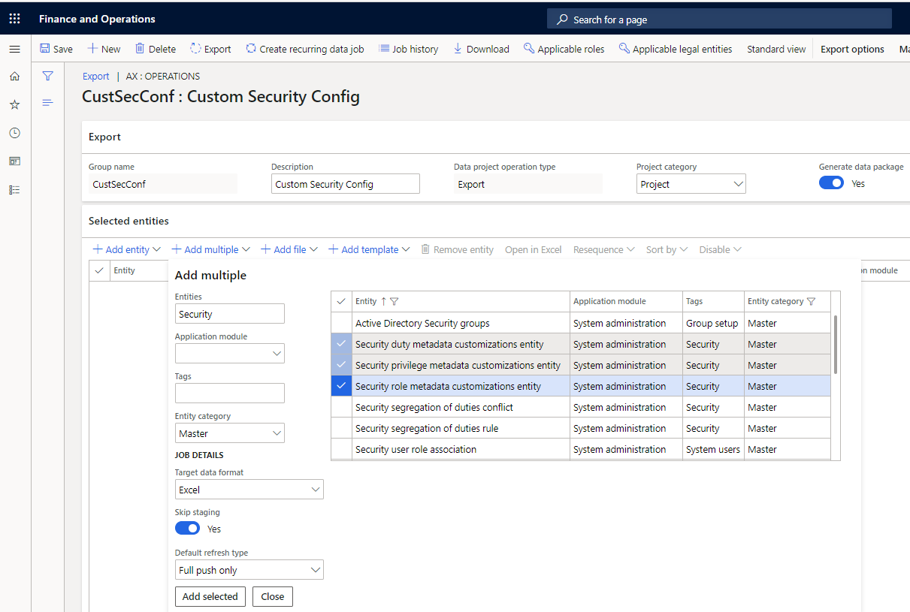

---
# required metadata

title: Import or export a customized security configuration by using Data management 
description: The topic explains how a customized security configuration can be exported and imported across environments by using the Data management framework.
author: tonyafehr
ms.date: 07/17/2020
ms.topic: article
ms.prod:
ms.technology: 

# optional metadata

# ms.search.form:
audience: IT Pro
# ms.devlang: 
ms.reviewer: sericks
# ms.tgt_pltfrm: 
# ms.custom: NotInToc
ms.search.region: Global
# ms.search.industry:
ms.author: peakerbl
ms.search.validFrom: 2020-07-31
ms.dyn365.ops.version: 10.0.12
---

# Import or export a customized security configuration by using Data management 

[!include[banner](../includes/banner.md)]

The topic explains how a customized security configuration can be exported and imported across environments by using the [Data management framework](../data-entities/data-entities-data-packages.md). This functionality can be used when, for example, a customized security configuration must be moved from a test environment to a production environment.

The following entities hold the customized, role-based security (that is, privileges, duties, and roles) that has been added or modified by using security configuration:

- Security privilege metadata customization entity
- Security duty metadata customization entity
- Security role metadata customization entity

## Export customized security configuration

1. Go to **System administration \> Workspaces \> Data management**.
2. Select the **Export** tile.
3. In the **Group name** field, enter a name for the group.
4. Set the **Generate data package** option to **Yes**.

    

5. Select **Add multiple** to open the drop-down dialog box.
6. Filter the entities by setting the following fields:

    - In the **Entities** field, enter **Security**.
    - In the **Entity category** field, select **Master**.

7. In the **Target data format** field, select **Excel**.
8. Select the applicable security customization entities.
9. Select **Add selected**.

    In version 10.0.12 and later, ignore any warning messages about data length. Those messages aren't applicable, because the entities that are included use containers in data package mode.

10. Select **Close**.
11. Make sure that the **Sequence** field is set in the order of the entity dependencies. Privileges should be first, then duties, and finally roles.
12. Select **Export**.
13. Select **Close**.
14. Wait for the job to be completed. Select **Refresh** to view the status.
15. Select **Download package**.
16. Save the package.

## Import customized security configuration

1. Go to **System administration \> Workspaces \> Data management**.
2. Select the **Import** tile.
3. In the **Group name** field, enter a name for the group.
4. Select **Add file**.
5. Select **Upload and add**.
6. Find the exported package, and then select **Open**.

    In version 10.0.12 and later, ignore any warning messages about data length. Those messages aren't applicable, because the entities that are included use containers in data package mode.

7. Select **Close**.
8. Select **Import**.
9. Select **Close**.
10. Wait for the job to be completed. Select **Refresh** to view the status.

## Related security configuration entities

- **SystemSecurityUserRoleOrganizationEntity** – Assignment of organizations to security roles.
- **Security segregation of duties rule** – Segregation of duties rules.
- **Security segregation of duties conflict** – Segregation of duties conflicts. This entity has unresolved conflicts but also reviewed conflicts.

## Additional resources

- [Data import and export jobs overview](../data-entities/data-import-export-job.md)
- [Move all user and security settings with data entities (blog post)](https://dynamicspedia.com/2020/05/move-all-user-and-security-settings-with-data-entities/), by Andr&eacute; Arnaud de Calavon

[!INCLUDE[footer-include](../../../includes/footer-banner.md)]