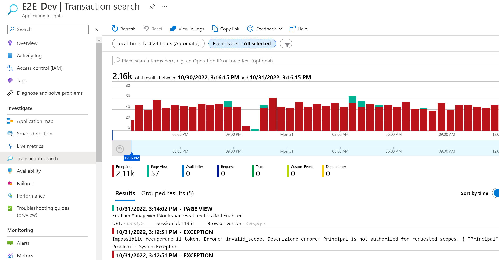
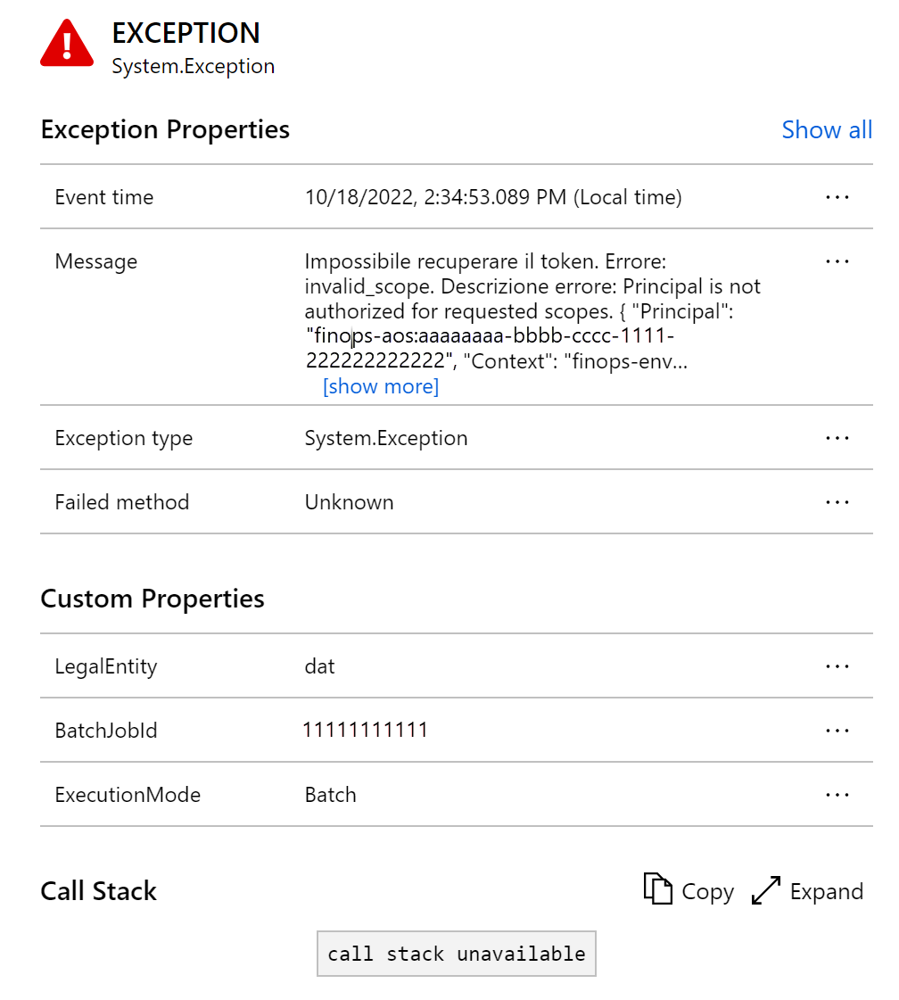

---
# required metadata

title: Monitoring and telemetry using Application Insights
description: This article explains how to use, set up, and configure the Application Insights integration for finance and operations apps.
author: LaneSwenka
ms.date: 04/21/2023
ms.topic: article
ms.prod:
ms.technology:

# optional metadata

# ms.search.form:
# ROBOTS:
audience: IT Pro, Developer
# ms.devlang:
ms.reviewer: twheeloc
# ms.tgt_pltfrm:
ms.custom: 257614
ms.assetid: 558598db-937e-4bfe-80c7-a861be021db1
ms.search.region: Global
# ms.search.industry:
ms.author: laswenka
ms.search.validFrom: 2016-09-30
ms.dyn365.ops.version: AX 7.0.0

---

# Monitoring and telemetry using Application Insights

The monitoring and telemetry feature in finance and operations apps is a direct, point-to-point integration between an instance of a finance and operations app and the target Application Insights destination. This feature lets developers and admins triage and resolve application issues in near-real time.  The telemetry that's generated isn't collected by Microsoft for support or other operational reporting. Instead, the data is customer owned and customer driven.

## What telemetry is entered in Application Insights, and in which tables?

The following table describes the different telemetry types that come from X++ and the target table names in Application Insights.

| Telemetry type | Table name in Application Insights |
|----------------|------------------------------------|
| FormRun form loads | pageViews |
| X++ Exceptions | Exceptions |
| X++ custom events | customEvents |
| X++ custom metrics | customMetrics |

Application Insights has a wide range of features to help you use this data:

- [Create a dashboard](/azure/azure-monitor/visualize/tutorial-logs-dashboards) for an overview of the health of your organization.
- Perform proactive monitoring by using [Smart detection](/azure/azure-monitor/app/proactive-diagnostics).
- [Set up alerts](/azure/azure-monitor/app/tutorial-alert) for important scenarios, based on your organization.
- Visualize and track common [navigation patterns from a usage perspective](/azure/azure-monitor/app/usage-flows). For example, a user always selects a specific tab before they go back to the main tab and close the page. This pattern might indicate that a field should be located on the first tab to save the user time.
- Create custom queries to troubleshoot performance and errors by using the [Logs](/azure/azure-monitor/log-query/log-query-overview) panel that can be accessed under **Monitoring** in the left pane.

## Overview panel in Application Insights

Application Insights provides different views of the telemetry data that it has collected. The **Transaction search** panel shows a detailed list of the different diagnostics and events from your finance and operations app, and is a gateway to the other features of the portal. You can drill into each entry for more details. The following illustration shows an example.

The list can be filtered so that it shows only the telemetry types that you want. The resulting views can then be saved to Azure dashboards.
 
## Performance panel in Application Insights

The **Performance** panel isn't currently used by this feature, but it might be used in the future.

## Failures panel in Application Insights

To open the **Failures** panel, either select **Failures under investigate** in the left pane, or select the **Failed requests** chart.
 
Information in the **Failures** panel comes from the exceptions table in Application Insights. All exceptions that are captured in X++ are shown as generic exceptions of the **System.Exception** type. The panel shows the number of failed requests and the number of affected users for each operation for the application. You can select the operations to view error details for them. Failures that are related to standard business logic, X++ customizations, and independent software vendor (ISV) solutions are captured here. These failures include errors that are generated by interactive user activity in the browser and batch jobs that process data asynchronously on a batch Application Object Server (AOS) instance. Select an operation to view more information about it in the right pane.
 
In the telemetry properties, you can determine whether a failure originated in the **Interactive** or **Batch** execution mode, from which user, and from which legal entity. Exceptions can be logged as bugs in Microsoft Azure DevOps or GitHub by using standard integrations from Application Insights. They can also be logged to a bug in the bug tracking system of your choice.

For more information, see [Find and diagnose run-time exceptions with Azure Application Insights](/azure/azure-monitor/learn/tutorial-runtime-exceptions).

## Querying data in Application Insights

In Application Insights, in the left pane, under **Monitoring**, select **Logs** to open the **Logs** panel.
 
### Common fields

All the telemetry and events that are entered in Application Insights have the following fields:

- **cloud\_RoleInstance** – This field is set to the instance type, such as **ServiceFabric** for sandbox and production deployment, or a cloud-hosted environment name for a virtual machine (VM)–based deployment.
- **session\_Id** – This field uniquely identifies all activities in a single user session. The session ID is reset when a user opens a new tab, selects the **F5** key or the **Refresh** button, or closes and reopens the app.

    > [!NOTE] 
    > This field is enabled only if **User sessions** telemetry is configured.

 - **user\_Id** – This field is currently set to the user ID from the UserInfo table of finance and operations apps. 
 
    > [!NOTE] 
    > This field is enabled only if **User sessions** telemetry is configured.

- **client\_IP** – Application Insights always sets this field to **0.0.0.0** for compliance with privacy laws and regulations. The Internet Protocol (IP) address that's provided is used to set the **client\_City**, **client\_StateOrProvince**, and **client\_CountryOrRegion** fields.
- **message** – This field is used to capture the error message that's shown to the user, in the user's local language, and the X++ stack trace where the error for failure-type telemetry originated.
- **Custom properties – LegalEntity** – This field is set to the legal entity code where the telemetry originated.
- **Custom properties – BatchJobId** – This field is set to the record ID of the batch job that resulted in the telemetry.
- **Custom properties – ExecutionMode** – This field is set to **Interactive** for browser-initiated telemetry and **Batch** for batch jobs. If it's set to **Batch**, an accompanying **BatchJobId** value will be entered.

## Enable the public preview feature

> [!NOTE]
> This feature isn't currently available in Azure China or Azure Government. We will work to add it to the generally available feature when it becomes available. Currently, all the telemetry is sent only to Azure public cloud. Therefore, you can't supply an instrumentation key for Azure China or Azure Government at this time.

This feature is in public preview. To enable it, open the **Feature management** workspace, and enable the **Monitoring and telemetry** feature. If you don't see that feature, and the private preview feature is enabled, you must first disable the private preview. For more information, see the next section of this article.

After the feature is enabled, you must configure the parameters.

1. Go to **System Administration \> Setup \> Monitoring and telemetry parameters**.
2. On the **Environments** tab, enter the Microsoft Dynamics Lifecycle Services environment ID for each environment, and categorize the environment as a **Development**, **Test**, or **Production** environment. The environment ID can be retrieved from the **Environment details** page in Lifecycle Services.
3. On the **Application Insights Registry** tab, specify which categories of environments should send telemetry to which specific Application Insights destinations. For example, developer telemetry can go to one place, and production telemetry can go to another.
4. On the **Configure** tab at the top, you can turn on each type of telemetry that you want to capture and turn off each type that you don't want to capture. You can keep all types turned on, or you can enable them only when you must diagnose an issue. 

> [!NOTE]
> After telemetry is disabled, it won't stop being sent for a few minutes, because there's a cache. In addition, if telemetry is disabled, you won't receive proactive alerts if you've enabled them in Application Insights. If telemetry is enabled, you'll have usage and potential extra costs with Application Insights.

## Disable the private preview feature

If the private preview software is installed, it must be removed from your environment through Lifecycle Services. You can bundle this process into your next regularly scheduled package deployment by following the steps in [Uninstall a package](/dynamics365/fin-ops-core/dev-itpro/deployment/uninstall-deployable-package).

After the private preview is removed, you'll see the **Monitoring and telemetry** feature in the **Feature management** workspace. None of setup or configurations from the private preview are changed when you enable this feature, because the schema names are identical in the public preview. Therefore, no data is lost when you remove the private preview version.

[!include [banner](../includes/banner.md)]
