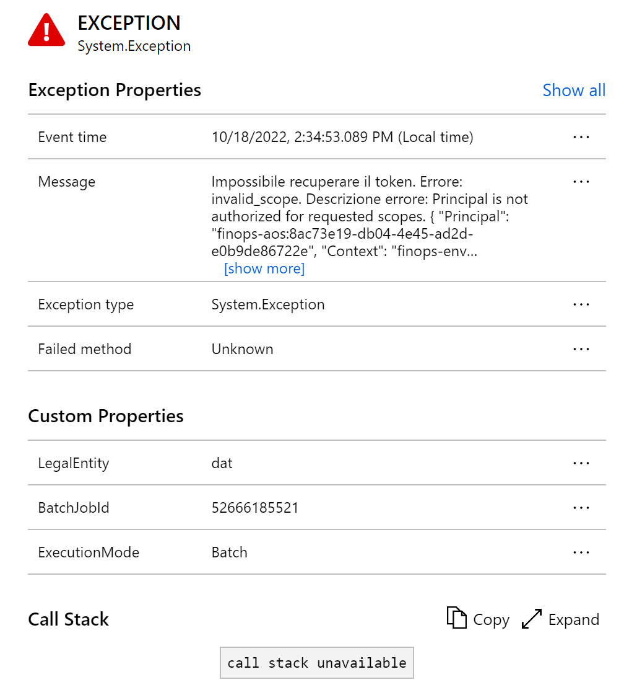

---
# required metadata

title: Monitoring and telemetry using Application Insights
description: This article explains how to use, setup, and configure the Azure Application Insights integration for Finance and Operations apps.
author: LaneSwenka
ms.date: 10/19/2022
ms.topic: article
ms.prod:
ms.technology:

# optional metadata

# ms.search.form:
# ROBOTS:
audience: IT Pro, Developer
# ms.devlang:
ms.reviewer: sericks
# ms.tgt_pltfrm:
ms.custom: 257614
ms.assetid: 558598db-937e-4bfe-80c7-a861be021db1
ms.search.region: Global
# ms.search.industry:
ms.author: laswenka
ms.search.validFrom: 2016-09-30
ms.dyn365.ops.version: AX 7.0.0

---

# Monitoring and telemetry using Application Insights

The monitoring and telemetry feature in Finance and Operations apps is a point-to-point integration directly between an instance of Finance and Operations to the target Application insights destination.  The telemetry generated is not collected by Microsoft for support or other operational reporting, the data is customer owned and customer driven.  This feature allows developers and admins to triage and resolve application issues in near-real time. 

## What telemetry and which tables are being populated in Application Insights?
The following table describes the different telemetry types coming from X++ and the target table name in Application Insights.

|Telemetry type |	Application Insights table name |
|------------|---------------------------------|
|FormRun form loads |	pageViews |
|X++ Exceptions |	Exceptions |
|X++ custom events |	customEvents |
|X++ custom metrics |	customMetrics |

Application Insights has a wide range of features to help you use this data:
* [Create a dashboard](/azure/azure-monitor/visualize/tutorial-logs-dashboards) for an overview of the health of your org.
* Perform proactive monitoring by using [Smart Detection](/azure/azure-monitor/app/proactive-diagnostics).
* [Set up alerts](/azure/azure-monitor/app/tutorial-alert) for important scenarios based on your org.
* Visualize and track common navigation [patterns from a usage](/azure/azure-monitor/app/usage-flows) perspective. This will help you understand, for example, whether a user always selects a specific tab first before navigating back to the main tab and closing the form. If so, this might indicate that a field should be positioned on the first tab, instead of another tab, to save the user time every time they open this record.
* Create custom queries to troubleshoot performance and errors by using the [Logs](/azure/azure-monitor/log-query/log-query-overview) panel under Monitoring on the left pane.

## Overview panel in Application Insights

Application Insights provides different views of the telemetry data it has collected. The Transaction search panel shows a detailed list of the various diagnostics and events from your Finance and Operations app and is a gateway to the other features of the portal. You can drill into each entry for more details. See the following sample.

 

The list can be filtered down to telemetry types of your choosing, and these views can be saved on to Azure Dashboards.
 
## Performance panel in Application Insights
The performance panel is not used by this feature today, but may be populated in the future.

## Failures panel in Application Insights
To open the Failures panel, either select Failures under Investigate on the left pane or select the Failed requests graph.
 
The exceptions table in Application Insights powers the Failures panel.  All excpetions captured in X++ show up as generic System.Exception type exceptions. The count of failed requests and the number of users affected for each operation for the application are shown on this panel. You can see error details for the operations if you click in to them. Failures related to standard business logic, X++ customizations, and ISV solutions are captured here.  This includes errors generated by interactive user activity in the browser, as well as batch jobs processing data asynchronously on a batch AOS. Selecting an operation shows more information about it in the right panel.
 
In the telemetry properties you can identify if a failure originated in Interactive vs Batch, by which user, and from which legal entity.  The exception can also be logged as a bug in Azure DevOps or GitHub using standard integrations from Azure Application Insights.  Exceptions can also be logged in to a bug in your bug tracking system of choice, be it Azure DevOps, GitHub, or others.

 

More information: [Find and diagnose run-time exceptions with Azure Application Insights](/azure/azure-monitor/learn/tutorial-runtime-exceptions)

## Querying data in Application Insights
In Application Insights, go to the Logs panel under Monitoring on the left pane.
 
### Common fields
All the telemetry and events populated in Application Insights have these common fields:
* **cloud_RoleInstance**: This will be populated with the instance type such as ServiceFabric for Sandbox and Production, or a cloud hosted environment name in the case of a VM-based deployment.
* **session_Id** : This uniquely identifies all activities in a single user session. The session value is reset when a user opens a new tab, selects F5/refresh, or closes and reopens the app.  Note this is only enabled if User sessions telemetry is configured.
* **user_Id**: This is currently set to user ID from the UserInfo table of Finance and Operations. Note this is only enabled if User sessions telemetry is configured.
* **client_IP**: This field is always populated to 0.0.0.0 by Application Insights for General Data Protection Regulation (GDPR) compliance. The IP address provided is used to populate the client_City, client_StateOrProvince, and client_CountryOrRegion fields.
* **message**: This field is used to capture the error message shown to the user, in their local language, as well as the X++ stacktrace that originated in the error for failure type telemetry.
* **Custom properties – LegalEntity**: This is populated with the legal entity code that originated in the telemetry.
* **Custom properties – BatchJobId**: This is populated with the record-id of the batch job that resulted in the telemetry.
* **Custom properties – ExecutionMode**: This is populated with Interactive for browser-initiated telemetry, and Batch for batch jobs.  If set to Batch, an accompanying BatchJobId will be populated.

 
## How to enable the public preview feature

> [!Note]
> This feature is not available in Azure China or Azure Government at this time.  We will work to add this to the generally available feature when it comes available.  Today, all of the telemetry is sent **only** to Azure public cloud, so you will not be able to supply an instrumentation key for China or Government at this time.

Since this feature is in public preview, it is first enabled by going to the Feature Management workspace.  Once there, search for the “Monitoring and Telemetry” feature and enable it.  If you do not see this option, and you had the private preview feature enabled you will need to disable that first.  Detailed instructions are in the next section of this article.

Once enabled, you will need to configure the parameters.
1.	Visit the System Administration – Setup – **Monitoring and telemetry parameters** form.
2.	Visit the **Environments** tab first.  Here you will need to populate the LCS Environment Ids for each environment, as well as categorize it as a Development, Test, or Production environment.  The environment Id can be retrieved from the environment details page in Lifecycle Services.
3.	Visit the **Application Insights Registry** tab.  Here you can determine which categories of environments send telemetry to which specific application insights destination.  In this way developer telemetry can go to one place, while Production telemetry can go to another for example.
4.	Lastly, return to the top tab called **Configure**.  Here you can turn on and off each type of telemetry you wish to capture.  You can keep them all enabled, or only enable them when you need to diagnose an issue. 

> [!Note]
> Note that if you disable the telemetry, there is a cache so it will take a few minutes to stop sending. In addition, if it is disabled you won’t receive proactive alerts if you have enabled those in Application Insights.  Lastly, if the telemetry is enabled you will have usage and potential extra costs with Application Insights.

## How to disable the private preview feature
For those who had the private preview software installed, you must first remove that from your environment through Lifecycle Services.  This can be bundled in to your next regularly scheduled package deployment, by following the steps outlined in [Uninstall a package](/dynamics365/fin-ops-core/dev-itpro/deployment/uninstall-deployable-package).  

Once it is removed, you will see the Monitoring and Telemetry feature in the Feature Management workspace.  Once re-enabled, you will notice that none of setup or configurations were changed as the schema names are identical in the public preview, so no data is lost by removing the private preview version.

## What's coming next
Soon we will document how to write custom X++ code to populate custom events and metrics, which are supported as part of the public preview.  We will add more articles soon on these topics.

[!include [banner](../includes/banner.md)]
