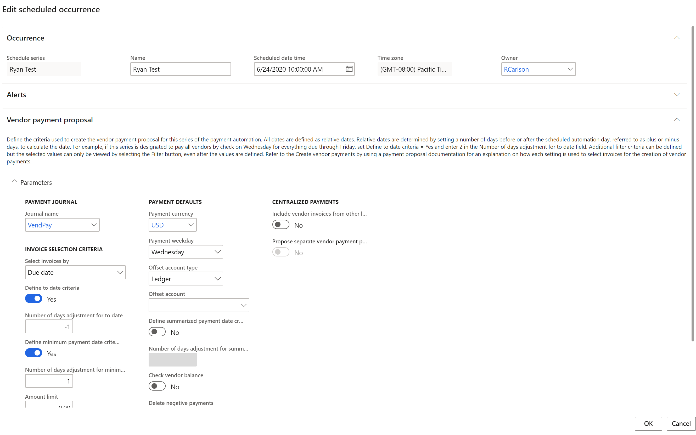

---
# required metadata

title: Process automation
description: This feature allows simple scheduling of processes that will be run by the batch server. The updated calender view of the scheduled work allows end users to view and take action on scheduled and completed work.
author: RyanCCarlson2
manager: tonyafehr
ms.date: 06/24/2020
ms.topic: article
ms.prod:
ms.service: dynamics-ax-applications
ms.technology: 

# optional metadata

ms.search.form: ProcessScheduleSeries
audience: Application User, Developer, IT Pro
# ms.devlang: 
ms.reviewer: sericks
ms.search.scope: Operations, Core 
# ms.tgt_pltfrm: 
# ms.custom: 
ms.search.region: Global
# ms.search.industry:
ms.author: rcarlson
ms.search.validFrom: 2020-06-30
ms.dyn365.ops.version: AX 10.0.11
---

# Process automation

[!include[banner](../includes/banner.md)]

This feature allows simple scheduling of processes that will be run by the batch server. The updated calender view of the scheduled work allows end users to view and take action on scheduled and completed work.

## Administration

The central administration page for all **Process automations** is found in the System Administration module under the **Setup** menu. This page will list all automated processes (series) already set up in the system.  It will also allow you to add new process automations directly from this page.  Once a series is set up, you can manage each series from this list. You can chose to **edit** the entire series, **delete** it, **view all occurrences** in a list view or **disable** the series if you wish to simply pause the scheduled work for some period of time. 

## Calendar view 
One of the key benefits of process automation is the ability to see the scheduled work in a simple calendar view.  This view allows you to see work for a week at a time. You will see this view on the right-hand side of the process automation page. It will be populated with the scheduled work for the selected series. 

## Occurrence changes
Each individual occurrence can be modified without impacting other occurrences defined by the series that originated them. Occurrences of scheduled work can be edited from the calendar view by pressing the **View/Edit** button and selecting **Occurrence**.  This allows you access to all the settings originally shown in the series setup wizard and provides you the ability to make a one-off change for the selected occurrence.  An occurrence of scheduled work can also be disabled by pressing the **disable** button from the calendar view. 

## Developer documentation 
A developer guide is currently being written to allow developers to extend the process automation framwork and have custom processes that you require to be run by the batch server scheduled with the process automation wizard and appear in the calendar view automatically. 
