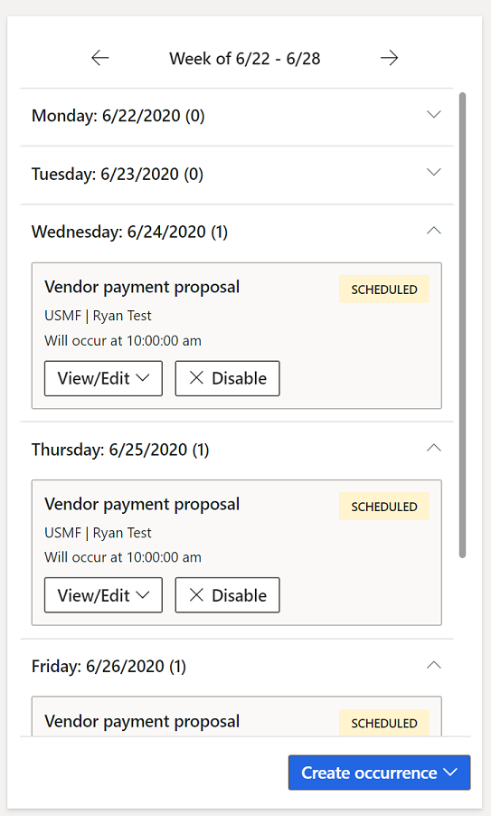

---
# required metadata

title: Process automation
description: This article provides details about how process automation allows simple scheduling of processes that will be run by the batch server.
author: RyanCCarlson2
ms.date: 06/29/2022
ms.topic: article
ms.prod:
ms.technology: 

# optional metadata

ms.search.form: ProcessScheduleSeries
audience: Application User, Developer, IT Pro
# ms.devlang: 
ms.reviewer: sericks
# ms.tgt_pltfrm: 
# ms.custom: 
ms.search.region: Global
# ms.search.industry:
ms.author: rcarlson
ms.search.validFrom: 2020-06-30
ms.dyn365.ops.version: AX 10.0.11
---

# Process automation

[!include[banner](../includes/banner.md)]

Process automation allows simple scheduling of processes that will be run by the batch server. The updated calendar view of the scheduled work allows end users to view and take action on scheduled and completed work.

## Administration

The central administration page for all process automations is found in the System Administration module under the **Setup** menu. This page will list all automated processes (series) that are set up in the system. It will also allow you to add new process automations directly from this page. After a series is set up, you can manage each series from this list. You can choose to edit the entire series, delete it, view all occurrences in a list view, or disable the series if you would like to pause the scheduled work for a while.

Use the **Background processes** tab on this page to administer any background processes that are running in your environment. Select **Edit** to make schedule changes for any background process. These changes can include a sleep time period that will cause the process to "sleep" or pause running for a specified period each day. Select **View most recent results** to view the execution results for each background process.

Any processes that are disabled in feature management won't show when the feature is disabled. Additionally, the process automation scheduling engine won't schedule any occurrences or background processes for a disabled feature. Re-enabling the feature will cause any scheduled occurrences or background processes in the past to run immediately. The process automation scheduling engine relies on the system batch job, **Process automation polling system job** to run. The job shouldn't be altered or tampered with at any time. If this batch job isn't running, or it's in an error state, select **Initialize process automation** to reset the batch job. This reset ensures that any new automations released in a more recent version of the application are initialized.

## Calendar view

One of the key benefits of process automation is the ability to see the scheduled work in a simple calendar view.  This view allows you to see work for a week at a time. You'll see this view on the right side of the **Process automation** page. It will be populated with the scheduled work for the selected series.

## Occurrence changes

Each occurrence can be modified without impacting other occurrences defined by the series that originated them. Occurrences of scheduled work can be edited from the calendar view by selecting the **View/Edit** button and selecting **Occurrence**. This page allows you access to all the settings originally shown in the series setup wizard and provides the ability to make a one-off change for the selected occurrence. An occurrence of scheduled work can also be turned off by selecting the **Disable** button from the calendar view.

## Developer documentation

The process automation framework allows developers to extend the process automation framework. The [Process automation framework](../process-automation/process-automation-framework.md) documentation provides information about how you can create custom processes that you require to be run by the batch server scheduled with the process automation wizard and appear in the calendar view automatically.

[!INCLUDE[footer-include](../../../includes/footer-banner.md)]
