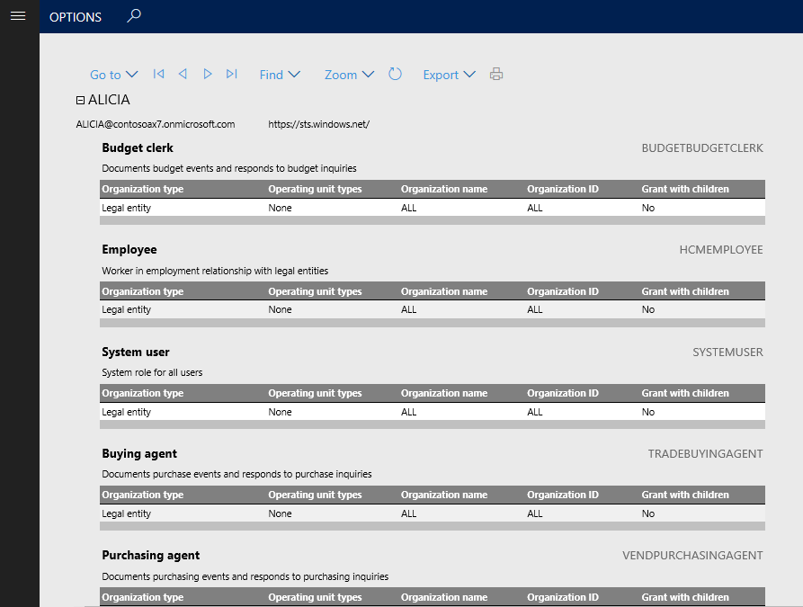
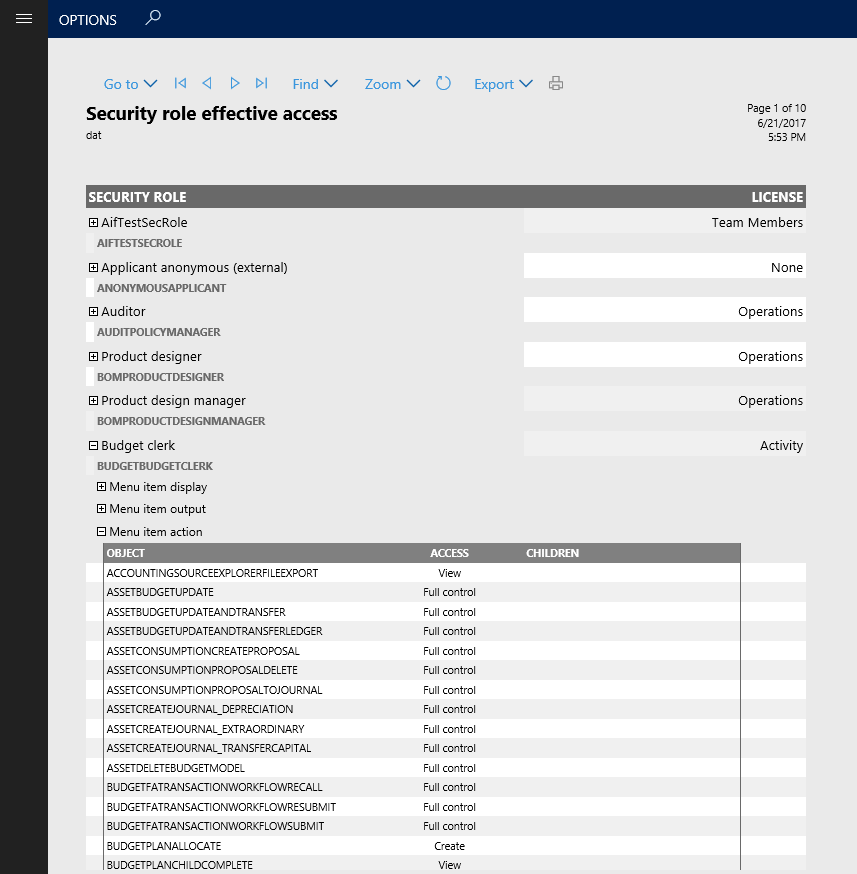

---
# required metadata

title: Out-of-box security reports
description: This topic describes the security reports that help you understand the set of security roles running in your environment and the users assigned to each role.
author:  peakerbl
ms.date: 08/14/2019
ms.topic: article
ms.prod: 
ms.technology: 

# optional metadata

ms.search.form:  SysSecConfiguration, SrsReportViewerForm
audience: IT Pro
# ms.devlang: 
ms.reviewer: sericks
# ms.custom: 
ms.search.region: Global
# ms.search.industry: 
ms.author: peakerbl
ms.search.validFrom: 2017-06-30
ms.dyn365.ops.version: Platform update 8
---

# Out-of-box security reports

[!include [banner](../includes/banner.md)]

Finance and Operations provides a set of rich security reports to help you understand the set of security roles running in your environment and the set of users assigned to each role. In addition to the reports noted in this topic, developers can generate a workbook containing all user security privileges for all roles using **Visual Studio > Dynamics 365 > Addins > View related objects and licenses for all roles**.

Each of the security reports can be found under **System administration \> Inquiries \> Security.** A description of each report is provided below.

## User role assignments

The **User role assignments** report generates a view of the current user role assignments in your system. By default, the report includes all users with roles assigned. You can optionally limit the report to a specific set of users by entering a list of users when generating the report. On the **User role assignments** parameters pane, go to **Records to include** > **Filter.** From here you can add or remove filters to the list of users the report will be generated for.

For each user in the report a list of roles is provided, along with any restrictions at the legal entity or organization level.

## Role to user assignments 

The **Role to user assignment** report provides an aggregation of role assignments. Expanding a role in the report shows the list of users assigned to the role, and expanding the user name shows any restrictions the role has applied. The same method for filtering the set of users can be applied to this report as described for the **User role assignments** report.

## Security role access

The **Security role access** report provides a view of the effective permissions for each security role. This report provides a flattened list of permissions grouped by type across all sub-roles, duties, and privileges contained in the role.

The data set backing the **Security role access** report can be very large, causing the report to take some time to run. If there have been no changes to security roles since the last time the report was run, you can skip building the report by setting the **Rebuild collection** option to **No** on the report parameters pane. This will render the report from the existing data set. If it is the first time the report has run, or there could be changes to the role definitions, the **Rebuild collection** option should be set to **Yes**. You can optionally limit the roles to be included in the report by adding a filter under **Records to include**.

Expanding a role shows the category of objects the role has access to. Expanding one of the object types will show a detailed list of each object of that type included in the role.

## Security duty assignments

The **Security duty assignments** report provides a view of all the duties contained within a role. This report can be configured to run on any collection of roles to ensure that segregation of duties is maintained between roles. By default, the report will include all roles. To limit the roles included, leverage the filtering provided in the **Records to include** section.

Expanding a role in the **Security duty assignments** report will show each duty assigned to the role, along with details of the duty.

## Batch processing of reports
Any of the above reports can be set to run as a batch job by going to the **Run in the background** section of the report's parameter pane. Set **Batch processing** to **Yes**, then provide a batch task job name, batch group, and whether the job should run as Private or Critical. The report will then be created when the batch task runs.

[!INCLUDE[footer-include](../../../includes/footer-banner.md)]