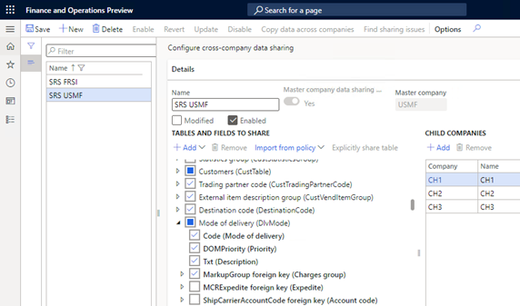
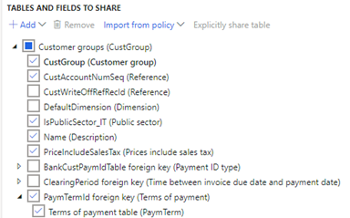

# Cross-company data sharing overview

[!include [banner](../includes/banner.md)]

Cross-company data sharing concept allows you to share company specific master, reference, and setup data across companies within finance and operations deployment.

Two data sharing concepts are available:

- Duplicate record sharing (DRS) is a concept where creating, updating, or deleting of records in for any company in the policy is copied/replicated across all companies in the policy. Updates of fields will also be replicated if selected for sharing in the policy. DRS was the first sharing type made available.
- Master company sharing, also known as single record sharing (SRS), is a concept where a single physical record belonging to a master company is virtually shared across child companies. Create, update, or delete in any company in the policy will update the single records used across all companies. Master company sharing is currently in preview.

## Why should you consider cross-company data sharing?

You should consider cross-company data sharing if you need consistent data across more than one company in a deployment. There might be hundreds of companies or more in a deployment and the business requires that at any time, these companies can rely on a single version of truth for critical data.

Here are some examples of business scenarios for cross-company data sharing:

- All customers should always be available to service and have the same terms across all companies.
- Terms for payment and delivery should always be aligned across all companies per region.
- Configuration for cash and bank management parameters must be aligned to secure consistent processing across all companies.

Using roles and security configuration it's possible to centralize maintenance of shared tables by only providing permissions to selected users in selected companies.

## Data sharing policies

Data sharing is based on configuration of Data sharing policies. Policies let you control the following aspects of data sharing:

- Data sharing concept.
- The tables that are shared.
- The fields that are shared.
- The companies that participate in the sharing.

The same company and table can only be in one enabled policy. It's possible to share the same table in more than policy. This can be required when the limits of records or companies are reached for DRS, or to create policies for tables that need to be shared differently per country/region.

## When to consider duplicate record versus master company sharing (preview)?

Duplicate record sharing comes with several advantages, and you should always select this option whenever possible. This is an important consideration as once master company sharing is enabled, there's no way to reduce the scope or to stop sharing.

Master company sharing should be considered only if there's a need to share:

- Across more than 300 companies in the same policy
  - In a policy, the number of transactions for any table will exceed 2 million records.
  - The limit is calculated as number of records per company x number of companies in a policy.
  - The table is supported for master company sharing.

|  Considerations  | Duplicate record sharing | Master company sharing |
|----|-----|-----|
| Can tables, fields and/or companies be removed after a policy has been enabled/updated? | Yes   | No   |
| Can a policy be disabled? |  Yes  |  No  |
| Can tables, fields, and/or companies be added after a policy have been enabled? | Yes   | Yes  |
| Can mandatory foreign key relations be excluded/unselected for sharing? | No   | No   |
| Can sharing of non-mandatory foreign key fields be manually managed? | Yes   | No   |
| Can fields that aren't selected for sharing still be maintained in each company? | Yes   | No   |
| Max number of companies in a policy |  300  | No limit   |
| Max number of records per table and policy | 2 million    |  No limit  |
| Can tables without a unique index be shared? |  No  |  Yes  |
| What table data sharing types are supported? | Duplicate   | Duplicate and single   |
| Can companies have existing records in a table before sharing is enabled? | Yes   | Only master company   |
| Is it required to select copy data and to validate sharing issues after enabling or updating a policy? |  Yes  |  No  |
| List of officially supported tables |  [Supported tables](/dynamics365/fin-ops-core/dev-itpro/sysadmin/drs-srs-tables)  | [Supported tables](/dynamics365/fin-ops-core/dev-itpro/sysadmin/drs-srs-tables#tables-supported-for-master-company-data-sharing)   |
| Are Microsoft-provided policy templates available?  |  Yes  |  No  |

It's possible to combine duplicate record sharing and master company sharing for the same set of companies by using different policies. It's important to always select all applicable tables and optional foreign key fields in the duplicate record policy and enable the policy before the master company sharing policy is enabled. This way you can share, for example, the customer groups and terms of payment tables, using duplicate record sharing and the customer table using master Company sharing for scenarios where it's only the number of customer records that exceeds the limit and the number of companies don't exceed 300 for the policy.

## Specific considerations for successful data sharing

### Automatically added tables based on selected foreign key fields

Foreign key fields are selected automatically or manually. Tables that are referenced are automatically added when a policy is enabled or updated if the reference table is not already added.

In the example shown in the following image, unless the terms of payment table is added manually, it will be added automatically because the PaymTermId foreign key field has been selected for sharing in the Customer groups table.

> [!NOTE]
> Only one level of child foreign key relationships is added automatically.

Tables that are automatically added when a policy is enabled or updated won't be visible in the Configure cross-company data sharing form until the policy is disabled. The best practice is to manually add tables based on the selected foreign key fields prior to enabling or updating the policy. This makes it possible to understand the tables and fields that will be shared. This way it also provides the option for DRS policies to select fields for these tables, including optional foreign key fields that in turn might add more tables.

### Country/region specific considerations for successful data sharing

Tables that include country/region specific fields and/or logic need to be carefully considered. It might be required to use sharing policies per country/region for certain tables to avoid configuration conflicts. Country/region specific fields will only be viable/editable for companies in that country/region, but updates for these fields might trigger conflicts with companies in other country regions.

### Additional considerations

- Composite tables must be shared in the same policy. If not, a message will inform users to add additional tables during enable and update to secure this.  
- For tables that use number sequences, the number sequence types must be the same across all companies in a sharing policy for those entities.
  - It's also possible to align number sequences during enable and update.

## Limitations

- Foreign key fields that reference Financial dimensions, for example ledger or default dimension can't be shared. Dimensions hold a loose foreign key reference to the backing dimension data, which can reference both company-specific and non-company specific data. Determining the appropriate action to be taken for each dimension value has inherent complexity and would require a change from the current implementation, which could dramatically impact performance.
- Sharing can’t be used with dual-write.
- Deletion of shared records isn't yet fully supported and shouldn't be used. When a shared record is deleted, any references (lookup/reference fields) on transactions might become blank. The same is currently also true for the Rename action that renames the unique record key.

## Duplicate record sharing

The sharing logic for DRS is based on unique keys for records, such as Account for Customers or Name for Terms of Payment. Therefore, it's required that a table must have a unique index to be part of a DRS policy. After a policy is enabled or updated, it's recommended to copy data across companies to process the initial synchronization. Because the volumes can be large, it's recommended to only perform this action during non-business hours.

Only required foreign key fields are selected by default when adding a table to a policy. Optional foreign keys need to be selected manually to be included.

### Conflict resolution

Validation rules are run when a sharing policy is enabled or updated. It's recommended to always use 'Find sharing issues' to view and resolve any inconsistencies between companies. Inconsistencies occur when attribute values differ between companies based on unique record keys. For example, the same name for terms of payment. Examples can be differences in description or payment method. In data sharing issues, it's possible to select the company’s values that should be used for all other companies in the policy - either field by field or the full record.  

### Customer and vendor master data sharing feature

Customer and vendor master data sharing allows you to share customer and vendor data across multiple companies. It can be enabled using the customer and vendor master data sharing feature in Feature management. It's important to consider limits in the maximum number of records and companies stated above. Tables that are part of the party concept might require additional preparations before sharing can be enabled. Any scenario where the party relations differ across companies for the same unique record key will have to be resolved. For example, customer account number 1000 might be related to different party IDs across companies. In this case, it will be required to align party relationships if the customers use the rename function to keep them as separate customers. For more information, see [Party and global address book](../data-entities/dual-write/party-gab.md).

### Stop or reduce sharing scope

Sharing can be stopped by removed for one or more companies before you can update the policy. The approach is applicable for deselecting fields from sharing.

To stop sharing tables, you must disable the policy and then remove the tables. The same is true when deleting an entire policy. For all of these scenarios, synchronization will stop for the excluded scope, but existing records will remain. Sharing will stop automatically at enable or update when the number of records for a table or number of companies exceed the maximum limits.  

## Master company sharing (preview)

Master company sharing is enabled by using the master company data sharing feature in the Feature management module. The feature must be enabled while in Maintenance mode.

> [!NOTE]
> Because it is not possible to stop or reduce the sharing scope, it's strongly recommended to thoroughly test and validate master company data sharing policies, prior to enabling the same configuration in a production environment. Currently being in preview mode, this feature is not supported by Microsoft Support for production use.

All possible fields are selected by default when a table is added to a master company sharing policy. This includes all foreign key fields for all tables that are supported for master company sharing. Master company policies can’t be disabled; therefore, it's especially important to manually add all tables that otherwise will be added automatically based on the default foreign key fields. This is the only way to fully understand the table and field sharing scope that will be enabled. Automatically added tables won't be visible in the Configure cross-company data sharing form. One example is that the Vendors table will be added when the Customer table is added based on foreign key relation, unless the Vendors table is already shared using DRS.

The DRS policy configuration can be used as a workaround mode, when it's required to exclude a table from being automatically added based on foreign key relation. The workaround is to create and enabled a DRS policy for the table adding the Master company and a non-operational company to this policy. Not sharing a foreign key table will also mean that there won't be any value for the foreign key field.  

### Limitations

The following limitations exist:

- Change tracking for child company tables isn't supported. For example, this means that full export must be used in data management.
- Sharing can't be used in combination with Retail Channel Databases.
- Sharing is based on kernel logic. This means that no actual records exist in SQL for child companies.
