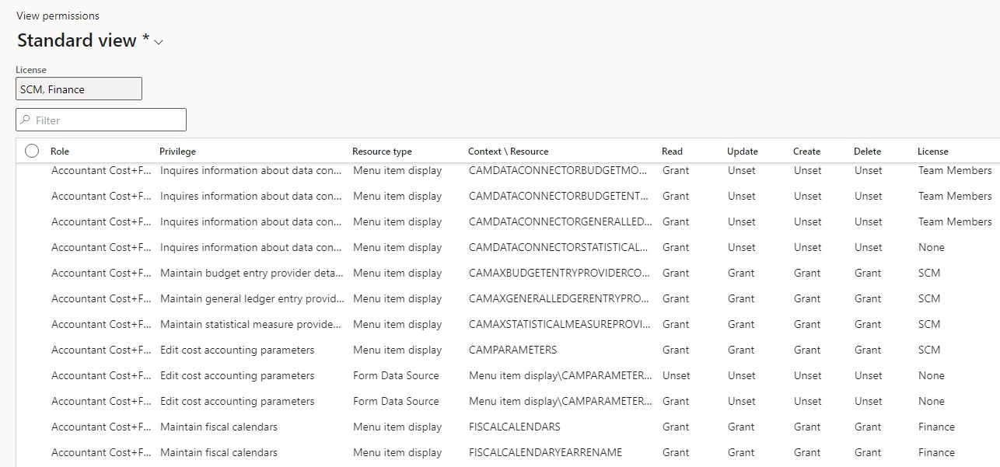
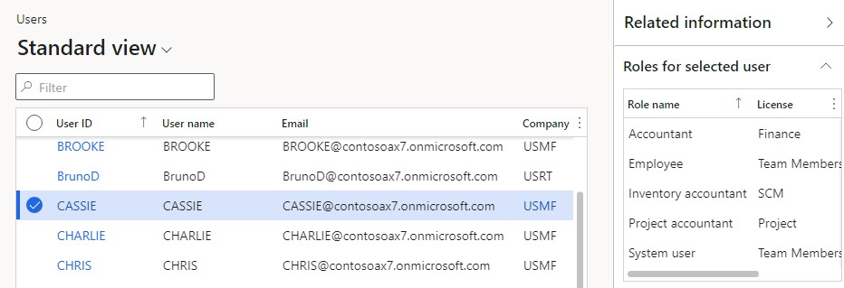
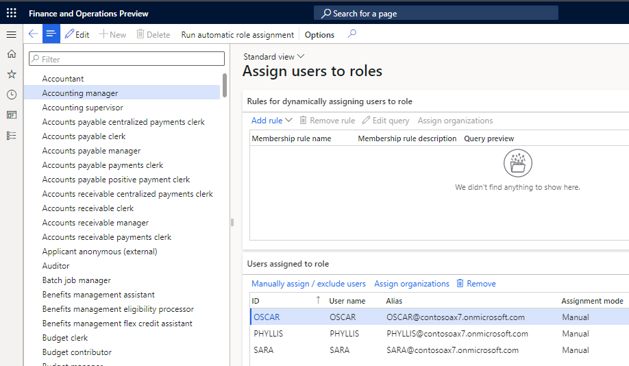
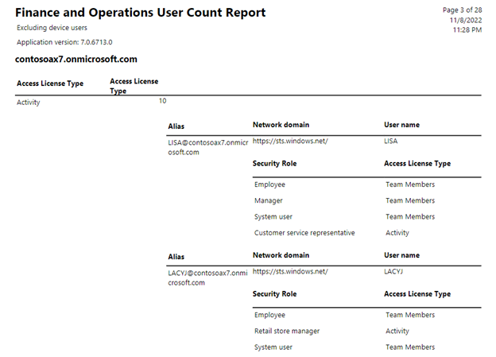
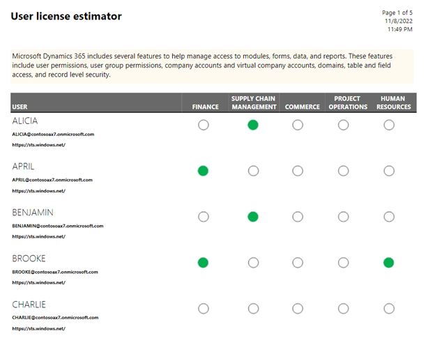
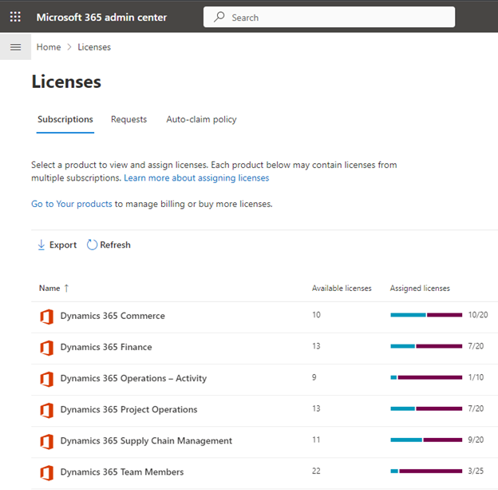

# Stay compliant with user licensing requirements

[!include [banner](../includes/banner.md)]

This article provides an overview of how customers can stay compliant with the user licensing requirements for finance and operations apps. These apps include Microsoft Dynamics 365 Finance, Dynamics 365 Supply Chain Management, and Dynamics 365 Commerce.

The licensing requirements for users are determined by the security roles that are assigned to enabled users. Security roles are built based on a hierarchy of the following elements:

- Sub-roles
- Duties
- Privileges
- Directly referenced securable objects

For more information, see [Role-based security](./role-based-security.md).

The licensing requirements for users are determined at the organization or tenant level. This article is focused on the requirements for a single environment. If you have multiple environments, the requirements must be analyzed across all of them.

A licensing requirement is assigned to every securable object or resource that's included in a user role.

The rest of this article describes the different tools that you can use to ensure that the actual licensing complies with the expected licensing requirements. The first thing to verify is that the user roles have the expected licensing requirements and are assigned to the appropriate users.

## License requirement per role

The **Assign roles to user** dialog box that's opened from the **Users** page can help you understand the impact on user licensing when roles are assigned. You can also use it to get an overview of the licensing requirements for each role. You can use the dialog box itself or export data to Excel for further analysis. Custom roles can require licenses for more than one application.

If a role has unexpected licensing requirements, you can use the **View permissions** page to understand what security resources and grants are driving the requirements.

## Licensing requirements on the View permissions page

During security configuration on the **Configure security** page, you can select the following items:

- Any security object
- A role
- A duty
- Permissions

Select **View permissions** to view all permissions that are currently included and their licensing requirements. The header of the **View permissions** page shows the required license level.

You can filter the **License** column to focus on the resources for an unexpected license. The next step might be to remove those resources or modify the grants. For example, you might grant **Read** access instead of full access, and then reevaluate the impact on licensing requirements. We recommend that you first change the security configuration in a non-production environment and validate the impact before you update the production environment.

The **Operations** license value indicates that a full user license for finance and operations apps is required or compliant.

We recommend that you always use the **View permissions** page while you configure security for roles, duties, and privileges. In that way, you can evaluate the impact on user licensing.

## Roles per user with licensing information

You assign roles to users on the **Users** page (**System administration \> Users**). You can view license requirements for each user and role in the **Roles for selected user** FactBox.

## Users per role

You can use the **Role to user assignment** report or the **Assign users to role** page to view all users who are assigned a specific role.

## Enabled users

For internal security and to help avoid licensing requirements for users who have left or aren't actively using the finance and operations apps, we recommend that you disable those users on the **Users** page.

## User license counts report

You can use the **User license counts** report to get a count of required licenses per license type (for example, **Team members**, **Activity**, and **Operations**). This report is the only report that is required for customers who are on the legacy unified operations licensing model. It provides totals for Unified operations, Activity, and Team members licenses. It also provides details about each user and the licensing requirements for each assigned role. Users are listed under the highest license type. The **User counts history** report shows total counts per date without any details.

> [!NOTE]
> This report depends on the **Named user license count reports processing** batch job. To determine when the batch was last run, use the **Batch job history** page.

Customers who are on the app-specific licensing model must first use the **User license counts** report to determine the licenses that are required for the **Activity** and **Team members** license types only. They must then use the **User license estimator** report for full user licenses.

## User license estimator report

The **User license estimator** report indicates how many combined *base* and *attach* licenses are required. For more information about *base* and *attach* licenses, see the "Base licenses and cost savings opportunities for 'attach' licenses" section of the [Microsoft Dynamics 365 Licensing Guide](https://go.microsoft.com/fwlink/?LinkId=866544&amp;clcid=0x409).

The **User license estimator** report can't distinguish *base* and *attach* licenses for a user. The choice between them is made when licenses are assigned. A new comprehensive report is expected to be available during the calendar year 2023.

If users have one indicated application license (as is the case for April in the previous illustration), that specific app *base* license (Finance in this case) must be assigned to them.

If users have more than one indicated application license (as is the case for Brooke in the previous illustration), licenses for all apps must be assigned to them: a *base* license for one of the apps and *attach* licenses for the rest.

If users have no indicated application license (as is the case for Charlie in the previous illustration), any finance and operations *base* license must be assigned to them. This license will be a license for Finance, Supply Chain Management, Commerce, Project Operations, and Human Resources. 

You can perform a rough compliance check by using the combined total for required app-specific licenses at the bottom of the report. That total must equal or be less than the total number of available *base* and *attach* licenses for finance and operations apps in the Microsoft 365 admin center.

## Available and assigned licenses

You can view available and assigned licenses under **Licenses** in the Microsoft 365 admin center.

## Additional resources

For information about how to buy and license finance and operations apps, see [Microsoft Dynamics 365 Licensing Guide](https://go.microsoft.com/fwlink/?LinkId=866544&amp;clcid=0x409).

For information about how to assign licenses to users in the Microsoft 365 admin center, see [Assign licenses to users](/microsoft-365/admin/manage/assign-licenses-to-users).

Additional user licenses are required when multiple implementation projects exist for the same tenant. For more information, see [Multiple LCS projects and production environments on one Azure AD tenant](../../fin-ops/get-started/implement-multiple-projects-aad-tenant.md#licensing-requirements).

[!INCLUDE[footer-include](../../../includes/footer-banner.md)]
