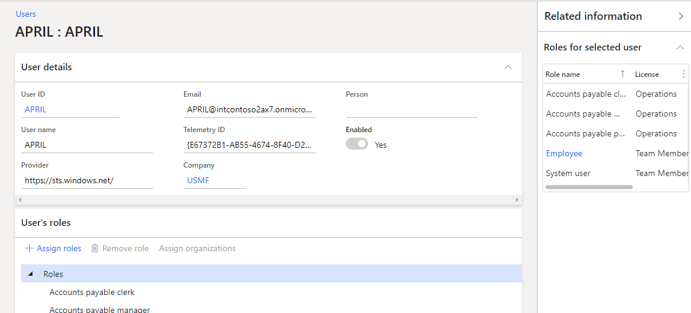
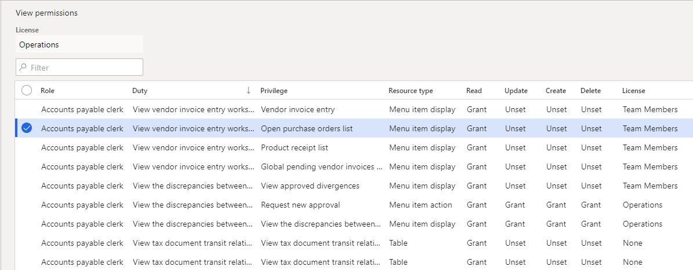
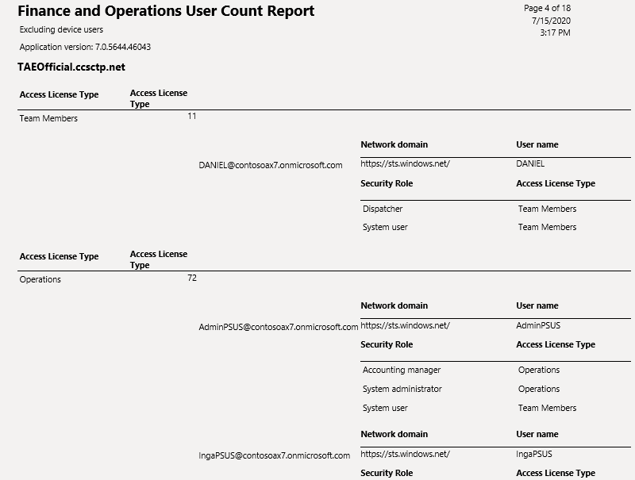
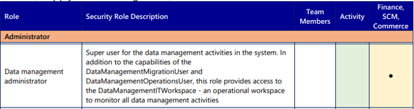
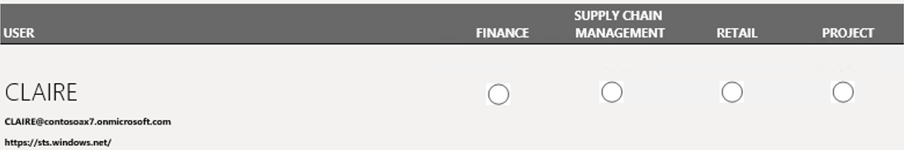
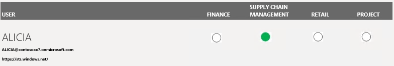
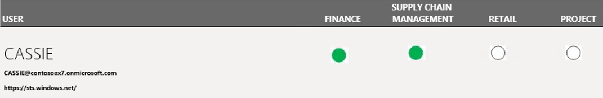

---
# required metadata

title: Stay compliant with user licensing requirements
description: This topic provides information about how you can stay compliant with the user licensing requirements for Finance and Operations apps.
author: peakerbl 
ms.date: 10/06/2020
ms.topic: article
ms.prod: 
ms.technology: 

# optional metadata

# ms.search.form:  
audience: IT Pro
# ms.devlang: 
ms.reviewer: sericks
# ms.tgt_pltfrm: 
# ms.custom: 
ms.search.region: Global
# ms.search.industry: 
ms.author: chaubold
ms.search.validFrom: 2018-05-30 
ms.dyn365.ops.version: AX 7.0
---

# Stay compliant with user licensing requirements

[!include [banner](../includes/banner.md)]

This topic provides an overview of how customers can stay compliant with the user licensing requirements for Finance and Operations apps, such as Microsoft Dynamics 365 Finance, Dynamics 365 Supply Chain Management, and Dynamics 365 Commerce.

The licensing requirements for users are determined by the security roles that are assigned to those users. Security roles are built based on a hierarchy of:

- Sub-roles
- Duties
- Privileges
- Directly referenced securable objects 

For more information, see [Role-based security](./role-based-security.md).

The licensing requirements for users are determined at the organization or tenant level. This topic is focused on the requirements for a single environment. If you have multiple environments, the requirements must be analyzed across all of them.

A licensing requirement is assigned to every securable object. Examples of licensing requirements include **None**, **Team members**, **Activity**, and **Operations**. The **Operations** licensing requirement indicates that a full user license is required. Some privileges are unique to a specific full user license and require a *base* or *attach* license for the full user license be assigned to the user. For more information, see the [User license estimator report](#user-license-estimator-report) section later in this topic.

The rest of this topic describes the various tools that you can use to ensure that the actual licensing complies with the expected licensing requirements.

## Roles for selected user FactBox on the Users page

You assign roles to users on the **Users** page (**System administration \> Users**). You can view license requirements for each role in the **Roles for selected user** FactBox.

The maximum license requirement determines the actual licensing requirement for a user. If any license requirement is identified as **Operations**, you must use the [User license estimator](#user-license-estimator-report) report to determine the full user licensing requirements.

> [!NOTE]
> Starting with platform update for version 10.0.15, the required license types are extended to include application specific license types such as Commerce, Finance, and Supply Chain Management. This extension makes it possible to view the actual license requirements when you assign roles to users and when using the Roles for the selected user FactBox. More than one value can be displayed for the required license type. 

## View permissions page

During security configuration on the **Configure security** page (**System administration \> Security \> Configure security**), you can select any security object, a role, duty, or permissions, and then select **View permissions** to view all permissions that are currently included and their licensing requirements. The header of the **View permissions** page shows the required license level.

> [!NOTE]
> Starting with platform update for version 10.0.15, the required license types are extended to include application specific license types such as Commerce, Finance, and Supply Chain Management. This extension makes it possible to identify the specific security objects that determine the actual license requirements while also configuring security. More than one value can be displayed for the required license type. 

## User license counts report

The **User license counts** report (**System administration \> Inquiries \> License**) is used to get a count of required licenses per license type (for example, **Team members**, **Activity**, and **Operations**).

The report also provides details about each user and the licensing requirements for each assigned role. Users are listed under the highest license type. If the license requirement is identified as **Operations**, you must use the [User license estimator](#user-license-estimator-report) report to determine the specific full user licensing requirements.

The **User counts history** report shows total counts per date, but without any details.

> [!NOTE]
> This report depends on the **Named user license count reports processing** batch job. To determine when the batch was last run, use the **Batch job history** page.

## User license estimator report

If the previously mentioned tools have identified that any users require a license of the **Operations** type, you can use the **User license estimator** report (**System administration \> Inquiries \> License reports**) to get a count of specific licensing requirements for those users. The report includes only those users.

If no privileges that require a specific full user license have been assigned to a user, that user is shown, but no specific full user licenses are marked. That user will be compliant with any full user license that is assigned. In the example in the following illustration, the **Database management administrator** role is assigned to a user, and no other roles that require a license of the **Operations** type are assigned.

Based on the licensing guide, this user is compliant with any full user license.

Admin rights apply across the Finance, Supply Chain Management, and Commerce apps. For example, if you have a Finance license, you have the admin rights for Finance, Supply Chain Management, and Commerce.

This principle might apply to several roles that are provided by Microsoft and customizations, based on the included privileges. No specific license is indicated for these users on the **User license estimator** report.

Alternatively, if privileges that require a specific full user license have been assigned to a user, that license is indicated when you look at the licenses that are assigned to the user. In the example in the following illustration, the user must have a *base* license for Supply Chain Management.

If privileges that require more than one specific full user license have been assigned to a user, those licenses are indicated when you look at the licenses that are assigned to the user. In this case, the user must have a *base* license for one of the licenses and an *attach* license for all other full user licenses that are required. In the example in the following illustration, the user must have either a *base* license for Finance and an *attach* license for Supply Chain Management, or a *base* license for Supply Chain Management and an *attach* license for Finance.

The totals per specific full user license counts aren't divided into *base* licenses and *attach* licenses.

> [!NOTE]
> The total count per specific full user license and evaluation of custom privileges are included starting in the release of the platform update for version 10.0.13. The report can't separate the *base* and *attach* license requirements. Therefore, it lists only the total full user licenses requirements.

## Additional resources

For information about how to buy and license Finance and Operations apps, see [Microsoft Dynamics 365 Licensing Guide](https://go.microsoft.com/fwlink/?LinkId=866544&amp;clcid=0x409).

For information about how to assign licenses to users in the Microsoft 365 admin center, see [Assign licenses to users](/microsoft-365/admin/manage/assign-licenses-to-users).

Additional user licenses are required when multiple implementation projects exist for the same tenant. For more information, see [Multiple LCS projects and production environments on one Azure AD tenant](../../fin-ops/get-started/implement-multiple-projects-aad-tenant.md#licensing-requirements).

[!INCLUDE[footer-include](../../../includes/footer-banner.md)]