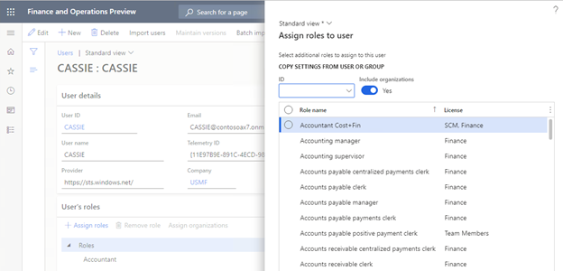

# Stay compliant with user licensing requirements

[!include [banner](../includes/banner.md)]

This article provides an overview of how customers can stay compliant with the user licensing requirements for finance and operations apps, such as Microsoft Dynamics 365 Finance, Dynamics 365 Supply Chain Management, and Dynamics 365 Commerce.

The licensing requirements for users are determined by the security roles that are assigned to enabled users. Security roles are built based on a hierarchy of:

- Sub-roles
- Duties
- Privileges
- Directly referenced securable objects 

For more information, see [Role-based security](./role-based-security.md).

The licensing requirements for users are determined at the organization or tenant level. This article is focused on the requirements for a single environment. If you have multiple environments, the requirements must be analyzed across all of them.

A licensing requirement is assigned to every securable object/resource that is included in a user role. 

The rest of this article describes the various tools that you can use to ensure that the actual licensing complies with the expected licensing requirements. The first thing to verify is that the user roles have the expected licensing requirements and that they are assigned to the appropriate users.

## License requirement per role

The **Assign roles to user** dialog in the **Users** page makes it possible to understand user licensing impact when assigning roles. It can also be used to get an overview of licensing requirements for each role. Use the dialog itself or export to Excel for further analysis. Note that custom roles can require licenses for more than one application.

For unexpected licensing requirements for a role, it is possible to use the **View permission** page to better understand what security resources and grants are driving the requirements. 

## Licensing requirements in the View permissions page

During security configuration on the **Configure security** page, you can select any security object, a role, duty, or permissions, and then select **View permissions** to view all permissions that are currently included and their licensing requirements. The header of the **View permissions** page shows the required license level.

The **License** column can be filtered to focus on the resources for the unexpected license. Next step could be to remove these resources or modify the grants. For example, **Read** instead of full access and then reevaluate impact on licensing requirements. It is recommended to first change security configuration in a non-production environment and validate the impact before updating production. 

The **Operations** license value indicates that any full user finance and operations apps license is required/compliant.  

It is recommended to always use the **View permissions** page while configuring security for roles, duties, and privileges, in order to evaluate the user licensing impact.

## Roles per user with licensing information

You assign roles to users on the **Users** page (**System administration \> Users**). You can view license requirements for each user and role in the **Roles for selected user** FactBox.

## Users per role

The **Role to user assignment** report or the ** Assign users to role** page can be used to view all users that are assigned a specific role.

## Enabled users

For internal security and to avoid licensing requirements for users that have left or are not actively using the finance and operations apps, it is recommended to disable these users in the **Users** page.

## User license counts report

The **User license counts** report is used to get a count of required licenses per license type (for example, **Team members**, **Activity**, and **Operations**). This report is the only report needed for customers on the legacy unified operations licensing model. The report provides totals for Unified operations, Activity and Team members licenses. 

The report also provides details about each user and the licensing requirements for each assigned role. Users are listed under the highest license type. 
The **User counts history** report shows total counts per date, but without any details.

> [!NOTE]
> This report depends on the **Named user license count reports processing** batch job. To determine when the batch was last run, use the **Batch job history** page.

For customers on the app specific licensing model, it will be required to first use the **User license count** report to determine required licenses for **Activity** and **Team members** only and then to use the **User license estimator** report for full user licenses.

## User license estimator report

The **User license estimator** report will tell how many combined **base** and **attach** licenses are required. For more details about base and attach licenses, see the **Base licenses and cost savings opportunities for “attach” licenses** section in the [Microsoft Dynamics 365 Licensing Guide](https://go.microsoft.com/fwlink/?LinkId=866544&amp;clcid=0x409). 

The **User license estimator** report cannot distinguish between **base** vs. **attach** licenses for a user, since this it a choice when assigning licenses. A new comprehensive report is expected to be available during calendar year 2023, stay tuned!

Users with one indicated application license, e.g., **April** above, are required to be assigned that specific app **base** license, e.g., **Finance** (Dynamics 365 Finance). 

Users with more than one indicated application license, e.g., **Brooke** above, are required to be to be assigned licenses for all apps, one **base** and **attach** for the others. 

Users listed in the reports, but without any indicated application license, e.g., **Charlie** above, are required to be to be assigned any Finance and Operations **base** license, i.e., Finance, Supply Chain Management, Commerce, Project Operations and Human resources. 

A rough compliance check can be made by using the combined total for required app specific licneses at the bottom of the report, is equal or less than the total of available **base** and **attach** licenses for Finance and Operations apps in the **Microsoft 365 Admin center**. 

## Available and assigned licenses

Available and assigned licenses can be viewed in the **Microsoft 365 Admin center** under **Licenses**.

## Additional resources

For information about how to buy and license finance and operations apps, see [Microsoft Dynamics 365 Licensing Guide](https://go.microsoft.com/fwlink/?LinkId=866544&amp;clcid=0x409).

For information about how to assign licenses to users in the Microsoft 365 admin center, see [Assign licenses to users](/microsoft-365/admin/manage/assign-licenses-to-users).

Additional user licenses are required when multiple implementation projects exist for the same tenant. For more information, see [Multiple LCS projects and production environments on one Azure AD tenant](../../fin-ops/get-started/implement-multiple-projects-aad-tenant.md#licensing-requirements).

[!INCLUDE[footer-include](../../../includes/footer-banner.md)]
