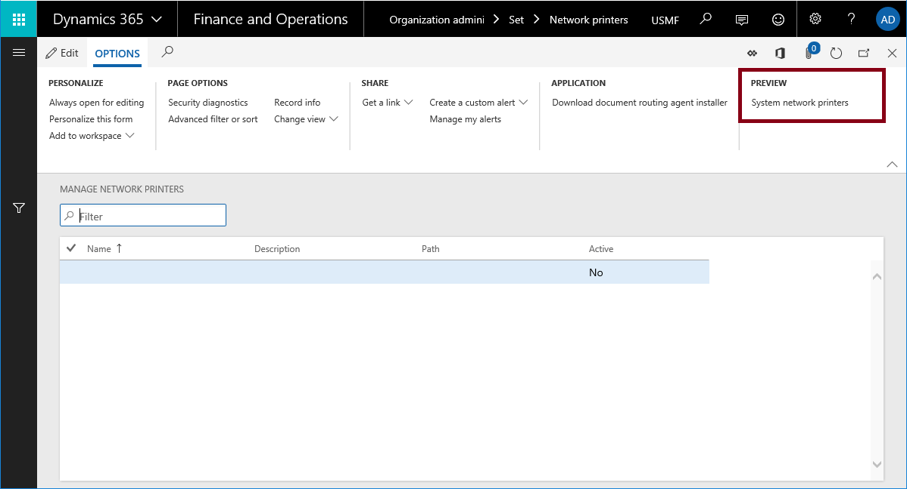

---
# required metadata

title: Manage access to network printers across legal entities
description: This article provides information about how to use the System administration utility to set up network printers.
author: RichdiMSFT
ms.date: 12/11/2018
ms.topic: article
ms.prod: 
ms.technology: 

# optional metadata

# ms.search.form: 
# ROBOTS: 
audience: IT Pro
# ms.devlang: 
ms.reviewer: sericks
# ms.tgt_pltfrm: 
ms.assetid: 6135bcf7-bf8f-42ae-b2c6-458f6538e6a4
ms.search.region: Global
# ms.search.industry: 
ms.author: richdi
ms.search.validFrom: 2018-12-04
ms.dyn365.ops.version: AX 7.0.0

---

# Manage access to network printers across legal entities

[!include [banner](../includes/banner.md)]

> [!IMPORTANT]
> Access to the System administration utility is managed by the Carbon Flighting Service. The **System network printers management** page is only available for system admins.

Domain admins register network printers with the finance and operations service by using the Document Routing Agent (DRA). After the printers are registered, the organization admin is responsible for making them available to users. The settings are managed on the **Manage network printers** page (**Organization administration** \> **Setup** \> **Network printers**).

Because the settings on the **Manage network printers** page are intended for organization admins, the data is limited to the active legal entity. Because system admins can't manage network printer settings across legal entities, it can be difficult to update settings across legal entities in some situations, such as when network printer changes occur. For example, a network printer instance is deleted when a network printer path is updated or hardware is replaced, or someone tries to purge all documents in the printer queue.

The System administration utility is a recovery tool for inadvertent print instructions. It also simplifies the task of managing network printer settings, such as access from specific legal entities.

## Access the feature
After the feature has been turned on, a **Preview** group will appear on the **Options** tab of the Action Pane on the **Manage network printers** page.

1. Select **Organization administration** > **Setup** > **Network printers**.
2. On the Action Pane, in the **Preview** group, select **System network printers**.
3. On the **System network printers** page, register the network printers with the service by using the DRA. You will see the configuration information for each legal entity in the organization.

## Supported operations
Currently, the System administration utility supports only Delete operations. Here are the results if you delete network printers by using the **System network printers** page:

- All documents in the printer queue that are directed at the printer are deleted.
- The network printer is deleted for all legal entities in the organization.
- Domain admins can register devices by using the old printer name.
- The organization admins can continue to use the existing tools to manage network printer settings for a single legal entity.

[!INCLUDE[footer-include](../../../includes/footer-banner.md)]
