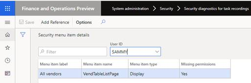

# Security diagnostics for task recordings

[!include [banner](../../includes/banner.md)]

## Before you begin

This article provides information about how to analyze and manage security permission requirements based on a task recording. Before you complete the steps in this article, you must have a task recording of the business process that you want to analyze. To record a business process, see [Task recorder resources](../../user-interface/task-recorder.md). 

## Manage security for a task recording

1. Go to **System administration** > **Security** > **Security diagnostic for task recording**.
2. Open the task recording from its location. Select **Open from this PC** or **Open from Lifecycle Services**, and then select **Close**.
3. This will open the **Security menu item details** page that lists the security objects required for the process.

 > [!NOTE]
 > The **Action** and **Output** menu items are not included in the list.

4. In the **User ID** field, select a user. If the user does not have permissions for some menu items, the **Missing permissions** field will update to **Yes**.
  
  

5. Select **Add Reference** to see a list of the security objects, including roles, duties, and privileges that grant the missing permission.
6. Select a security object from the list:

	- If **Role** is selected, select **Add role to user**. This will open the **Assign users to roles** page. For more information, see [Assign users to security roles](assign-users-security-roles.md) page.
	- If **Duty** is selected, select **Add duty to role**, select the roles that the duty should be added to, and then select **OK**.
	- If **Privilege** is selected, select **Add privilege to duties**, select the roles that the duty should be added to, and then select **OK**.

[!INCLUDE[footer-include](../../../../includes/footer-banner.md)]
