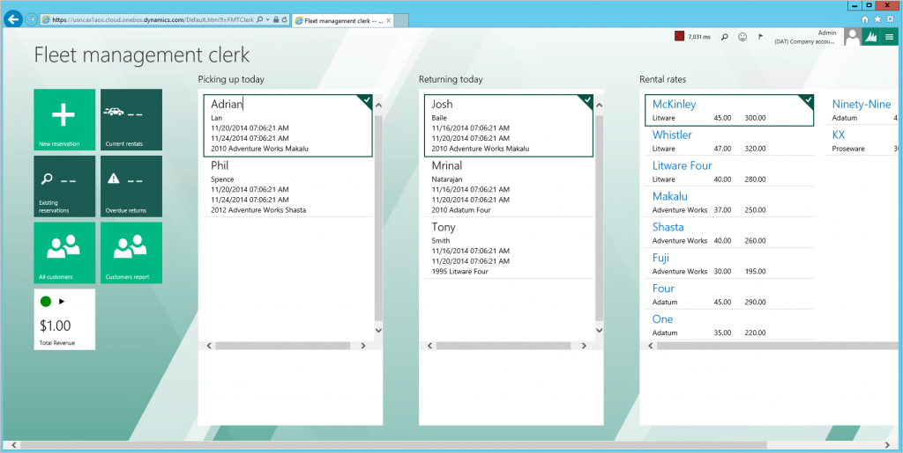
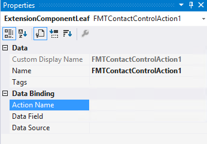
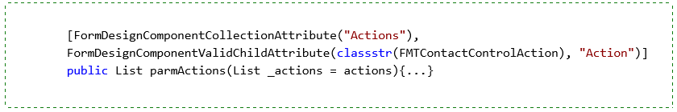
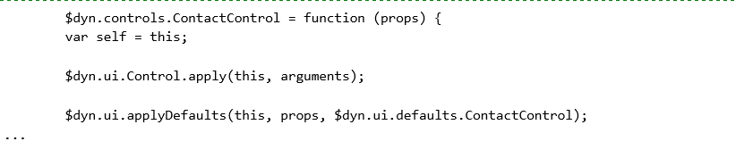

# Build extensible controls

[!include [banner](../includes/banner.md)]

This article describes how to create new application controls that have a property sheet in Visual Studio and have server-side business logic.

## Prerequisites

For this tutorial, you must access the environment by using Remote Desktop, and you must be provisioned as an administrator on the instance. For more information, see [Deploy and access development environments](../dev-tools/access-instances.md).

## Overview
The Control Extensibility Framework lets you create new application controls. You can use the same tools that Microsoft uses to build controls that are already present in the program, such as the chart control. Three important artifacts are involved in the process of developing an extensible control:

-   **The X++ build class** – The build class lets a developer define the properties that appear in the Microsoft Visual Studio property sheet for the control. The developer can also define the modeling behavior for the control when it's used in the form designer. The build class is consumed by the run-time class to initialize the state of the control based on the value of properties in the property sheet.
-   **The X++ run-time class** – The run-time class lets a developer define server-side business logic and data access patterns for an extensible control. Two concepts that are specific to building extensible controls are the *properties* and *commands* that the X++ class defines. Each property and command that is defined is serialized into a JavaScript view model at run time, and can be consumed by the client parts of the extensible control (the HTML and JavaScript). These properties and commands are the main channels for moving information between the server-side and client-side parts of the control.
-   **The control HTML and JavaScript** – Each control uses HTML, JavaScript, and CSS files to define control visualization and client-side interaction patterns. By using the Microsoft Dynamics HTML binding syntax together with jQuery, a developer can consume the properties and commands that are defined in X++ to design powerful data-driven UI.

All three artifacts of extensible control development are explained in more detail in the following sections.

## Key concepts
-   Defining an extensible control's design-time behavior
-   Defining an extensible control's run-time behavior
-   Defining an extensible control's view by using HTML and CSS
-   Defining an extensible control's view model by using JavaScript

## Setup
### Import the tutorial project and transactional data

Use Visual Studio to import the tutorial project. The tutorial project includes the artifacts that you will use to complete this tutorial. Use Visual Studio to open the FMTutorial project and load the data for the tutorial. You will use the **FMTDataHelper** class to load data for the Fleet Management tutorial.

1. Download the Fleet Management sample from <https://github.com/Microsoft/FMLab>, save it to **C:\\**, and unzip it.
2. On the desktop, double-click the Visual Studio shortcut to open the development environment.
3. On the <strong>Dynamics 365 **menu, click **Import Project</strong>.
4. In the **Import Project** dialog box, next to the **File name** text box, click the ellipsis button (...).
5. In the **Select the file to import** dialog box, browse to **C:\FMLab**, click **FMTutorialDataModel.axpp**, and then click **Open**.
6. In the **Project file location** field, enter **C:\FMLab**.
7. Select the **Overwrite Elements** check box and the **Current solution** option. The following screen shot shows the completed **Import Project** dialog box. 

   

8. Click **OK**.
9. In Solution Explorer, under the **FMTutorial** project, expand **Classes**.
10. Right-click **FMTDataHelper**, and then click **Set as Startup Object**.
11. On the **BUILD** menu, click **Rebuild Solution**. You use the rebuild to make sure that all the files in the project are built, regardless of timestamps. You can view the build progress in the **Output** window.
12. After the build is completed, press Ctrl+F5 to run the project. The **Login** form closes when authentication succeeds, and then the data is loaded.

### Set up aggregate data

Use FMTAggregateMeasurements to populate the Microsoft SQL Server Analysis Services database with aggregate data.

> [!NOTE]
> These steps must be completed immediately after you use the **FMTDataHelper** class to import data. You may **NOT** need to do these steps if the [aggregate measure is "InMemoryRealTime"](../analytics/model-aggregate-data.md), depending on what tutorial files you have.

1.  In Solution Explorer, under **Analytics**, double-click **FMTAggregateMeasurement**.
2.  In the designer, right-click **FMTAggregateMeasurement**, and then click **Deploy and Process**.

## Preview the clerk workspace
Before you begin to build the contact control, look at the appearance of the current implementation. In the following sections, you will use the Control Extensibility Framework to enrich the visualization of the controls and the form.

1.  In Solution Explorer, expand **Forms**, right-click **FMTClerkWorkspace**, and then click **Set as Startup Object**.
2.  Press Ctrl+F5 to open the **Fleet management clerk** page in Internet Explorer. As the following screen shot shows, the data on this page appears as a simple grid in a list style that contains several string and date controls. 

    

3.  Exit Internet Explorer.

## Modify the build class for the contact control
To save time, you will work on a partially completed extensible control that is named the contact control. You will extend the contact control to complete its design, run-time, and visualization behaviors. The partially completed contact control already supports multiple title fields, subfields, and action buttons. However, it doesn't currently support an image. To add image support, you must extend the design experience for the contact control. You will add a data field that can specify image data.

### Technical overview

To see an example of a build class, in Solution Explorer, expand **Classes**, right-click **FMTBuildContactControl**, and then click **View Code**. The class code appears in the code editor. **FMTBuildContactControl** is the build class for the contact control. For each extensible control, the build class defines the properties that the control shows in the property sheet. The build class also defines the modeling experience for the control in the Visual Studio form designer. There are three primary design-time behaviors that you can define for an extensible control. Each behavior is declaratively defined by using a **FormDesign** attribute. Here are the design-time behaviors that you can define:

-   **Name** – You can specify the control name that appears in the form designer when you add the control to a form. To specify the name, add a **FormDesignControlAttribute** attribute to the build class declaration of the extensible control. For example, the following declaration of the **FMTBuildContactControl** class shows the attribute. 

    

-   **Designer properties** – These are the properties that you see in the property sheet when you add the control to a form. There are several attributes that let you add various types of designer properties. For example, the **FormDesignPropertyAttribute** attribute adds a property to the property sheet, and the property name and the section are supplied as arguments to the attribute. For example, the following code adds the **Action Name** property to the **FMTContactControlAction** class. 

    

    The following screen shot shows how this property appears in the **Properties** pane in Visual Studio. 

    

-   **Child design components** – These are child nodes that you see after you add the control to a form. There are two types of child design components: leaf and leaf collection.
    -   A leaf is defined by using a **FormDesignComponentAttribute** attribute on an X++ method that accepts or returns another build class. The build class determines the properties that the leaf has in the property sheet.
    -   A leaf collection is defined by using a **FormDesignComponentCollectionAttribute** attribute. The allowable leaf types for the collection are defined by using **FormDesignComponentValidChildAttribute** attributes.

    For example, the following code adds a leaf collection that is named **Actions** for the **FMTBuildContactControl** class. 

     

    The following screen shot shows how the specified child design component appears when you add the control to a form. 

    

### Tutorial steps

1.  Check that the code for the **FMTBuildContactControl** class appears in the code editor. If it doesn't, in Solution Explorer, expand **Classes**, right-click **FMTBuildContactControl**, and then click **View Code**.
2.  Add a child design component to the FMTBuildContactControl class. A child design component lets a developer who places the control in a form to specify the image that appears on the control. In this step, you will add the **FormDesignComponentAttribute** attribute to create a new entry in the property sheet. You will then add the **FormDesignPropertyDataFieldAttribute** attribute, which indicates that the new designer property enables the selection of a data field.
    1.  Add the highlighted code that follows to the declarations for the class. This code adds the **FormBindingDataField** field to the X++ that the **FMTBuildContactControl** class is using. 

        

    2.  Add the following code to the **FMTBuildContactControl** class. Add this method after the designer property for the data source. 

        

        > [!NOTE]
        > The child design component will show the properties that are available on the **FormBindingDataField** build class. This is appropriate, because you want to enable image data binding to a data field and data source. This is all that is required to add a designer property to the build class of the contact control.

3.  Press Ctrl+S to save your changes, and then close the code editor.
4.  In Solution Explorer, right-click **FMTutorial**, and then click **Build**.
5.  If the **FMTPickingUpTodayPart** form isn't already open, expand **Forms**, and then double-click **FMTPickingUpTodayPart**. The form opens in the form designer.
6.  In the form designer, expand **Design** &gt; **PickingUpTodayGrid**, and then select and delete the controls that currently appear in the grid.
7.  Right-click **PickingUpTodayGrid**, point to **New**, and then click **FMTContactControl**. Expand the **FMTContactControl** node, and notice that **Image** appears as a new child design component. The following illustration shows the contact control in the form designer. 

     

    You must also update the run-time class for the contact control to consume the design-time changes. You will revisit adding the control to the form and specifying data bindings and property values later.
8.  Press Ctrl+S to save your changes, and then close the form designer.

## Modify the runtime class for the contact control
Next, you must modify the run-time class to read the data source and data field for the image from the build class. You must also create a run-time property, so that the image data is available to the control's client HTML and JavaScript.

### Technical overview

To see an example of the run-time class, in Solution Explorer, expand **Classes**, right-click **FMTContactControl**, and then click **View Code**. The class opens in the code editor. **FMTContactControl** is the run-time class for the contact control. The class defines the run-time behavior of the contact control. The run-time class typically contains X++ for data access or business logic. In addition, there are two primary run-time behaviors that are related to extensible controls that you define in the run-time class. Each behavior is declaratively defined by using an attribute.

-   **Run-time properties of the control** – These properties can be of two types:
    -   *Static properties*, which are set via code or initialized with values from designer properties.
    -   *Bindable properties*, for which the run-time value is determined by a binding to a data source and data field combination.

    Run-time properties are declared by using **FormPropertyAttribute** attributes. The following example shows a property declaration in **FMTContactControl**. 

    

    The **FormPropertyAttribute** attribute accepts two arguments:
    -   The first argument indicates to the framework the kind of JavaScript view model property to create.
        -   If you supply **BindableValue**, a **ReferenceProperty** is generated in the JavaScript view model. A **ReferenceProperty** updates itself when data changes in the data source.
        -   If you supply **Value**, a **ValueProperty** is generated in the JavaScript view model. A developer must write code to update the value of a **ValueProperty**.
    -   The second argument of the attribute sets the name for the property as it will be defined in the JavaScript view model.

    > [!NOTE]
    > Don't be concerned if **TitleFields** don't seem to be bound to data because the example uses a **Value** property. The **TitleFields** property returns a List that contains **FormBindingDataFields**, each of which is data-bound. The X++ method that has the **FormPropertyAttribute** attribute is a simple getter/setter that uses a **FormProperty** as the backing field. The **FormProperty** contains the logic for updating the property, based on value or data source changes. It also serves as the backing field for the property.

-   **Run-time commands for the control** – Commands enable the client parts of the control to trigger X++ logic, based on client-side user interactions. Commands are declared by using a **FormCommandAttribute** attribute. The single argument specifies the name of the command as it will appear in the JavaScript view model. The following example shows a command declaration in **FMTContactControl**. 

    

### Tutorial steps

1.  Verify that the **FMTContactControl** class is open in the code editor. If it isn't, in Solution Explorer, expand **Classes**, right-click **FMTContactControl**, and then click **View Code**.
2.  Add a run-time property for the image data to **FMTContactControl**. In the **FMTContactControl** class, declare a **FormProperty** that is named **imageFieldProperty**, as shown by the highlighted line in the following example. 

    

3.  Add the following X++ method after the **parmDataSource** X++ method. The new method will serve as the getter/setter for **imageFieldProperty**.

    > [!NOTE]
    > You don't return the value of the image data here, because the framework will let you bind to the data in the client, as you will see later. 

    

4.  Initialize **imageFieldProperty** by adding the highlighted line in the following example to the new method of **FMTContactControl**. 

    

5.  Now supply the binding to **imageFieldProperty** by adding the highlighted line in the following example to the **applyBuild** method of **FMTContactControl**. 

    

6.  Press Ctrl+S to save the changes. You've now finished modifying the run-time class. Next, you will update the HTML view to display the image.

## Modify the HTML for the contact control
The HTML of the contact control is where you add UI elements, such as text boxes, images, and buttons, that interact with the properties and commands that are defined in the run-time class. Extensible controls use a declarative HTML-based binding syntax to bind HTML element behaviors to properties, commands, JavaScript expressions, and JavaScript functions. These bindings are parsed at run time, and the resulting HTML is injected into the DOM. The following section explains a few of the bindings that are used in FMTContactControl.htm to add an image to the control.

### Technical overview

The **bind** attribute, together with the **text** binding handler enables binding to the **text** property of an HTML element. For example, the following HTML uses the **bind** attribute and the **text** binding handler. 

 

The preceding HTML is equivalent to the following HTML. 

 

You will see the benefits of the binding when you bind to properties or commands. For example, if you have a view model property that is named **FirstName**, you can bind to it as shown in the following example. Here, **$data** is the object that contains the view model properties and commands. 

 

The HTML output changes, based on the current value of **FirstName**. The following example shows the output if **FirstName** has a value of **John**. 

[****](./media/x15.png) 

If the value of the **FirstName** property changes for some reason (for example, X++ or JavaScript was run to update the property), the binding is automatically reevaluated, and the HTML output immediately reflects the change. All binding handlers follow this pattern of automatic reevaluation when the binding value changes. The **if** and **foreach** binding handlers are unique in that they perform DOM manipulation based on the binding values.

-   To conditionally add an element to the DOM, use the **if** binding handler and supply the condition under which the element should be added. If the condition is false, the element isn't added to or removed from the DOM, and no bindings that are associated with the element are evaluated. Of course, if the binding value that is supplied to **if** changes, an element that was removed will be added to the DOM again, and the bindings will be evaluated.
-   To iterate over an array of elements, use the **foreach** binding. This is useful when nearly identical HTML elements must be displayed.

The following table shows some of the other binding handlers.

| Binding handler | Description                                          |
|-----------------|------------------------------------------------------|
| css             | Specify a CSS class, based on a condition.           |
| style           | Apply CSS styles, and bind the values to properties. |
| attr            | Bind an HTML attribute.                              |

In addition to using HTML elements inside the HTML for your control, you can also add framework controls such as CheckBox, Group, Tile, SectionContainer, Label, and List to your control. Instead of binding handlers, each framework control enables binding values to be passed to its view model properties. For example, a **CommandButton** is added by using the **role** attribute. 

 

In this case, **ActionCommand** can be supplied with a JavaScript function. 

 

One additional feature of the HTML binding syntax is the context-aware nature of bindings. By default, the context of all HTML elements is set to the JavaScript view model for the control. However, the context changes in certain circumstances. For example, for a **foreach** binding, every child element that is nested inside the hosting element (the element that has the **foreach** binding) obtains the current item in the loop as the context. To access the context of the parent element when you're inside of a **foreach** binding, use the **$parent** object. The following example from FTMContactControl.htm will help make this point clearer. 

 

**Actions** is a List property that is available on the control's JavaScript view model. This property was defined in the **FMTContactControl** run-time class. Each action in the **Actions** list has **Data Source**, **Data Field**, and **Action Name** properties. Within the **foreach** loop, **$data** refers to the current action, and **$data.ActionName** cam retrieve the **ActionName** property from the current action in the loop. Within the loop, view model properties on the control aren't accessible via **$data**. Instead, **$parent** can be used to retrieve the view model properties.

### Tutorial steps

Add the HTML for the **ImageField** property that you created in the run-time class.

1.  In Solution Explorer, expand the **Resources** folder under the **FMTutorial** project, and double-click **FMTContactControlHTM**. The FMTContactControl.htm file opens in the HTML editor.
2.  Add the following HTML to the FMTContactControl.htm HTML. The gray text is shown just for placement context. 

    

3.  Press Ctrl+S to save the changes to FMTContactControl.htm.

In the preceding example, you use the framework image control to render the image. **Value** is a property that is defined on the Image control. This property lets you specify the value for the image data. The image control supports several kinds of image types, but for this example, you’re concerned with only two possible types: URLs and Base64 strings. Because the image type depends on data that is known only at run time, you will use a property that derives this information, **ImageValue**. You might notice that no such property is defined in the run-time class for **FMTContactControl**. Therefore, this property isn't part of the automatically generated JavaScript view model for that control, and it also isn't defined on **$data**. To make the **ImageValue** property accessible via **$data**, you must extend the automatically generated JavaScript view model to add the property.

## Review the JavaScript for the contact control
As was mentioned earlier, for every X++ method that has either a **FormPropertyAttribute** or **FormCommandAttribute** attribute, a JavaScript property or command is generated and made accessible to an extensible control's HTML via the view model. You can extend this view model with additional properties and commands that are defined only on the client. In other words, the properties and commands have no associated X++ methods. After you extend the view model, the additional client-only properties and commands can be used in bindings via the **$data** object.

### Technical overview

The Control Extensibility Framework offers many functions that help with data bindings and data access. Some of the functions that are used in FMTContactControl.htm, such as **$field** or **$model**, make it easy to access the data source and its fields from the HTML bindings. These functions are functional aliases that are used in the HTML bindings for JavaScript functions that are defined by the framework. Within the extended JavaScript view model, the equivalent, non-aliased functions are **$dyn.getField** and **$dyn.getModel**. You can also use jQuery within the extended JavaScript view model by using the **$** symbol. The following example shows the standard pattern that is used to define a constructor for the extended JavaScript view model. In this example, you save a reference to **this**, apply the base **Control** class behaviors, and then combine the automatically generated properties and commands with the properties and command from the extended view model. 

 

The **self** variable now contains all properties and commands that are generated from the X++ run-time class. The following example shows how to add a client-only property to extend the view model. 

 

The **self** variable will then contain all the properties and commands that are generated from the X++ run-time class, and also the **ActionTypes** property that was added as a client-only property. There are many more topics that are related to building view models for controls, but they are outside the scope of this tutorial. For this tutorial, we don’t need to make any changes to the view model for **FMTContactControl**. Therefore, you can close the FMTContactControl.js file and proceed to the next section.

## Add the extensible control to the Fleet Management workspace
You will now update the **Fleet Management Clerk** workspace so that it uses the contact control that you just completed.

1. In Solution Explorer, expand **Forms**, and then double-click **FMTPickingUpTodayPart**. The form opens in the form designer.
2. In the form designer, expand **Design** &gt; **PickingUpTodayGrid**.
3. If there is an existing contact control, delete it. You must remove and then re-add the control, so that the form designer picks up the X++ changes that you made. Right-click the existing control, and then click **Delete**.
4. Right-click **PickingUpTodayGrid**, point to **New**, and then click **FMT Contact Control**.
5. Click the **FMTContactControl1** node that you just added, and set the **Data Source** property to **FMTCustomer**.
6. Expand the **FMTContactControl1** node, click **Image**, and then, in the **Properties** pane, set the following properties.

   |  Property   |    Value    |
   |-------------|-------------|
   | Data Source | FMTCustomer |
   | Data Field  |    Image    |

7. Create new title fields:
   1.  Right-click **Title Fields**, and then click **New Title Field**.
   2.  Click the **Title Field** node that you just created, and then, in the **Properties** pane, set the following properties.

       | Property    | Value       |
       |-------------|-------------|
       | Name        | FirstName   |
       | Data Source | FMTCustomer |
       | Data Field  | FirstName   |

   3.  Right-click **Title Fields** again, and then click **New Title Field**.
   4.  Click the **Title Field** node that you just created, and then, in the **Properties** pane, set the following properties.

       | Property    | Value       |
       |-------------|-------------|
       | Name        | LastName    |
       | Data Source | FMTCustomer |
       | Data Field  | LastName    |

8. Create new subtitle fields:
   1. Right-click **Subtitle Fields**, and then click **New Subtitle Field**.
   2. Click the **Subtitle Field** node that you just created, and then, in the **Properties** pane, set the following properties.

      |       Property        |   Value    |
      |-----------------------|------------|
      |         Name          | StartDate  |
      |      Data Source      | FMTRental  |
      |      Data Field       | StartDate  |
      | Formatting Expression | Pickup {0} |

   3. Right-click *<strong><em>Subtitle Fields</em></strong>* again, and then click *<strong><em>New Subtitle Field</em>*.</strong>
   4. Click the **Subtitle Field** node that you just created, and then, in the **Properties** pane, set the following properties.

      |       Property        |   Value    |
      |-----------------------|------------|
      |         Name          |  EndDate   |
      |      Data Source      | FMTRental  |
      |      Data Field       |  EndDate   |
      | Formatting Expression | Return {0} |

   5. Right-click **Subtitle Fields** again, and then click **New Subtitle Field**.
   6. Click the **Subtitle Field** node that you just created, and then, in the **Properties** pane, set the following properties.

      |  Property   |       Value        |
      |-------------|--------------------|
      |    Name     | VehicleDescription |
      | Data Source |     FMTVehicle     |
      | Data Field  |    Description     |

   7. Press Ctrl+S to save your changes.

9. Copy **PickingUpTodayGrid** by right-clicking in the grid and clicking **Copy**.
10. In Solution Explorer, click **Forms** &gt; **FMTReturningTodayPart**, and then double-click **FMTReturningTodayPart**. The form opens in the form designer.
11. Expand **Design**, right-click **ReturningTodayGrid**, and then click **Delete**.
12. Right-click **Design**, and then click **Paste**.
13. Select the **PickingUpTodayGrid** grid that you just added to the **FMTReturningTodayPart** form. Set the **Name** property to **ReturningTodayGrid**, and then press Ctrl+S to save the changes to the **EMTReturningTodayPart** form.
14. In Solution Explorer, find the **FMTRentalRatesPart** form. Double-click the form to open it in the form designer, and then click **Design** &gt; **RentalRatesGrid**.
15. Delete each field from **RentalRatesGrid**. To remove the fields, click the first field, hold down the Shift key while you click the last field, and then press Delete.
16. Right-click in the grid, point to **New**, and then click **FMT Contact Control**.
17. Expand **FMTContactControl1**, click **Image**, and then, in the **Properties** pane, set the following properties.

    |  Property   |      Value      |
    |-------------|-----------------|
    | Data Source | FMTVehicleModel |
    | Data Field  |      Image      |

18. Right-click **Title Fields**, and then click **New Title Field**.
19. Click the title field node that you just created, and then, in the **Properties** pane, set the following properties.

    |  Property   |      Value      |
    |-------------|-----------------|
    |    Name     |  VehicleModel   |
    | Data Source | FMTVehicleModel |
    | Data Field  |      Model      |

20. Right-click **Subtitle Fields**, and then click **New Subtitle Field**.
21. Click the **Subtitle Field** node that you just created, and then, in the **Properties** pane, set the following properties.

    |  Property   |     Value      |
    |-------------|----------------|
    |    Name     |  VehicleMake   |
    | Data Source | FMTVehicleMake |
    | Data Field  |      Make      |

22. Right-click **Subtitle Fields**, and then click **New Subtitle Field**.
23. Click the **Subtitle Field** node that you just created, and then, in the **Properties** pane, set the following properties.

    |       Property        |                                                                                                    Value                                                                                                    |
    |-----------------------|-------------------------------------------------------------------------------------------------------------------------------------------------------------------------------------------------------------|
    |         Name          |                                                                                                 RatePerDay                                                                                                  |
    |      Data Source      |                                                                                                FMTModelRate                                                                                                 |
    |      Data Field       | RaterPerDay
<strong>Note:</strong> The <strong>Data Field</strong> value must match the table field name. If you correct the spelling error, the values won't match, and you will receive a run-time error.
 |
    | Formatting Expression |                                                                                                ${0} per day                                                                                                 |

24. Right-click **Subtitle Fields**, and then click **New Subtitle Field**.
25. Click the **Subtitle Field** node that you just created, and then, in the **Properties** pane, set the following properties.

    |       Property        |     Value     |
    |-----------------------|---------------|
    |         Name          |  RatePerWeek  |
    |      Data Source      | FMTModelRate  |
    |      Data Field       |  RatePerWeek  |
    | Formatting Expression | ${0} per week |

26. Press Ctrl+S to save your changes to **FMTRentalRatesPart**.
27. In Solution Explorer, right-click the **FMTClerkWorkspace** form, and then click **Set as Startup Object**.
28. Press Ctrl+F5 to open the updated contact control in Internet Explorer.

    > [!NOTE]
    > If you receive a JavaScript error, you might have to clear the Internet Explorer cache, so that the browser loads the new JavaScript file:

    1.  When you're prompted to open the debugger, click **No**.
    2.  While Internet Explorer is open, press F12 (or click **Settings** &gt; **F12 Developer Tools**), and then press Ctrl+R.
    3.  In the **Clear Browser Cache** dialog box, click **Yes**.
    4.  Reload the page by pressing Ctrl+F5.

 In this tutorial, you've seen how you can use X++ when you define the design-time and server-side behaviors for a control, and how you can consume a powerful HTML-based and JavaScript-based framework when you design the UI and user interaction patterns. The Control Extensibility Framework helps provide a separation between the modeled behavior of a control and its physical manifestation. As a best practice, you should try to maintain this loose coupling between data, metadata, and UI when you build extensible controls.

## Bidirectional or right-to-left support
To validate right-to-left (RTL) support for your extensible control, you simply need to set the **dir** (direction) attribute on the HTML document. When this attribute is changed, the browser will automatically change the layout direction of your control. You should make sure that your control doesn’t implement any styling which interferes with this layout. Instead of setting this attribute manually, you can also validate by placing your control on a form, and then selecting a RTL language. Selecting a RTL language will cause the client to also update the **dir** attribute appropriately. For more information, see [dir attribute](https://www.w3.org/TR/html5/dom.html#the-dir-attribute) in the HTML standards.

[!INCLUDE[footer-include](../../../includes/footer-banner.md)]
