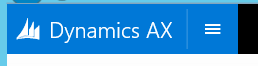
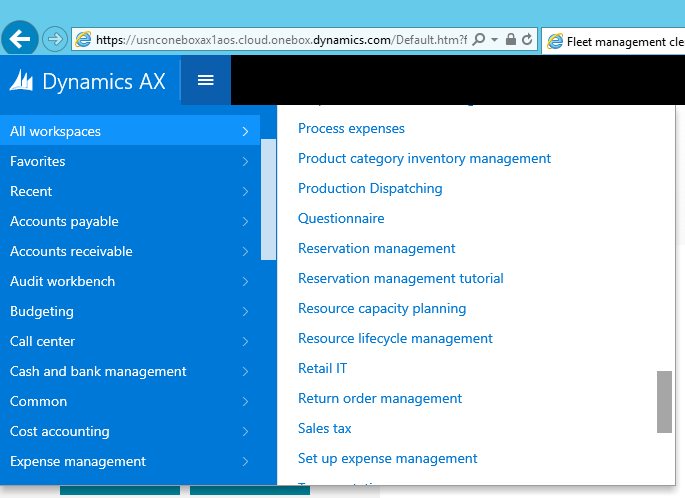
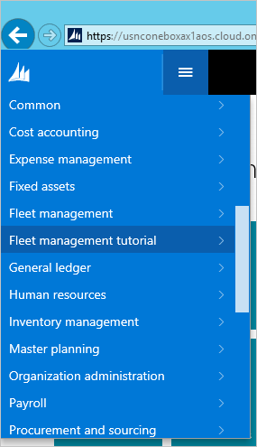
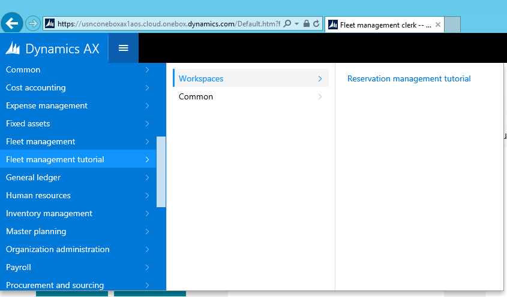

# Build navigation

[!include [banner](../includes/banner.md)]

In this tutorial, you will add navigational elements to a workspace and the navigation pane.

## Prerequisites

For this tutorial, you need to access the environment using Remote Desktop, and be provisioned as an administrator on the instance. For more information, see [Access Instances](../dev-tools/access-instances.md).

## Key concepts
-   A *workspace* is an overview page that is specific to a particular subject area. Workspaces are common to all users. In this tutorial, you will add content into an existing workspace.
-   The *dashboard* is the default home page for each user.
-   *Tiles* are securable objects that can be shown on a workspace or the dashboard. They can be secured by using menu items.

## Setup
If this is the first tutorial that you are working on, review [Access Instances](../dev-tools/access-instances.md) and make sure that you provision your administrator user if you are working on a local VM.

### Import the tutorial project

If you have already imported the Fleet management tutorial project, skip to the next section.

1.  Download the Fleet Management sample from <https://github.com/Microsoft/FMLab>, save it to **C:\\**, and unzip it.
2.  In Visual Studio, on the **Finance and operations** menu, click **Import Project**.
3.  In the **Import Project** window, next to the **Filename** text box, click the ellipsis button.
4.  In the **Select the file to import** window, browse to **C:\FMLab**, click **FMTutorialDataModel.axpp,** and then click **Open**.
5.  In the Project file location text box, enter **C:\FMLab.**
6.  Select the **Overwrite Elements** option, and then click **OK**.

### Import transactional data

1.  In Visual Studio, open the **FMTutorial** project. On the **File** menu, point to **Open**, and then click **Project/Solution**.
2.  In the **Open Project** dialog box, browse to C:\FMLab\FMTutorial, and then click FMTutorial. Click **Open**. The **FMTutorial** project appears in **Solution Explorer**.
3.  Use the FMTDataHelper class to load data for the Fleet Management tutorial. In **Solution Explorer**, in the FMTutorial project, expand **Classes**, right-click **FMTDataHelper**, and then click **Set as Startup Object**.
4.  From the **BUILD** menu, click **Rebuild Solution**. You use the rebuild to update the timestamps of the imported artifacts. You can view the build progress in the **Output** window.
5.  Press **Ctrl+F5** to run the project and load the data.

## Add a tile to the tutorial workspace
First, we will add a new tile to the form FMTClerkWorkspace.

1.  In **Solution Explorer**, expand **Forms** and then double-click **FMTClerkWorkspace**.
2.  In the designer, expand **PanoramaBody**.
3.  Right-click **TileContainer**, and then click **New** &gt; **Tile Button.**
4.  Specify the following properties for the new tile button.

    | **Property** | **Value**           |
    |--------------|---------------------|
    | Text         | Test tile           |
    | Tile         | FMTAllCustomersTile |

    This will create a duplicate of the existing **All customers** tile.
5.  In **Solution Explorer**, click **Forms** &gt; **FMTClerkWorkspace**, right-click, and then select **Set as Start-up Object**. Setting a start-up object is necessary to allow Visual Studio to launch when you press Ctrl+F5 in step 7. Setting this form as the start-up object will cause the work-in-progress Fleet management clerk workspace to appear after you press Ctrl+F5. We will preview this form again later in detail.
6.  Right-click **FMTutorial**, and then click **Rebuild**.
7.  Press **Ctrl+F5** to run the project.

After you build and run the project, the Fleet management clerk workspace will launch. The new tile named, **Test tile**, that you created will be included in the first section of the workspace, at the end of the set of tiles. 

 

> [!NOTE]
> The tile will not navigate anywhere when clicked. To enable this, you can define a Menu Item Name on FMTAllCustomersTile, under **Tiles** in **Solution Explorer**.

## Add a new workspace to the navigation pane
Next, we will add the FMTClerkWorkspace form to the navigation pane. We will do this in two locations:

-   The **All workspaces** list.
-   A new item in the area list containing a menu structure that shows the workspace.

### Create a menu item that points to the FMTClerkWorkspace workspace

1.  Right-click **FMTutorial**, point to **Add**, and then click **New Item**.
2.  Click **AX Artifacts** &gt; **User Interface** &gt; **Display Menu Item**. In the **Name** property, enter **FMTClerkWorkspace**.
3.  Click **Add**.
4.  Specify the following properties for the new menu item.

    | **Property** | **Value**                       |
    |--------------|---------------------------------|
    | Label        | Reservation management tutorial |
    | Object       | FMTClerkWorkspace               |

### Create a tile that points to the FMTClerkWorkspace workspace menu item

1.  Right-click **FMTutorial**, point to **Add**, and then click **New Item**.
2.  Click **AX Artifacts** &gt; **User Interface** &gt; **Tile**. In the **Name** property, enter **FMTClerkWorkspace**.
3.  Click **Add**.
4.  Specify the following properties for the new tile.

    | **Property** | **Value**         |
    |--------------|-------------------|
    | MenuItemName | FMTClerkWorkspace |

### Add a menu extension for the navigation pane

1.  In **Application Explorer**, click **User Interface** &gt; **Menus**, right-click **NavPaneMenu**, and then click **Create extension**.
2.  In **Solution Explorer**, double-click **NavPaneMenu.Extension**.
3.  In the designer, right-click **NavPaneMenu.Extension**, point to **New**, and then click **Submenu**.
4.  Select the new submenu. In the **Name** property, enter **NavPaneMenuFleetTutorial**.
5.  In **Solution Explorer** or **Application Explorer**, locate the **FMTClerkWorkspace** tile, and drag it onto the newly created submenu. Click **Save**.
6.  Right-click **FMTutorial**, and then click **Rebuild**.
7.  Press **Ctrl+F5** to run the project. After you build and run the project, the navigation pane will contain a link to the new workspace. Open the navigation pane by clicking the navigation pane button (three lines) at the top right of the application window. 

    

8.  When you open the navigation pane, select **All workspaces**, and scroll down in the list after it opens. You should see the following new Reservation management tutorial workspace in the list. 

    

### Add the form to the main menu structure

Now you’ll add a new main menu section that contains a tile that points to the tutorial workspace. You will then add a link to the same form in this section. This will demonstrate the appearance of a non-workspace form link.

1.  In Visual Studio, in **Solution Explorer**, right-click **FMTutorial**, point to **Add**, and then click **New Item**.
2.  Click **AX Artifacts** &gt; **User Interface** &gt; **Menu**. In the **Name** property, enter **FleetManagementTutorial**.
3.  Click **Add**.
4.  In **Solution Explorer**, double-click the new menu **FleetManagementTutorial** if it isn’t already open.
5.  In the properties list, set the **Label** property to **Fleet management tutorial**.
6.  In the designer, right-click **FleetManagementTutorial**, and click **New** &gt; **Submenu**.
7.  Specify the following properties for the new submenu.

    | **Property** | **Value**  |
    |--------------|------------|
    | Name         | Workspaces |
    | Label        | Workspaces |

8.  In **Solution Explorer** or **Application Explorer**, locate the **FMTClerkWorkspace** display menu item and drag it onto the new **Workspaces** submenu.
9.  In the designer, right-click **FleetManagementTutorial**, and then click **New** &gt; **Submenu**.
10. Specify the following properties for the new submenu.

    | **Property** | **Value** |
    |--------------|-----------|
    | Name         | Common    |
    | Label        | Common    |

11. In **Solution Explorer** or **Application Explorer**, locate the **FMTClerkWorkspace** display menu item and drag it onto the new **Common** submenu.
12. In **Application Explorer**, click **User Interface** &gt; **Menus** &gt; **MainMenu**. Right-click **MainMenu**, and then click **Create extension**.
13. In **Solution Explorer**, locate and open the new extension. Select and double-click **MainMenu.Extension** to open it.
14. In the designer, right click **MainMenu.Extension**, point to **New**, and then click **Menu reference**.
15. Specify the following properties for the new menu reference.

    | **Property** | **Value**               |
    |--------------|-------------------------|
    | Name         | FleetManagementTutorial |
    | Menu Name    | FleetManagementTutorial |

16. Click **Save**.
17. Right-click **FMTutorial**, and then click **Build**.
18. Press **Ctrl+F5** to run the project.
19. Go to the main menu section you just modified. Open the navigation pane and scroll down until you see the new top-level **Fleet management tutorial** menu. You may need to clear your browser cache by pressing **Ctrl+F5**. 

    

20. Click **Fleet management tutorial** &gt; **Workspaces** to expand that submenu. Your navigation pane should look like the following. 

     

    If you click on the **Common** submenu, you will see the menu item that you modeled there. You can click either of these links to check that you have set up the references correctly. If you have set up the references correctly, the tutorial workspace you’re working on should open when clicked on.

[!INCLUDE[footer-include](../../../includes/footer-banner.md)]
