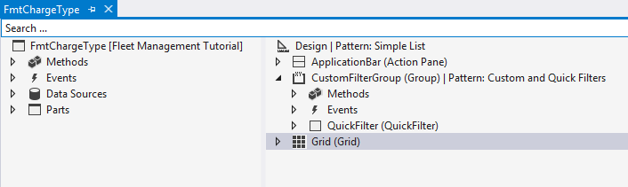
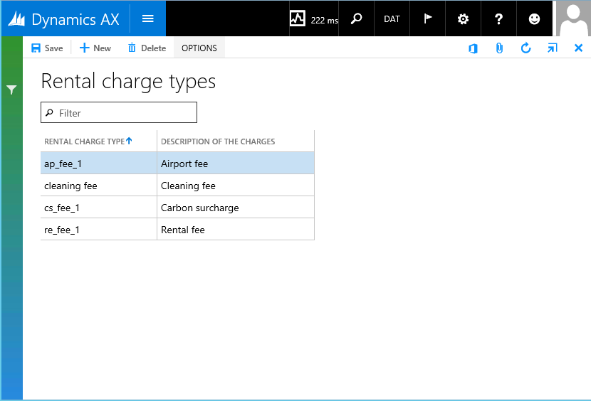

# Build the Rental Charge Type form

[!include [banner](../includes/banner.md)]

In this lab you’ll create a Simple List form. A Simple List form can show reference or secondary data that has six or fewer fields. For example, the form that you create will list and describe the types of rental charges. 

## Prerequisites

For this tutorial, you’ll need to access the environment using Remote Desktop, and be provisioned as an administrator on the instance. For more information, see [Access Instances](../dev-tools/access-instances.md).

## Overview
To create the form, you’ll start from the existing form, **FmtChargeType**. This form uses the Simple List pattern. The following illustration shows the **FmtChargeType** form with the required controls from the Simple List pattern. 

 

Adhering to the form pattern ensures that this Simple List form has the same structure and layout as other Simple List forms.

## Key concepts
-   Create a Simple List form using a pattern.
-   Bind a table to the form.
-   Add controls to the form.
-   View the form using Visual Studio and a browser.

## Setup
### Import the tutorial project and transactional data

Use Visual Studio to import the tutorial project. The tutorial project includes the artifacts that you’ll use to complete this tutorial. Use Visual Studio to open the FMTutorial project and load the data for the tutorial. You’ll use the FMTDataHelper class to load data for the Fleet Management tutorial. If this is the first tutorial you’re working on, review [Access Microsoft Instances](../dev-tools/access-instances.md) and make sure you provision your administrator user if you’re working on a local VM.

1.  Download the Fleet Management sample from <https://github.com/Microsoft/FMLab>, save it to **C:\\**, and unzip it.
2.  On the desktop, double-click the Visual Studio shortcut to open the development environment.
3.  On the **Finance and operations** menu, click **Import Project**.
4.  In the **Import Project** window, next to the **Filename** text box, click the ellipsis button.
5.  In the **Select the file to import** window, browse to C:\FMLab, click FMTutorialDataModel.axpp, and then click **Open**.
6.  In the **Project file location** text box, enter C:\FMLab.
7.  Select the **Overwrite Elements** option, and the **Current solution** radio button. The following illustration shows the completed **Import Project** dialog box. 

    

8.  Click **OK**.
9.  In **Solution Explorer**, expand **Classes, and** under the **FMTutorial** project, right-click **FMTDataHelper**, and then click **Set as Startup Object**.
10. On the **Build** menu, click **Rebuild Solution**. Use the rebuild to make sure that all of the files in the project are built regardless of timestamps. You can view the build progress in the **Output** window.
11. After the build completes, press **Ctrl+F5** to run the project. The browser will open and run the class that imports the data.

## Open the FMTutorial project
Use Visual Studio to open the FMTutorial project. If you have Visual Studio open and have already loaded the FMTutorial project, you can continue to the next section.

1.  If the development environment isn’t already open, on the desktop, double-click the Visual Studio shortcut to open the development environment.
2.  On the **File** menu, click **Open** &gt; **Project/Solution**.
3.  In the **Open Project** dialog box, browse to C:\FmLab\FMTutorial, select the **FMTutorial** solution, and then click **Open**
4.  The FMTutorial project appears in **Solution Explorer**.

## Use a template to create the form
Use Visual Studio to create the **FmtChargeType** form. You’ll use a template for building the Simple List form. You’ll also add a data source to the form and add fields to the data grid.

1.  In **Solution Explorer**, right-click the **FMTutorial** project, point to **Add**, and then click **Existing Item**.
2.  In the **Add Existing Item** window, browse to C:\FmLab, click **AxForm\_FmtChargeType**, and then click **Add**. The **FmtChargeType** form appears at the bottom of the **FMTutorial** project in **Solution Explorer**.
3.  In **Solution Explorer**, double-click **FmtChargeType**. The form opens in the Form designer.
4.  Add the **FmtChargeType** table as the data source for the form. Right-click **Data Sources,** and then click **New Data Source**. A data source node is added.
5.  Click the data source node from the previous step. In the **Properties** window, populate the following properties with the specified values.

    | **Property** | **Value**|
    |--------------|------|
    | Table        | FMTChargeType|
    | Name         | FMTChargeType *Be sure to specify the value for the Table property first. This property will automatically update to use that same value.* |

    The following illustration shows **Data Sources** after you add the **FMTChargeType** table. 

    

6.  In the Form designer, click **Design**. In the **Properties** window, populate the following properties with the specified values.

    | **Property** | **Value**                                                                    |
    |--------------|------------------------------------------------------------------------------|
    | Caption      | Rental charge types *This is the label that appears at the top of the form.* |
    | Data Source  | FMTChargeType *Use this property to specify the data source for the form.*   |

7.  In the Form designer, click **Design** &gt; **Grid**.
8.  Bind the FMTChargeType data source to the grid that appears in the simple list form. In the **Properties** window, in **Data Source**, enter **FMTChargeType**.
9.  You have to specify the data source before you add fields to the grid. You can then use the fields from the data source to add columns to the grid. Add two fields from the data source to the grid. The fields you add will appear as columns on the Simple List form. Expand the FMTChargeType data source **Fields** node in the left pane. Press **Ctrl** and then click the following fields:
    -   ChargeType
    -   Description

10. Drag the selected fields to **Design** &gt; **Grid** in the right pane. The following illustration shows the grid after the grid node is expanded and the two fields are added. 

    

11. In the Form designer, click **Design &gt; CustomFilterGroup &gt; QuickFilter**.
12. In the **Properties** window, click **TargetControl**, and then select **Grid** to bind the **QuickFilter** control to the grid on the form.
13. Click **File** &gt; **Save** **FmtChargeType**.

## View the form
Use Visual Studio to build and run the **FmtChargeType** form.

1.  In **Solution Explorer**, right-click the **FmtChargeType** form, and then click **Set as Startup Object**.
2.  Press Ctrl+F5 to build and run the form.
3.  The form opens in Internet Explorer.
4.  To add a rental charge type, click **New** in the Action Pane at the top of the form. Add the following information.

    | **Rental Charge Type** | **Description** |
    |------------------------|-----------------|
    | cleaning               | Cleaning fee    |

5.  In the Action Pane, click **Save**.
6.  Refresh the browser to see the new record in the list. The following illustration shows how the form should look.

    

7.  The form opens in view mode. Click **Edit** in the Action Pane to switch the form into edit mode. To return to view mode, click **Options** and then **Read mode**.

[!INCLUDE[footer-include](../../../includes/footer-banner.md)]
