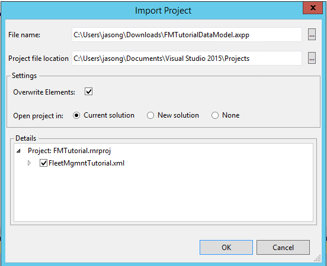
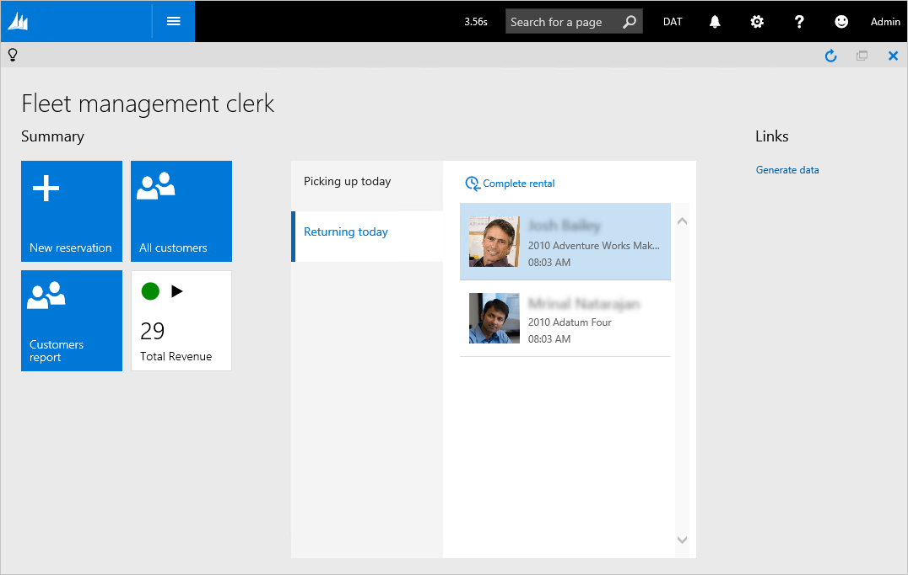
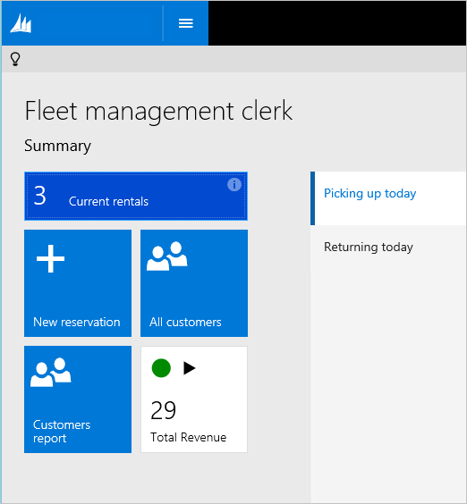
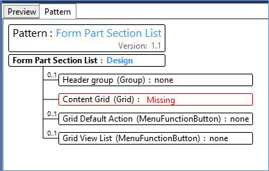
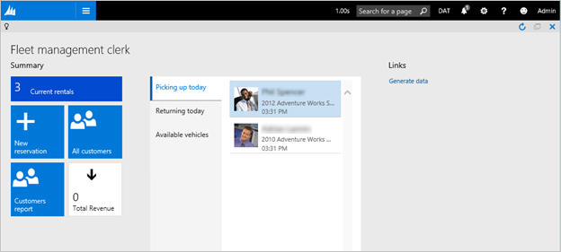

# Modify a workspace with a tile, list, and data cache

[!include [banner](../includes/banner.md)]

In this tutorial, you will create a new tile and include it in the summary section of a workspace, build a new list for a workspace, and create a data cache for the list in the workspace.

## Prerequisites

For this tutorial, you must access the environment by using Remote Desktop, and you must be provisioned as an administrator on the instance. For more information, see [Deploy and access development environments](../dev-tools/access-instances.md).

## Key concepts

- Learn about and use form patterns that are related to workspaces.
- Create a new tile, and include it in the **Summary** section of a workspace.
- Build a new list for a workspace.
- Create a data cache for the list in the workspace.

## Setup

### Import the tutorial project and transactional data

Use Microsoft Visual Studio to import the tutorial project. The tutorial project includes the artifacts that you will use to complete this tutorial. Use Visual Studio to open the FMTutorial project and load the data for the tutorial. You will use the **FMTDataHelper** class to load data for the Fleet Management tutorial. If this is the first tutorial that you’re working on, review [Deploy and access development environments](../dev-tools/access-instances.md), and make sure that you provision your administrator user if you’re working on a local virtual machine (VM).

1. Download the **FMTutorialDataModel.axpp** file from the Microsoft Dynamics Lifecycle Services (LCS) methodology, and copy it to the **Downloads** folder of the VM.
2. On the desktop, double-click the Visual Studio shortcut to open the development environment.
3. On the **Dynamics 365** menu, click **Import Project**.
4. In the **Import Project** dialog box, next to the **File name** field, click the ellipsis (**...**) button.
5. In the **Select the file to import** dialog box, browse to the **Downloads** folder, click **FMTutorialDataModel.axpp**, and then click **Open**.
6. Select the **Overwrite Elements** check box and the **Current solution** option. The following illustration shows the completed **Import Project** dialog box.

    

7. Click **OK**.
8. In Solution Explorer, expand **Classes**, and then, under the **FMTutorial** project, right-click **FMTDataHelper**, and then click **Set as Startup Object**.
9. On the **Build** menu, click **Rebuild Solution**. Use the rebuild to make sure that all the files in the project are built, regardless of timestamps. You can view the build progress in the **Output** window.
10. After the build is completed, press **Ctrl+F5** to run the project. The browser opens and runs the class that imports the data.

### Open the FMTutorial project

Use Visual Studio to open the FMTutorial project. If you have Visual Studio open and have already loaded the FMTutorial project, you can continue to the next section.

1. If the development environment isn’t already open, on the desktop, double-click the Visual Studio shortcut to open it.
2. On the **File** menu, click **Open** \> **Project/Solution**.
3. In the **Open Project** dialog box, browse to **Documents** \> **Visual Studio 15.0** \> **Projects**, select the **FMTutorial** solution, and then click **Open**.
4. The FMTutorial project appears in Solution Explorer.

## Exercise 1: Understand the operational workspace pattern

Before you start to make adjustments to **FmtClerkWorkspace** form, you will look at the current state of the form to better understand what content is already there and how that contents fits the Operational Workspace pattern.

1. In Solution Explorer, double-click the **FmtClerkWorkspace** form to open it in the designer.
2. Click the **Design** node.
3. Click the **Pattern** tab. Operational workspaces have an optional Action Pane and optional filter group (as indicated by the 0..1 notation to the left of those nodes). However, the panorama-style tab is required by this pattern. The **Patterns** tab shows that the PanoramaBody control matches the required Tab in the pattern, but there are no corresponding controls for the optional items at this level of the pattern.

    

4. Click **PanoramaBody**.

    

All workspaces have three required sections:

- **Summary section** – This section is intended to contain tiles or form parts, which correspond to a card or chart.
- **Tabbed list** – This section consists of one or more lists of data that is relevant to the user’s work. Only one list is shown at a time, and each list can optionally include local filters and actions. Individual lists are modeled inside form part controls.
- **Related links** – This section consists of important or commonly used links for this activity or persona.

Operational workspaces can optionally include a panorama section that contains up to two charts (the Section Charts tab page) and a Power BI section.

### View the workspace

1. In Solution Explorer, right-click the **FmtClerkWorkspace** form, and then click **Set as Startup Object**.
2. Press **Ctrl+F5** to build and run the form. The form opens in Internet Explorer.

    

## Exercise 2: Create a new tile for the workspace

Now that you understand the content structure of a workspace, you will see how to add content to a workspace. For example, one important piece of information for this workspace might be the number of rentals that are currently in progress. In this section, you will add the required metadata to add a new tile to the **Summary** section of the **FmtClerkWorkspace** form to show this information. To make this tile work correctly, you will have to add four metadata artifacts: a query, a menu item, a tile, and a tile button.

### Add a query that retrieves current rentals

All tiles require a backing query to retrieve the correct information.

1. In Solution Explorer, in the **FMTutorial** project, right-click the **Queries** folder, point to **Add**, and then click **New item**.
2. Click **Dynamics 365 Items** \> **Data Model** \> **Query**. For the **Name** property, enter **FMTRental\_Current**.
3. Click **Add**.
4. If the new **FMTRental\_Current** query isn’t already open in the designer, double-click it in Solution Explorer.
5. In the designer, right-click **Data Sources**, and then click **New Data Source**.
6. In the **Properties** window, set the following properties.

    | Property        | Value     |
    |-----------------|-----------|
    | Table           | FMTRental |
    | Dynamics Fields | Yes       |

7. Right-click **Ranges**, and then click **New Range**.
8. In the **Properties** window, set the following properties.

    | Property | Value      |
    |----------|------------|
    | Field    | State      |
    | Value    | InProgress |

9. Right-click **Order By**, and then click **New Field**.
10. In the **Properties** window, set the following properties.

    | Property    | Value      |
    |-------------|------------|
    | Direction   | Descending |
    | Data Source | FMTRental  |
    | Field       | StartDate  |

11. Press **Ctrl+S** to save.

### Add the corresponding menu item

1. In Solution Explorer, in the **FMTutorial** project, right-click the **Menu items** folder, point to **Add**, and then click **New item**.
2. Click **Dynamics 365 Items** \> **User Interface** \> **Display menu item**. Set the **Name** property to **FMTRental\_Current**.
3. Click **Add**.
4. If the new **FMTRental\_Current** menu item isn’t already open in the designer, double-click it in Solution Explorer.
5. In the **Properties** window, set the following properties.

   | Property |                                    Value                                    |
   |----------|-----------------------------------------------------------------------------|
   |  Label   | @FMT197 This value corresponds to “Current rentals”. |
   |  Object  | FMTRental                                  |
   |  Query   | FMTRental\_Current                              |

6. Press **Ctrl+S** to save.

### Add a tile

1. In Solution Explorer, in the **FMTutorial** project, right-click the **Tiles** folder, point to **Add**, and then click **New item**.
2. Click **Dynamics 365 Items** \> **User Interface** \> **Tile**. Set the **Name** property to **FMTCurrentRentalsTile**.
3. Click **Add**.
4. If the new **FMTRental\_Current** tile isn’t already open in the designer, double-click it in Solution Explorer.
5. In the **Properties** window, set the following properties.

    | Property       | Value              |
    |----------------|--------------------|
    | Size           | ShortWide          |
    | Menu Item Name | FMTRental\_Current |
    | Type           | Count              |

6. Press **Ctrl+S** to save.

Tiles also have a refresh frequency property that controls how often the counts on the tiles are automatically updated. The value that is set for this property should be based on the demand for updated counts, together with query execution speed against volume data. For guidance about how to set this property, see [Tile and List Caching for Workspaces](tile-list-caching-workspaces.md). For this lab, the default value of 10 minutes will be enough.

### Add a tile button to the workspace form

1. In Solution Explorer, double-click the **FmtClerkWorkspace** form to open it in the designer.
2. Right-click **Design** \> **PanoramaBody** \> **TileContainer**, point to **New**, and then click **Tile Button**.
3. Press **Alt+Up arrow** four times to move the tile button to the top of TileContainer.
4. In the **Properties** window, set the following properties.

    | Property | Value                 |
    |----------|-----------------------|
    | Name     | FMTCurrentRentalsTile |
    | Tile     | FMTCurrentRentalsTile |

5. Press **Ctrl+S** to save.

### View the new tile on the workspace

Use Visual Studio to build and run the updated **FmtClerkWorkspace** form.

1. In Solution Explorer, right-click the **FmtClerkWorkspace** form, and then click **Set as Startup Object**.
2. Press **Ctrl+F5** to build and run the form. The form opens in Internet Explorer.

    [](./media/currentrentalstile.png)

3. Click the **Current rentals** tile. You go to the **Rentals** page, which should be filtered to the three current rentals.
4. Click the **Back** button or the **Close** button to return to the workspace.
5. Click on the small **i** button in the upper-right corner of the **Current rentals** tile. You see information about how current the data in the tile is. Additionally, a link is provided that you can use to manually refresh the tile to view updated data.

### View tile data cache values at run time

A system administrator can modify tile cache parameters at run time by using the **Tile data cache configuration** page.

1. Click in the navigation search field on the navigation bar.
2. Type **Tile data**, and then click **Tile data cache configuration** in the search results.
3. Find the **FMTCurrentRentalsTile** record.

    

From this page, the system administrator can perform several run-time modifications to a tile cache. For example, the system administrator can enable/disable the data cache, modify the refresh frequency, and enable/disable the ability to manually refresh the count tile. Note that tile caches are registered when a form that has a tile is first opened. Therefore, the list of tiles that is shown in your environment might differ from the list in the preceding illustration.

## Exercise 3: Create a new tabbed list in the workspace

Next, you will next see how to include an additional list in the workspace. This section will give you some experience with building forms and will also expose you to form patterns. You will add a list of available vehicles, so that you will be able to initiate a new rental by selecting an available vehicle. In this section, you will just add the new list to the new workspace but won't add the action to initiate the rental. To add this list, you will have to complete the following tasks:

1. Add a new tab page to the workspace.
2. Add a new form that has the list content.
3. Add a new menu item that points to the new form.
4. Add a new query to limit the vehicles to available vehicles.

### Add space in the workspace for a new list

1. In Solution Explorer, double-click the **FmtClerkWorkspace** form to open it in the designer.
2. Right-click **Design** \> **PanoramaBody** \> **TabbedListSection** \> **TabbedLists**, and then click **New Tab Page**.
3. In the **Properties** window, set the following properties.

   | Property | Value |
   |----------|-------|
   | Name     | AvailableVehiclesContainer                           |
   | Caption  | @FMT199 This value corresponds to “Available vehicles”. |

4. Right-click **AvailableVehiclesContainer**, point to **New**, and then click **Form Part**. **Form Part** is the only control type that the Operational Workspace pattern allows here. This control will be used to link to the form that you will build to hold the content for this section.

   

5. In the **Properties** window, set the **Name** property to **AvailableVehiclesPart**.
6. Press **Ctrl+S** to save.

### Add a new form that has the new workspace content

1. In Solution Explorer, in the **FMTutorial** project, right-click the **Forms** folder, point to **Add**, and then click **New item**.
2. Click **Dynamics 365 Items** \> **User Interface** \> **Form**. Set the **Name** property to **FMTAvailableVehicles**.
3. Click **Add**.
4. If the new **FMTAvailableVehicles** form isn’t already open in the designer, double-click it in Solution Explorer.
5. Add the **FmtVehicle** table as a data source for the form.
    1. Right-click **Data Sources**, and then click **New Data Source**.
    2. Click the new data source node. In the **Properties** window, set the following properties.

        | Property | Value                                                                                                                                                      |
        |----------|------------------------------------------------------------------------------------------------------------------------------------------------------------|
        | Table    | FMTVehicle                                                                                                                                                 |
        | Name     | FMTVehicle **Note:** Be sure to specify the value for the **Table** property first. This property is automatically updated so that it uses the same value. |

6. Add the **FmtVehicleModel** table as a second data source for the form.
    1. Right-click **Data Sources**, and then click **New Data Source**.
    2. Click the new data source node. In the **Properties** window, set the following properties.

        | Property    | Value                                                                                                                                                           |
        |-------------|-----------------------------------------------------------------------------------------------------------------------------------------------------------------|
        | Table       | FMTVehicleModel                                                                                                                                                 |
        | Name        | FMTVehicleModel **Note:** Be sure to specify the value for the **Table** property first. This property is automatically updated so that it uses the same value. |
        | Join Source | FMTVehicle                                                                                                                                                      |
        | Link Type   | Inner Join                                                                                                                                                      |

7. Notice the **Pattern: \<select\>** notation next to **Form Design**. This indicates the required pattern for this node. Right-click **Design**, point to **Apply pattern**, and then click **Form Part Section List**. This form pattern is typically used by workspace lists.
8. Click the **Pattern** tab to see the expected content for this pattern. This information will help guide you as you create content for the form. **Note:** In the future, we plan to provide a mechanism for automatically creating a form structure, based on a selected form pattern.

    [](./media/formpartsectionlist.png)

    In particular, this pattern looks for the following elements:
    - An optional header group that contains any filters and actions that are required for this workspace list.
    - A required grid. As the red border in the preceding illustration indicates, the patterns engine can't currently find this element.
    - An optional default action, which can provide navigation to a backing form for an individual record in the grid.
    - An optional button that takes the user to a backing form that shows the full list of items in this section.

9. Right-click **Design**, point to **New**, and then click **Grid**.
10. In the **Properties** window, set the following properties. **Note:** The grid that we are building will contain cards and will be two cards wide.

    | Property             | Value       |
    |----------------------|-------------|
    | ExtendedStyle        | cardList    |
    | Multi Select         | No          |
    | Style                | List        |
    | Data Source          | FMTVehicle  |
    | Name                 | VehicleList |
    | Visible Columns Mode | Fixed       |
    | Visible Columns      | 2           |

11. Right-click the **VehicleList** grid, point to **New**, and then click **Group**.
12. In the **Properties** window, set the **Name** property to **VehicleCard**.
13. Right-click the **VehicleCard** group, point to **Apply pattern**, and then click **Business Card – Three Fields**.
14. Right-click the **VehicleCard** group, point to **New**, and then click **Image**.
15. In the **Properties** window, set the following properties.

    | Property    | Value           |
    |-------------|-----------------|
    | Data Source | FMTVehicleModel |
    | Data Method | vehicleImage    |

16. Expand **Data Sources** \> **FMTVehicle** \> **Fields**.
17. Drag the **VehicleId** and **DisplayRelationType** fields into the **VehicleCard** group.
18. Right-click **Design**, point to **New**, and then click **Group**. Update the new group's **Name** property to **HeaderGroup**.
19. The new HeaderGroup element requires a subpattern, because there are two variants for the arrangement of filters and actions in these sections. Right-click **HeaderGroup**, point to **Apply pattern**, and then click **Filters and Toolbar – Inline**.
20. Right-click **HeaderGroup**, point to **New**, and then click **Group**. Update the new group’s **Name** property to **FilterGroup**.
21. Right-click **FilterGroup**, point to **New**, and then click **QuickFilter**.
22. In the **Properties** window, set the following properties.

    | Property       | Value              |
    |----------------|--------------------|
    | Name           | VehicleQuickFilter |
    | Target Control | VehicleList        |

23. Press **Ctrl+S** to save.

### Add a new query that limits the data to available vehicles

1. In Solution Explorer, in the **FMTutorial** project, right-click the **Queries** folder, point to **Add**, and then click **New item**.
2. Click **Dynamics 365 Items** \> **Data Model** \> **Query**. Set the **Name** property to **FMTAvailableVehicles**.
3. Click **Add**.
4. If the new **FMTAvailableVehicles** query isn’t already open in the designer, double-click it in Solution Explorer.
5. In the designer, right-click **Data Sources**, and then click **New Data Source**.
6. In the **Properties** window, set the following properties.

    | Property        | Value       |
    |-----------------|-------------|
    | Table           | FMTVehicle  |
    | Dynamics Fields | Yes         |

7. Right-click **Ranges**, and then click **New Range**.
8. In the **Properties** window, set the following properties.

    | Property | Value     |
    |----------|-----------|
    | Field    | Status    |
    | Value    | Available |

9. Press **Ctrl+S** to save.

### Add a new menu item that references the new form

1. In Solution Explorer, in the **FMTutorial** project, right-click the **Menu items** folder, point to **Add**, and then click **New item**.
2. Click **Dynamics 365 Items** \> **User Interface** \> **Display menu item**. Set the **Name** property to **FMTAvailableVehicles**.
3. Click **Add**.
4. If the new **FMTAvailableVehicles** menu item isn’t already open in the designer, double-click it in Solution Explorer.
5. In the **Properties** window, set the following properties.

    | Property       | Value                |
    |----------------|----------------------|
    | Object         | FMTAvailableVehicles |
    | Query          | FMTAvailableVehicles |

6. Press **Ctrl+S** to save.

### Link the new list to the workspace

1. In Solution Explorer, double-click the **FmtClerkWorkspace** form to open it in the designer.
2. Click **Design** \> **PanoramaBody** \> **TabbedListSection** \> **TabbedLists** \> **AvailableVehiclesContainer** \> **AvailableVehiclesPart**.
3. In the **Properties** window, set the **Menu item name** property to **FmtAvailableVehicles**.

### View the new menu item

Use Visual Studio to build and run the updated **FmtClerkWorkspace** form.

1. In Solution Explorer, right-click the **FmtClerkWorkspace** form, and then click **Set as Startup Object**.
2. Press **Ctrl+F5** to build and run the form. The form opens in Internet Explorer.

    

3. Click the **Available vehicles** tab to see the new list.
4. Click in the QuickFilter, type **Lit**, and then press **Enter** to filter down to Litware model vehicles that are available.

## Exercise 4: Create a backing data cache for a list

For lists that have expensive queries, or lists where multiple users might use and work from the same workspace, consider caching the list to improve performance. In this section, you will add the necessary artifacts to create a data cache for a list. These artifacts include a query that maps fields to the cache, a table that holds the cache, and a class that provides the mapping between the query and the table. You will then uptake this cache on one of the tabbed lists in the workspace.

### Add a query that maps fields to the data cache

The first step is to build a query that will be used to populate the cache table. This query should include all the tables that you want to get your cache data from, and it should limit the results to those records/columns that you want cached.

1. In Solution Explorer, in the **FMTutorial** project, right-click the **Queries** folder, point to **Add**, and then click **New item**.
2. Click **Dynamics 365 Items** \> **Data Model** \> **Query**. Set the **Name** property to **FMTPickupAndReturnQuery**.
3. Click **Add**.
4. If the new **FMTPickupAndReturnQuery** query isn’t already open in the designer, double-click it in Solution Explorer.
5. In the designer, right-click **Data Sources**, and then click **New Data Source**.
6. In the **Properties** window, set the following properties.

    | Property        | Value     |
    |-----------------|-----------|
    | Table           | FMTRental |
    | Dynamics Fields | No        |

7. Add the following five fields to the FMTRental data source. For each field, right-click **Fields**, point to **New**, and then click **Field**. In the **Properties** window, set the **Field** property as appropriate.
    - StartDate
    - EndDate
    - Vehicle
    - State
    - RentalId

8. Right-click **Ranges**, and then click **New Range**.
9. In the **Properties** window, set the following properties.

    | Property | Value                                                                                  |
    |----------|----------------------------------------------------------------------------------------|
    | Field    | State                                                                                  |
    | Value    | 1..2 **Note:** This value will cache rentals that are Ready for Pickup or In Progress. |

10. Under **FMTRental**, right-click **Data Sources**, and then click **New Data Source**.
11. In the **Properties** window, set the following properties.

    | Property        | Value       |
    |-----------------|-------------|
    | Table           | FMTCustomer |
    | Dynamics Fields | No          |

12. Add the following three fields to the FMTCustomer data source. For each field, right-click **Fields**, point to **New**, and then click **Field**. In the **Properties** window, set the **Field** property as appropriate.
    - FirstName
    - LastName
    - Image

13. Right-click **Relations**, and then click **New Relation**.
14. In the **Properties** window, set the following properties.

    | Property         | Value     |
    |------------------|-----------|
    | Join Data Source | FMTRental |
    | Field            | Customer  |
    | Related Field    | RecID     |

    The query that you've constructed should match the following illustration.

    

15. Press **Ctrl+S** to save.

### Add a cache table

The second step is to define a table that has the fields that are returned from the cache query. You must also add a **SysDataCacheContextId** field that will be used to map the cache row to the base framework cache tables. Additionally, you should also define any required relations between this table and other tables, and also any data methods that you require that involve the cached fields.

1. In Solution Explorer, in the **FMTutorial** project, right-click the **Tables** folder, point to **Add**, and then click **New item**.
2. Click **Dynamics 365 Items** \> **Data Model** \> **Table**. Set the **Name** property to **FMTPickupAndReturnTableCache**.
3. Click **Add**.
4. If the new **FMTPickupAndReturnTableCache** table isn’t already open in the designer, double-click it in Solution Explorer.
5. In the designer, right-click **Fields**, and then add the following fields. For each field, the following table shows the data type and the extended data type (EDT) or enum type.

    | Field type    | Field name            | EDT/enum type               |
    |---------------|-----------------------|-----------------------------|
    | String        | FirstName             | FirstName (EDT)             |
    | String        | LastName              | LastName (EDT)              |
    | Container     | Image                 | Bitmap (EDT)                |
    | Int64         | Vehicle               | FMTVehicleRecId (EDT)       |
    | Utc Date Time | StartDate             | StartDateTime (EDT)         |
    | Utc Date Time | EndDate               | EndDateTime (EDT)           |
    | Int64         | SysDataCacheContextId | SysDataCacheContextId (EDT) |
    | Enum          | State                 | FMTReservationState (Enum)  |
    | String        | RentalId              | FMTRentalId (EDT)           |

6. In the designer, right-click **Relations**, point to **New**, and then click **Relation**.
7. In the **Properties** window, set the following properties.

    | Property      | Value     |
    |---------------|-----------|
    | Name          | FMTRental |
    | Related Table | FMTRental |

8. Right-click the **FMTRental** relation, point to **New**, and then click **Normal**.
9. In the **Properties** window, set the following properties.

    | Property      | Value    |
    |---------------|----------|
    | Field         | RentalId |
    | Related Field | RentalId |

10. In the designer, right-click **Mappings**, and then click **New**.
11. In the **Properties** window, set the **Map** property to **SysDataSetCacheTableMap**.
12. Click **Id**. In the **Properties** window, set the **Map Field To** property to **RecId**.
13. Click **SysDataCacheContextId**. In the **Properties** window, set the **Map Field To** property to **SysDataCacheContextId**. **Note:** If the field doesn't appear in the list, you might have to save the table first, by pressing **Ctrl+S**.
14. Press **F7** to view the table’s code. Alternatively, right-click **FMTReturnAndPickupTableCache**, and then click **View Code**.
15. Add the following display methods to the table. The form will use these methods later.

    ```xpp
    public display FMTName fullName()
    {
        return this.FirstName + ' ' + this.LastName;
    }
    public display container customerImage()
    {
        ImageReference imgRef;
        container imgContainer = this.Image;
        if(imgContainer == connull())
            {
                imgRef = ImageReference::constructForSymbol("Person");
                imgContainer = imgRef.pack();
            }
            return imgContainer;
    }
    public display str rentalVehicle()
    {
        FMTVehicle vehicle;
        str value;
        if(this.Vehicle == 0)
        {
            value = "No vehicle assigned";
        }
        else
        {
            select vehicle where vehicle.RecId == this.Vehicle;
            value = vehicle.Description;
        }
        return value;
    }
    ```

16. Press **Ctrl+S** to save.

### Adding a cache class that links the query and table

The third step is to create a class that defines the relationship between the cache query and the catch table.

1. In Solution Explorer, in the **FMTutorial** project, right-click the **Classes** folder, point to **Add**, and then click **New item**.
2. Click **Dynamics 365 Items** \> **Code** \> **Class**. Set the **Name** property to **FMTPickupAndReturnClass**.
3. Click **Add**.
4. If the new **FMTPickupAndReturnClass** class isn’t already open in the designer, double-click it in Solution Explorer.
5. Add the following code to the class.

    ```xpp
    [SysDataSetExtension(classStr(FMTPickupAndReturnClass)), // The name of this class
    SysDataSetCacheTableExtension(tableStr(FMTPickupAndReturnTableCache))] // The name of the cache table
    class FMTPickupAndReturnClass extends SysDataSetQuery implements SysIDataSet
    {
        public SysDataCacheRefreshFrequency parmRefreshFrequency()
        {
            return 600; // Cache refresh frequency, in seconds.
        }
        public SysQueryableIdentifier parmQueryableIdentifier()
        {
            return queryStr(FMTPickupAndReturnQuery); // The name of the query.
        }
        public SysDataCacheTypeId parmCacheTypeId()
        {
            return tableNum(FMTPickupAndReturnTableCache); // The name of the table.
        }
        public static FMTPickupAndReturnClass construct()
        {
            return new FMTPickupAndReturnClass();
        }
    }
    ```

6. Press **Ctrl+S** to save.

### Uptake the data cache on a list in the workspace and table

After you've set up the data cache, you can start to use the cache in your forms. In this section, you will update one of the workspace lists so that it uses the data cache.

1. In Solution Explorer, double-click the **FMTReturningTodayPart** form to open it in the designer.
2. Expand the **Data Sources** node.
3. Delete the **FMTCustomer** data source.
4. Click the **FMTRental** data source. In the **Properties** window, set the **Table** property to **FMTPickupAndReturnTableCache**.
5. Click **Design** \> **ReturningTodayGrid**. In the **Properties** window, set the **Data Source** property to **FMTPickupAndReturnTableCache**.
6. Inside **ReturningTodayGrid**, click **CustomerImage**. Update the **Data Source** property to **FMTPickupAndReturnTableCache** and the **Data Method** property to **customerImage**.
7. Inside **ReturningTodayGrid**, click **FirstNameCopy1**. Update the **Data Source** property to **FMTPickupAndReturnTableCache** and the **Data Method** property to **fullName**.
8. Press **F7** to view code for the form.
9. Instrument the form so that it can react to data caching, as shown in the following code.

    ```xpp
    [Form]
    public class FMTReturningTodayPart extends FormRun implements SysIDataSetConsumerForm
    {
        public void registerDatasourceOnQueryingEvent()
        {
            FMTPickupAndReturnTableCache_DS.OnQueryExecuting +=
                eventhandler(this.parmDataSetFormQueryEventHandler().prepareDataSet);
        }
    }
    ```

10. Press **Ctrl+S** to save.

### Update the action above the list so that it works with the cache table

Actions that are performed from the workspace might expect records from the base tables. Therefore, these actions might have to be updated so that they work with the cache table. In this example, the **FmtCompleteRecord** form currently expects a **FMTRental** record as context. Therefore, this form must be updated so that it works correctly with either a base rental record or a cache table record as context.

1. In Solution Explorer, double-click the **FmtCompleteRental** form to open it in the designer.
2. Press **F7** to view the form’s code.

    ```xpp
    public void init()
    {
        //If this form was opened with a Rental as context
        if(element.args() != null && element.args().record() != null && element.args().record().TableId == tablenum(FMTRental))
        {
            //Get the Rental context
            rentalDS = FormDataUtil::getFormDataSource(element.args().record());
            rental = element.args().record();
            if(rental != null)
            {
                select firstonly forupdate vehicle where vehicle.RecId == rental.Vehicle;
            }
        }
        super();
    }
    ```

3. Update the **init()** method so that it matches the following code.

    ```xpp
    public void init()
    {
        //If this form was opened with a record context
        if(element.args() != null && element.args().record() != null))
        {
            //Get that context
            rentalDS = FormDataUtil::getFormDataSource(element.args().record());
            if(element.args().record().TableId == tableNum(FMTPickupAndReturnTableCache))
            {
                FMTPickupAndReturnTableCache cacheRecord = element.args().record();
                select firstonly forupdate rental where rental.RentalId == cacheRecord.RentalId;
            }
            else if(element.args().record().TableId == tableNum(FMTRental))
            {
                rental = element.args().record();
            }
            if(rental != null)
            {
                select firstonly forupdate vehicle where vehicle.RecId == rental.Vehicle;
            }
        }
        super();
    }
    ```

4. Press **Ctrl+S** to save.

### Update the Returning today query so that it works with the cache table

1. In Solution Explorer, double-click the **FmtRental\_ReturningToday** query to open it in the designer.
2. Expand the **Data Sources** node, and then click **FMTRental**.
3. In the **Properties** window, update the **Table** property to **FMTPickupAndReturnTableCache**. **Note:** The **Name** property should be updated automatically to the same value.
4. Press **Ctrl+S** to save.

### View the updated query

Use Visual Studio to build and run the updated **FmtClerkWorkspace** form.

1. In Solution Explorer, right-click the **FmtClerkWorkspace** form, and then click **Set as Startup Object**.
2. Press **Ctrl+F5** to build and run the form. The form opens in Internet Explorer.
3. Click the **Returning today** vertical tab.
4. Click **Complete rental** for the second record in the list.
5. Set **End Mileage** to **200**, and then click **OK**. Notice that the rental that you just returned still appears in the list.

### Make sure that your workspace is responsive

You must make sure that your lists remain up to date after a user performs an action that should remove a record from the list (for example, the user completes a rental). In this section, we will instrument that action to help guarantee that the workspace reacts appropriately.

1. In Solution Explorer, double-click the **FmtCompleteRental** form to open it in the designer.
2. Press **F7** to view the code for the form.
3. Locate the **clicked()** code for **OKButton**. Near the end of this method is a research call on the calling form’s data source. Just before that line of code, add the following **if** statement to delete the processed rental from the cache table.

    ```xpp
    . . .
    if(rentalDS.table() == tableNum(FMTPickupAndReturnTableCache))
    {
        //Delete updated record from backing cache
        FMTPickupAndReturnTableCache cacheRecord = element.args().record();
        cacheRecord.delete();
    }
    rentalDS.research(true);
    }
    ```

4. Press **Ctrl+S** to save.

### View the updated form

Use Visual Studio to build and run the updated **FmtClerkWorkspace** form.

1. In Solution Explorer, right-click the **FmtClerkWorkspace** form, and then click **Set as Startup Object**.
2. Press **Ctrl+F5** to build and run the form. The form opens in Internet Explorer.
3. Click the **Returning today** vertical tab.
4. Click **Complete rental** for the second record in the list.
5. Set **End Mileage** to **100**, and then click **OK**. Notice that the rental that you just returned no longer appears in the list.

## Related tutorials

- [Build the Customer form](build-customer-form.md) – See this tutorial if you want more exposure to form patterns. This tutorial will walk through the process of applying the Details Master pattern to a form.
- [Build navigation](build-navigation.md) – See this tutorial if you want instructions for adding your workspace to the menu structure.


[!INCLUDE[footer-include](../../../includes/footer-banner.md)]
