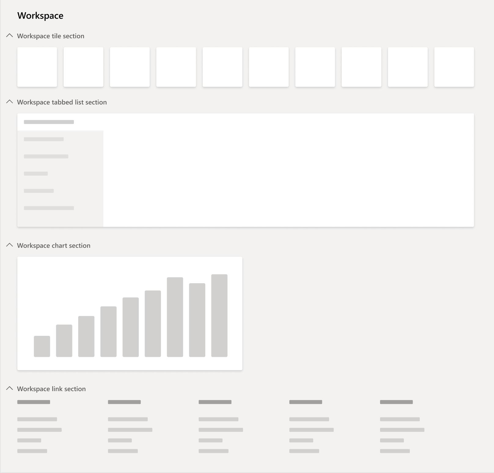

# Build operational workspaces

[!include [banner](../includes/banner.md)]

This article provides detailed information about workspaces and the patterns and subpatterns that are used to build operational workspaces. 

## A workspace is defined as...

- Part of the primary navigation mechanism.
- A form that supports a business activity (a logical group of tasks that make up the work of a target persona).
- A way to provide an initial overview and to increase productivity in the activity by allowing simple tasks to be completed directly in the workspace.

## Workspaces have the following goals...

- Enable the user to understand the current state of the activity to support informed decisions.
- Let users navigate to deeper pages by selecting data, which avoids round-trips to pages with no information.
- Let users perform light tasks in the workspaces to avoid round-trips to deeper pages.
- Complete an activity without leaving the workspace.
- Reduce the need for navigation.
- Provide visual impact.
- Be constructed using prescriptive patterns and best practices that lead to minimal COGS and fast response times.

To accomplish these goals, the operation workspace pattern was developed.

## Examples

An example of a workspace is the **Reservation management** workspace in **Fleet management**. You can get to it by accessing the menu item **FMClerkWorkspace**.   The workspace, shown above, has the following items:

- **Summary** - Contains tiles and a chart.
- **Rentals** - Contains a vertical tab control having three pages - the first is selected, and you can see the corresponding content on the rightmost side.
- **Statistics** - Contains stacked charts.
- **Related links** - Contains a series of grouped menu item links to forms of relevance to this user and activity.

The overall form, as well as each of the sections within, are defined using UX patterns and subpatterns. The corresponding patterns are described in detail in the following sections.

## Patterns and subpatterns
When you build an operational workspace, you should use the following patterns and subpatterns that are defined for workspace content. In general, when a control is cited in a pattern's structure, it will be described in the following way: Common name (ControlType) \[cardinality\]. If cardinality isn't specified, the item is required exactly once. For simple patterns and subpatterns, the structural tree is omitted.

### Patterns

There are the top-level patterns for use with operational workspaces.

#### Operational workspace

This pattern is the primary operational workspace pattern and should be applied to the **Design** node of the operational workspace form. It will prescribe the following structure:

- Design
    - ActionPane (ActionPane) \[0..\*\]
    - Workspace Page Filter Group (Group) \[0..1\]
        - Subpattern: Workspace Page Filter Group
    - FastTab (Tab)
        - Section Summary Tiles (TabPage)
            - Subpattern: Section tiles
        - Section Tabbed List (TabPage)
            - Subpattern: Section Tabbed List
        - Section Charts (TabPage) \[0..1\]
            - Subpattern: Section Stacked Chart
        - Section-Related Links (TabPage)
            - Subpattern: Section-Related Links

> [!NOTE]
> Starting in version 10.0.25, the following changes are introduced:
>
> - The panorama component has been replaced with FastTabs to facilitate the transition of workspaces to a more vertical orientation.
> - An **Operational workspace w/Tabs** pattern is available for workspaces that require multiple standard tabs of content, including Power BI reports.

#### Form Part Section List

This pattern is used for **Form Part** forms that contain a list. These lists are referenced within the Section Tabbed List (TabPage) in the **Operational workspace** pattern. Any remaining uses of the deprecated **Hub Part Grid** pattern should be migrated to the **Form Part Section List** pattern.

- Design
    - Header Group (Group) \[0..1\]
        - Subpattern: Filters and toolbar - Inline OR Subpattern: Filters and Toolbar - Stacked
    - Content Grid (Grid)
    - Default Action Button ($Button - any type of button) \[0..1\]
    - See All Menu Item (MenuFunctionButton) \[0..1\]

#### Hub Part Chart

This pattern is used for **Form Part** forms containing a chart control. These chart forms are referenced within two subpatterns: Section Tiles and Section Stacked Chart. It requires exactly one Chart control.

### Subpatterns

#### Workspace Page Filter Group

This subpattern is referenced in the **Operational workspace** pattern. It allows for a single input control, which can be used to filter the workspace as a whole.

#### Section Tiles

This subpattern is referenced in the **Operational workspace** pattern. It enables both tiles and charts to be defined, in any order. Tiles are defined by using TileButton controls, and charts are defined by using Form Part controls. A chart Form Part should have dimensions that match those of a normal tile, to ensure that the chart flows correctly with the tiles that are shown. Any remaining uses of the deprecated **Tiles** subpattern should be migrated to the **Section Tiles** subpattern. 

#### Section Tabbed List

This subpattern is referenced in the **Operational workspace** pattern. It enables multiple list containers to be modeled, each of which references a Form Part that points to a form that contains the desired list. It requires the following structure:

- Tabbed List (Tab)
    - Tabbed List Page (TabPage) \[0..\*\]
        - Form Part Section List (FormPartControl). **Note:** The referenced form should use the **Form Part Section List** form pattern.

#### Section Stacked Chart

This subpattern is referenced in the **Operational workspace** pattern. It allows for up to two charts, which will be rendered in a vertically stacked orientation. It requires the following structure:

- Tab page (TabPage)
    - First Chart FormPart (FormPartControl) \[0..1\]
    - Second Chart FormPart (FormPartControl) \[0..1\]

#### Section-Related Links

This subpattern is referenced in the **Operational workspace** pattern. It allows for a series of links that can include one level of nesting. It requires the following structure. Any remaining uses of the deprecated **Hub Part Links** subpattern should be migrated to the **Section Related Links** subpattern.

- Tab page (TabPage)
    - Menu Function Button (MenuFunctionButton) \[0..\*\]
    - Links Group (Group) \[0..\*\]
        - Menu Function Button (MenuFunctionButton) \[1..\*\]

#### Filters and Toolbar – Inline

This subpattern is referenced by the **Form Part Section List** pattern. It allows for some filters and a toolbar, all on the same line. It requires the following structure:

- Group (Group)
    - Filter Group (Group) \[0..1\]
        - Quick Filter (QuickFilterControl) \[0..1\]
        - Custom Filter Fields ($Field – any type of field) \[0..\*\]
    - Toolbar (ActionPane) \[0..1\]

#### Filters and Toolbar - Stacked

This subpattern is referenced by the **Form Part Section List** pattern. It allows for some filter fields on one line, and a toolbar on a line below those filters. This pattern is generally used only over simple lists. It requires the following structure:

- Group (Group)
    - Filter Group (Group) \[0..1\]
        - Quick Filter (QuickFilterControl) \[0..1\]
        - Filter Field 1 ($Field - any type of field) \[0..1\]
        - Filter Field 2 ($Field - any type of field) \[0..1\]
    - Toolbar (ActionPane) \[0..1\]

### Future best practices check

There are a few best practice (BP) checks that will eventually be built for workspaces. These checks are intended to provide guidance to the user about items that are recommended for performance or design reasons.

#### Filters are covered by indexes

This check is intended to ensure that any field that is modeled for use as a field on a workspace-wide filter is covered by an index. This check will help ensure that performance remains superior when users are taking advantage of these filters.

#### Chart parts only contain OLAP charts

When a workspace contains a chart, that chart is modeled as a separate form, and that form is referenced on the workspace via a Form Part control. The intent of this check is to ensure that any such charts ultimately referenced from a workspace are only using OLAP data.

#### Count tiles have queries defined

A tile caching system has been implemented to improve performance of workspaces, as these forms generally contain several count tiles. For these count tiles to work correctly with the caching system, each tile must have a query defined. That query may be defined on the tile or on the menu item referenced by the tile. The intent of this BP check is to ensure a query is defined in one of these two locations for all count tiles.

[!INCLUDE[footer-include](../../../includes/footer-banner.md)]
