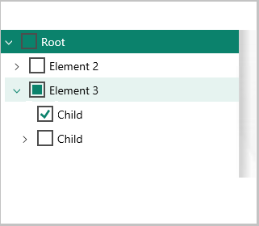

# Check box support in tree controls

[!include [banner](../includes/banner.md)]

This article is intended as a primer for using check box controls in the tree control. It's not a general “how to” for using tree controls.

Microsoft Dynamics AX 2012 includes several examples of tree controls that were enhanced so that they both show data in a tree hierarchy and let the user select one or more nodes by using check boxes. In Dynamics AX 2012, the tree control had no built-in support for check box controls. Instead, an image of a check box was added for each node in the tree control. The image state for each node was then toggled as the user clicked the check box. 

 

The current version has greatly simplified the experience for the developer. Check box support is now built into the tree control. 

 

You no longer have to use images to include a check box, and you also don't have to explicitly set the state of the check box state when it's selected. The control doesn’t use images, and the check box state is managed in the way that you would expect for a tri-state check box. Examples of tri-state check boxes can be found in most installation scenarios. When tri-state check boxes are used, if the user selects a parent node, all children of that parent also become selected. The check box interaction is independent of the node's expand/collapse functionality. When the parent node is collapsed (no children are visible), a check mark on the parent node indicates that all children are also selected. However, if one child of a parent that has multiple children isn't selected, the appearance of the parent node changes. The check box no longer contains a check mark but is filled in. This state is considered a partial check. Therefore, a parent node has three states:

-   Checked
-   Unchecked
-   Partial

If the user clicks the check box on a parent node that is in a partial state, the state of the parent and all its children changes to checked. (The parent node and all its child nodes are now selected.) 

**Parent node in a partial state** 

 

**Parent node and all child nodes in a checked state after the parent node is selected**

 

If the user clicks the check box on a parent node that is in a checked state, the state of the parent and all its children changes to unchecked. (The parent node and all its child nodes are now cleared.) 

**Parent node in a checked state** 


**Parent node and all child nodes in an unchecked state after the parent node is cleared** 

 

If the user clicks the check box on a parent node that is in an unchecked state, the state of the parent and all its children changes to checked. (The parent node and all its child nodes are now selected.) 

**Parent node in an unchecked state** 

 

**Parent node and all child nodes in a checked state after the parent node is selected** 

 

A child node that has no children (in other words, a child node that isn't a parent itself) has only two states: checked and unchecked. A child node that is the only child in a checked state affects the state of its parent. If a child node is selected, the state of its parent changes to partial. **Note:** A single node in a tree also has a “selected” state to indicate that it's the current node. This state differs from the checked state.

## Tree controls that contain check boxes in Dynamics AX 2012
The following example is from SysConfiguration.

1.  The program checks for the **mouseDown** event.
2.  When the **mouseDown** event is detected, the program determines whether the user clicked the node or the image.
3.  If the user clicked the image, the program toggles the image state.

None of this code is required for the current version.

```xpp
int mouseDown(int x, int y, int button, boolean ctrl, boolean shift)
{
    int idx,f;
    FormTreeItem        parentNode, node;
    int                 parentMode;
    boolean             enabled;
    #FormTreeControl;
    [idx,f] = this.hitTest(x,y);
    parentNode  = this.getItem(this.getParent(idx));
    node        = this.getItem(idx);
    if (node)
    {
        if(parentNode)
        {
            if (element.enabled(parentNode.data()))
            parentMode = true;
        }
        else
            parentMode  = true;
        if ((f & #FTCHT_ONITEMICON) && parentMode)
        {
            if (!node.overlayImage())
            {
                enabled = (element.enabled(this.getItem(idx).data()) ? false : true);
                element.enabled(this.getItem(idx).data(), enabled);
                element.drawTree();
            }
            return 1;
        }
    }
    return super(x, y, button, ctrl, shift);
}
```

In the current version, you still set the selected state for scenarios where the user is presented with preselected nodes. Additionally, the developer can still set the state explicitly when the FormTreeItem is created. However, instead of specifying the current image, the developer now sets the **stateChecked** property on the FormTreeItem. If developers must know when the state of a check box changes, they can override the **checkedStateChanged()** method.

## Basic check box use for tree controls in the current version
Make sure that the **Check Box** property on the modeled tree control is set to **Yes**. To explicitly set the state on a node, use the following code.

```xpp
formTreeItem.stateChecked(FormTreeCheckedState::Checked);
formTreeControl.setItem(formTreeItem);
```

To interrogate a node for its current state, use the following code.

```xpp
FormTreeItem formTreeItem = formTreeControl.getItem(formTreeControl.getSelection());
FormTreeCheckedState currentState;
if (formTreeItem != null)
{
    currentState = formTreeItem.stateChecked();
    switch (currentState)
    {
        case FormTreeCheckedState::Unchecked:
            /* unchecked */
            break;
        case FormTreeCheckedState::Checked:
            /*checked */
            break;
        case FormTreeCheckedState::Partial:
            /* parent has children checked */
            break;
        default:
            /* shouldn’t get here */
            break;
    }
}
```

To react to or track the checked state of a node (**idx** is the node index), use the following code.

```xpp
public void checkedStateChanged(int _Idx, FormTreeCheckedState _newState)
{
    super(_Idx, _newState);
}
```


[!INCLUDE[footer-include](../../../includes/footer-banner.md)]
