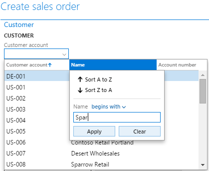

# Contextual data entry for lookups

[!include [banner](../includes/banner.md)]

In data entry scenarios, it is common for a user to attempt to identify an entity in terms of some more descriptive or natural language attribute if that entity is formally identified by a synthetic key, such as a number sequence. The contextual data entry feature allows users to type in either the synthetic key or a more descriptive attribute directly into a lookup field. This page explains how contextual data entry works and also provides implementation details and tips for developers who want their lookups to have this behavior.

## Introduction

In data entry scenarios, it is common for a user to attempt to identify an entity in terms of some more descriptive or natural language attribute if that entity is formally identified by a synthetic key, such as a number sequence. A user will typically attempt to enter an **Account Name** instead of an **Account ID** for the **Customer Account** when creating a Sales Order. This is because most interaction with a customer is done using their actual name instead of some synthetic identifier. Unfortunately, any user’s attempt to enter an **Account Name** will fail because the **Customer account** control’s underlying foreign key relates to a field that is a synthetic key—a number sequence—and Dynamics AX 2012 (and older) will always attempt to validate the entered value directly. Therefore, if the **Account ID** was unknown to the user, the user would be forced to perform some type of searching step, such as opening the **Customer account** control’s lookup and filtering on the **Account Name** column to identify the correct **Account ID** (see the image below). 

[](./media/howtocontextuallookups-3.png) 

This user experience is not optimal and is being addressed by data entry efficiency and productivity. The platform adds initial support for contextual data entry, where the system automatically attempts to understand whether the user’s entered data is in the context of the key field or some other more descriptive or well-understood field, and handle it appropriately. **For the remainder of this document, we’ll generically refer to these types of fields as ID (synthetic) and NAME (descriptive) fields, respectively.**

## Contextual lookup forms
Just like keyboard data entry, all system-generated lookup forms are also now contextual, meaning that filtering and sorting occur in the context of the data the user has entered. Using the create a Sales Order scenario as an example, the user will see the lookup shown below if an ID is entered. 

[](./media/howtocontextuallookups-1.png) 

If a NAME is entered, then the user will see the following lookup. Notice how the NAME column is moved first in the Grid, and how the lookup is sorted and filtered upon when the user’s data is in the context of NAME. 


## Contextual data entry implementation details
### Behavior

In the context of the Sales order create scenario mentioned above, the contextual data entry feature will allow the user to be able to freely type in either the ID or NAME without performing any laborious search process. In detail, the following behaviors will occur:

1.  If the user enters a complete ID reference, the value will be taken directly.
2.  If the user enters a complete and unique NAME reference, the value will be automatically translated into an ID and then processed.
3.  If the user enters a non-complete ID or NAME reference (such as *Micro* instead of *Microsoft*), but it still uniquely matches either ID or NAME via a BEGINS WITH predicate, then the value will be translated into its complete ID and then processed.
4.  If the user enters a non-complete ID or a non-unique NAME and there are multiple matches, then a *disambiguation* lookup will be presented to the user to select which value was actually intended.

See Appendix A for more detailed sample scenarios of contextual data entry.

### Prerequisites

To maintain functional correctness and reasonable performance, the following constraints were added to the application of the behaviors described in the previous section:

1. **Title Field 2** is the NAME field**.
2. The NAME field must either be covered by an index ***OR*** belong to a Table whose *Cache Lookup* property is set to *EntireTable*. All contextual lookup behavior will be disabled if this requirement is not met for performance reasons. **NOTE: An index should only be added for NON TRANSACTIONAL tables because of index maintenance costs**. Also note that you will **likely want to mark this index as non-unique** (Allow Duplicates = Yes).
3. If a control is using a custom lookup form (such as SysTableLookup; FormHelp on an EDT) then the disambiguation behavior described previously will not be turned on by default. This is because these custom lookup forms (and even surrounding modified and lookup method overrides) can and will do advanced things such as presenting a dialog, which are not desirable in the context of contextual lookups.

Handling custom lookup forms requires additional knowledge and will be covered in its own section.

### Programming model additions

The behaviors and rules expressed in *Listings 1* and *2* are contained primarily by a new X++ class called *FormControlAmbiguousReferenceResolver*. *FormControlAmbiguousReferenceResolver* uptake in application code will be necessary in more advanced scenarios. Its use will be described later in the document. In addition to the *FormControlAmbiguousReferenceResolver* class, a new control override called *resolveAmbiguousReference* has been added. R*esolveAmbiguousReference* acts as a hook point in the system for translating what the user typed into a value that the system is expecting. The basic flow is as follows:

1.  The user enters a value into a control and removes focus.
2.  An interaction is sent from the client to the server, indicating that a new value has been entered. The appropriate command is executed on the server.
3.  Before the command attempts to process the value entered by the user, it makes a call to *resolveAmbiguousReference* to give the system a chance to translate the value into the expected domain.
4.  The super implementation of resolveAmbiguousReference creates an instance of *FormControlAmbiguousReferenceResolver* which executes the rules described above.

The value returned from *resolveAmbiguousReference* is used for the remainder of the command’s execution. Validate() and modified() operate against the returned value.

## Standard lookup uptake
### Add an index that covers TitleField2

*TitleField2* defines the default definition of NAME. In order to enable ID and NAME contextual data entry, *TitleField2* must be either indexed OR belong to a table with *CacheLookup* set to *EntireTable*. If the table containing *TitleField2* does not yet define an index covering *TitleField2* **and, importantly, the table does not have a high volume of CUD (Creates/Updates/Deletes\*)**, then add a **non-unique** index (Allow Duplicates = Yes) covering *TitleField2*. This will cause the system to start executing the contextual data entry behavior, except for the custom lookup limitation described in the Prerequisites section. \*Adding an index on high-volume transactional tables may incur a noticeable performance penalty due to index maintenance costs.

### Enable disambiguation behavior for custom lookup scenarios

Custom lookup implementations can provide advanced or non-typical behaviors, such as presenting dialogs. Therefore, the system disables the default disambiguation behavior when a custom lookup scenario is detected. To opt into the default disambiguation behavior, override the *resolveAmbiguousReference* method (as shown below) **on the control hosting the lookup**. Note that the second parameter to the *resolveAmbiguousReferenceForControl* call is what overrides the default behavior of not performing disambiguation for custom lookup scenarios.

```xpp
public str resolveAmbiguousReference()
{
    return FormControlAmbiguousReferenceResolver::resolveAmbiguousReferenceForControl (this, true);
}
```

### Make custom lookup forms contextual

As mentioned earlier, all system-generated lookup forms automatically consider the context of the data entered into their host control. This includes most lookup forms generated via *SysTableLookup*. Modeled custom lookup forms, by their nature, cannot be fully-handled by the system and must be modified to match the behavior and visuals of contextual lookups forms.

1.  If the data contained by the host control is in the context of ID, then:
    1.  Make the ID column first in the Grid.
    2.  Sort and filter by ID.

2.  If the data contained by the host control is in the context of NAME, then:
    1.  Make the NAME column first in the Grid,
    2.  Sort and filter by NAME,

The following scenarios illustrate some custom lookups, along with the recommendation for how to enable contextual data entry in these cases.

#### Scenario 1: Custom lookup defined via the FormHelp property on an EDT

Custom lookups defined via FormHelp (even though modeled) still go through normal kernel-based lookup generation routines. Therefore, the kernel still has hooks to make some changes to the lookup form. Specifically, the lookup system has enough information to apply the correct filters and sorts; however, it is NOT known which controls should be moved in the lookup's grid.  (While an educated guess could be made based on bindings, that guess may be incorrect in more advanced lookup form designs.) If your custom lookup form is leveraging the `SysTableLookup::filterLookupPreRun` and `SysTableLookup::filterLookupPostRun` methods, then uptake the (new) optional parameters on `filterLookupPostRun` to have the NAME control moved automatically, as shown.

```xpp
public class MyCustomLookupForm extends FormRun
{
    public void run()
    {
        FormStringControl lookupHostControl = SysTableLookup::getCallerStringControl(this.args());
        boolean isFiltered = SysTableLookup::filterLookupPreRun(lookupHostControl, ID_Control, FormDataSourceToFilter);

        super();

        SysTableLookup::filterLookupPostRun(isFiltered, lookupHostControl.text(), ID_Control, FormDataSourceToFilter, 
            new FormControlAmbiguousReferenceResolver(callingControl), NAME_Control);
    }
}
```

If your lookup form isn’t using the *SysTableLookup::filterLookup\** methods, and you don’t want to uptake those methods, then you can simply add a control move as shown below.

```xpp
public class MyCustomLookupForm extends FormRun
{
    public void init()
    {
        super();
        this.applyControlOrdering();
    }

    private void applyControlOrdering()
    {
        FormControl callerControl = SysTableLookup::getCallerControl(this.args());
        if (FormControlAmbiguousReferenceResolver::isControlValueMappedToAlternativeField(callerControl))
        {
            Grid.moveControl(ID_Control.id(), NAME_control.id());
        }
        else
        {
            Grid.moveControl(NAME_Control.id(), ID_Control.id());
        }
    }
}
```

#### Scenario 2: Override of lookup method manually launching a form

Unlike Scenario 1, lookup forms launched by completely manual mechanisms, such as the class factory, have no kernel hooks. Therefore, it is the responsibility of the lookup form to adhere to the contextual data entry behaviors. The easiest way to do this is to leverage the SysTableLookup::filterLookup\* methods (similar to Scenario 1) except include one additional parameter to indicate that sorting should also be maintained. An example is shown below.

```xpp
public class MyCustomLookupForm extends FormRun
{
    public void run()
    {
        FormStringControl lookupHostControl = SysTableLookup::getCallerStringControl(this.args());
        boolean isFiltered = SysTableLookup::filterLookupPreRun(lookupHostControl, ID_Control, FormDataSourceToFilter);

        super();

        SysTableLookup::filterLookupPostRun(isFiltered, lookupHostControl.text(), ID_Control, FormDataSourceToFilter, 
            new FormControlAmbiguousReferenceResolver(callingControl), NAME_Control, true);
    }
}
```

## Advanced lookup uptake
### Scenario 1: Overriding ID and NAME bindings

If you want to use a set of fields other than what is chosen by default, you must manually construct an instance of *FormControlAmbiguousReferenceResolver* and provide the optional parameters representing the custom bindings. This specialized instance must be used in an override of *resolveAmbiguousReference* and in a custom lookup form (including *SysTableLookup*, which also accepts an instance of *FormControlAmbiguousReferenceResolver*). A custom binding cannot currently be specified in kernel-generated lookups. Methods currently accepting custom ID and NAME bindings:

1.  FormControlAmbiguousReferenceResolver
    -   Constructor
    -   resolveAmbiguousReferenceForControl
    -   surrogateFKHelperForAlternativeFieldMapping
    -   isControlValueMappedToAlternativeField

Here's an end-to-end example of how to provide custom bindings.

```xpp
[Control Hosting Lookup]
public str resolveAmbiguousReference()
{
    return FormControlAmbiguousReferenceResolver::resolveAmbiguousReferenceForControl(
        this, true, AbsoluteFieldBinding::construct(IDField, Table), 
        AbsoluteFieldBinding::construct(SomeOtherNAMEField, Table));
}

[Custom Lookup Form]
public class MyCustomLookupForm extends FormRun
{
    public void run()
    {
        FormStringControl lookupHostControl = SysTableLookup::getCallerStringControl(this.args());
        boolean isFiltered = SysTableLookup::filterLookupPreRun(lookupHostControl, ID_Control, FormDataSourceToFilter);

        super();

        SysTableLookup::filterLookupPostRun(isFiltered, lookupHostControl.text(), ID_Control, FormDataSourceToFilter, 
            new FormControlAmbiguousReferenceResolver(callingControl, AbsoluteFieldBinding::construct(IDField, Table),
            AbsoluteFieldBinding::construct(SomeOtherNAMEField, Table)), NAME_Control, true);
    }
}
```

### Scenario 2: Custom resolution logic

It’s possible to use custom resolution logic by overriding resolveAmbiguousReference and leveraging something other than FormControlAmbiguousReferenceResolver. Note that this logic needs to be common to the hosted lookup form so that keyboard and lookup-based entry stay in sync.

```xpp
public str resolveAmbiguousReference()
{
    // In this sample, allow “looser” data entry by simply picking the first record that matches, if any.
    CLI_Job _job;
    str mappedValue = this.text();
    if (strLen(mappedValue) > 0)
    {
        select firstonly _job order by _job.Title where _job.Title like mappedValue + “*”;
    }

    if (_job.RecId)
    {
        mappedValue = _job.Title;
    }

    return mappedValue;
}
```

## Appendix  Detailed usage scenarios for contextual data entry
For the scenarios, assume there is a table called "TableA" with PK field "ID" and index field "Name", with the FK we're trying to enter that is related to the ID (the user ultimately needs to pick an ID). Note that any algorithms that depend on like/begins with are assuming string fields. We won't be able to provide high fidelity resolution behavior on, for example, integral types. 

**Scenario 1: User enters a valid ID of "1234"** The super() implementation of resolveReference first queries against TableA.ID with the appropriate predicate. The query finds a single record, and returns the user's entered value to be further processed by validate and modified. Validation passes and the user sees "1234" in the UI. 

**Scenario 2: User enters an invalid ID of "4321"** The super() implementation of resolveReference first queries against TableA.ID. The query does not find any records, so a second query is performed against the Name field (SELECT TOP 2 FROM TableA WHERE TableA.Name LIKE "4321%"). Still, no record is found, so "4321" is passed through to validation, which fails. The user sees "4321" in the browser as well as a validation error. 

**Scenario 3: User enters a valid Name of "ACME"** The super() implementation of resolveReference first queries against TableA.ID. The query does not find any records, so a second query is performed against the Name field (SELECT TOP 2 FROM TableA WHERE TableA.Name LIKE "ACME%"). This query does find a single record (unique reference), so the lookup automatically returns the corresponding TableA.ID. Validate and modified continue executing in the context of that value. Validation passes, and ultimately the user sees the ID value for ACME in the browser (for example, ACME would switch to 1234 in the browser). 

**Scenario 4: User enters an invalid Name of "ACNE"** The super() implementation of resolveReference first queries against TableA.ID. The query does not find any records, so a second query is performed against the Name field (SELECT TOP 2 FROM TableA WHERE TableA.Name LIKE "ACNE%"). This query does not find any records, so the lookup passes ACNE through to validation, which fails. The user sees "ACNE" in the browser as well as a validation error. 

**Scenario 5: User enters an ambiguous Name of "ACME"** In this case, assume there are two records in the database: one with Name "ACME W" and another with "ACME E". The super() implementation of resolveReference first queries against TableA.ID. The query does not find any records, so a second query is performed against the Name field (SELECT TOP 2 FROM TableA WHERE TableA.Name LIKE "ACME%"). This query finds two records, so it cannot make any further assumptions. A disambiguation lookup is presented to the user showing "ACME W" and "ACME E" as choices. The user picks "ACME E". resolveReference then takes the records selected by the user and redirects it to the ID of "ACME E". Validate and modified continue execution in the context of the ID of "ACME E". The browser ultimately displays the ID of "ACME E" (for example, 1234). 

**Scenario 6: User enters an ambiguous Name of "ACME" and doesn't make a choice in the disambiguation lookup** In this case, assume there are two records in the database: one with Name "ACME W" and another with "ACME E". The super() implementation of resolveReference first queries against TableA.ID. The query does not find any records, so a second query is performed against the Name field (SELECT TOP 2 FROM TableA WHERE TableA.Name LIKE "ACME%"). This query finds two records, so it cannot make any further assumptions. A disambiguation lookup is presented to the user showing "ACME W" and "ACME E" as choices. The user doesn't make a selection from the lookup. Therefore "ACME" is passed through to validate and modified. Validation fails and the user is presented with a validation failure message. The browser still displays a value of "ACME". 

**Scenario 7: User enters a "valid" ID of "12" and presents the lookup form** Prior to presenting the lookup, the system queries against TableA.ID (SELECT TOP 1 FROM TableA WHERE TableA.ID LIKE '12%'). The query finds a record and therefore assumes the user must be operating in the context of ID. It presents the lookup, filtering and sorting by ID. 

**Scenario 8: User enters an invalid ID of "4321" and presents the lookup form** Prior to presenting the lookup, the system queries against TableA.ID (SELECT TOP 1 FROM TableA WHERE TableA.ID LIKE '4321%'). The query does not find a matching record and therefore assumes the user is entering a Name. The lookup is presented as filtered and sorted by Name (no records shown in this case). 

**Scenario 9: User enters a "valid" Name of "AC" and presents the lookup form** Prior to presenting the lookup, the system queries against TableA.ID (SELECT TOP 1 FROM TableA WHERE TableA.ID LIKE 'AC%'). The query does not find a matching record and therefore assumes the user is entering a Name. The lookup is presented as filtered (those records matching "begins with AC") and sorted by Name in alphabetical order. 

**Scenario 10: User enters an invalid Name of "EM" and presents the lookup form** Prior to presenting the lookup, the system queries against TableA.ID (SELECT TOP 1 FROM TableA WHERE TableA.ID LIKE 'EM%'). The query does not find a matching record and therefore assumes the user is entering a Name. The lookup is presented as filtered and sorted by Name. No records are found and therefore the user is presented with an empty lookup.


[!INCLUDE[footer-include](../../../includes/footer-banner.md)]
