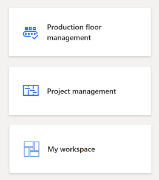

# Create icons for workspace tiles

[!include [banner](../includes/banner.md)]

This article provides guidelines and recommendations for creating and assigning icons to custom workspace tiles.  

The dashboard contains a set of workspace tiles to which the user has access. Each of these tiles contains an icon specific to that workspace. For out-of-the-box workspaces provided by Microsoft, the icons used on the workspace tiles generally correspond to a symbol from the [Dynamics Symbol font](symbol-font.md). This article discusses the guidelines and recommendations for creating and assigning icons to tiles for workspaces created by Microsoft Certified Partners or individual customers.

## Implementation details
For workspace icons, we recommend using an AOT resource for the icon. While the out-of-the-box symbols will work, we recommend creating your own so that multiple workspaces don't use the same icons. For each workspace that needs an icon, create a new image file that adheres to the guidelines below. Note that the recommended guidance for newer versions of the product has changed.

### Modeling details

When you create a workspace tile, you need to follow these guidelines:

-   Add an AOTResource for each new icon.
-   On the tile corresponding to the workspace, set the following properties:
    -   ImageLocation=AOTResource
    -   NormalImage=&lt;name of AOTResource&gt;

## Icon creation
Guidelines for creating images for custom workspace tiles are below. The recommended dimensions for the image and icon are based on the out-of-the-box workspace icons. While images of other sizes are allowed, the size and positioning of the icon relative to the full image should be maintained regardless of the image size.  

Following these recommendations ensures that your workspace icon matches the styling and size of other workspace icons and that the content of your workspace icon does not get cropped by the CSS applied to the image.

-   The image file should be a PNG file with a 1:1 aspect ratio.
-   The recommended minimum image size is 50 × 50 pixels (px), where the icon is contained in a square that is centered in the image. For the minimum 50 × 50 px image size, the icon should be contained in a **30 × 30 px** square in the center of the image.

    > [!NOTE]
    > The crispness of out-of-box workspace icons and custom workspace icons might differ at different zoom levels. The reason for this difference is that images in PNG format have a fixed resolution, whereas out-of-box workspace icons are font glyphs that scale smoothly. For better resolution at different zoom levels, consider creating larger images with the same relative dimensions. For example, create 200 × 200 px or 400 × 400 px images.

-   The icon should have a **white background with transparent content**. 
-   The framework will set a default background color for the transparent portions of your image so that it will match the current user theme.

## Example 
Consider the following image/icon that is to be used for a new workspace. 

 

This icon would be converted to an image with a **white background and transparent content** with the icon centered in a larger image canvas as shown.  

 

To understand how this relates to the sizing recommendations, here is the workspace icon image overlaid with the new sizing recommendations.   

 

Using this image on a workspace tile yields the following result on the dashboard. 

                

[!INCLUDE[footer-include](../../../includes/footer-banner.md)]
