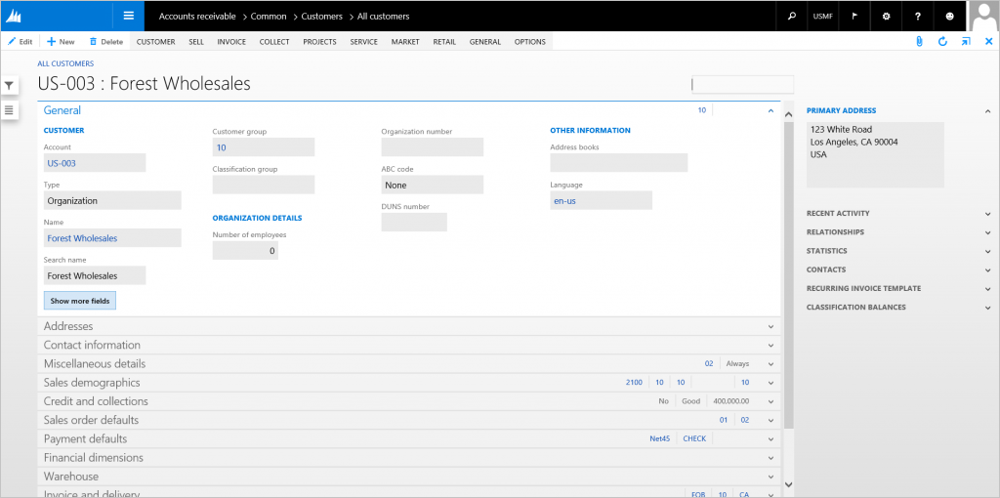
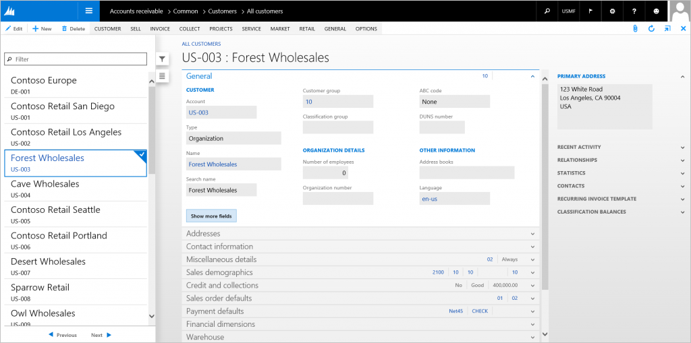
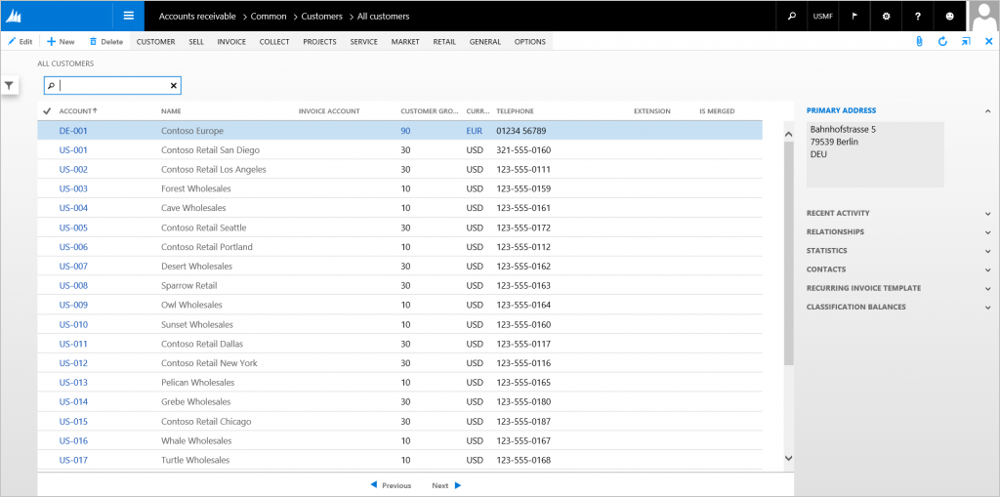
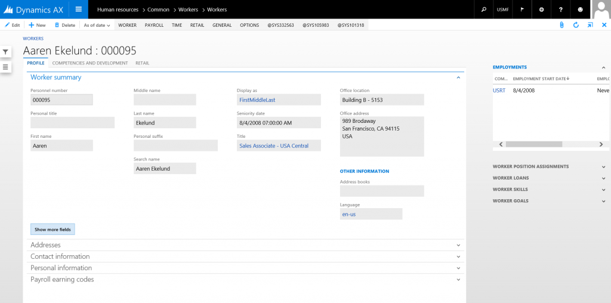
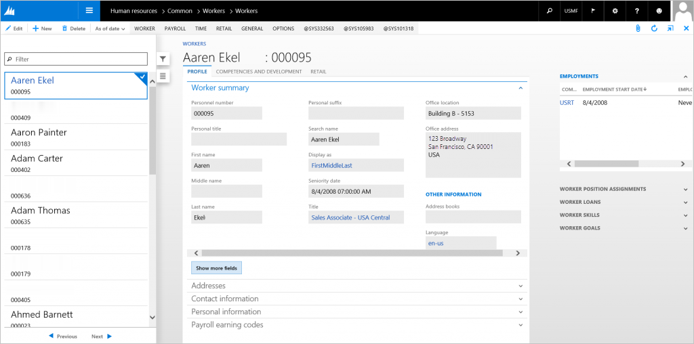
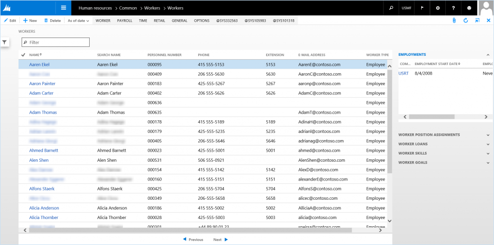
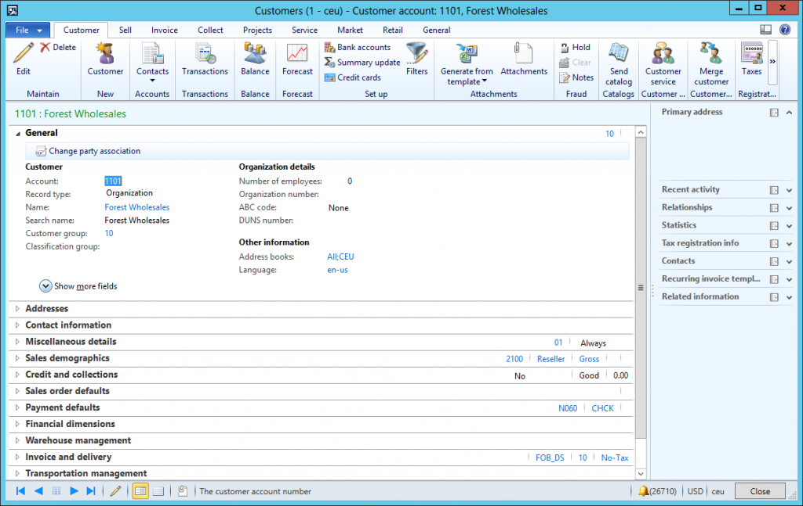
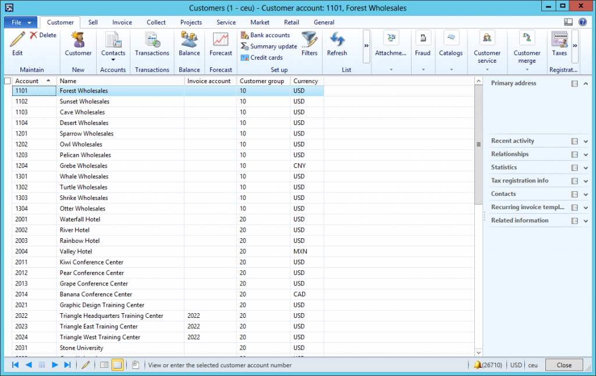
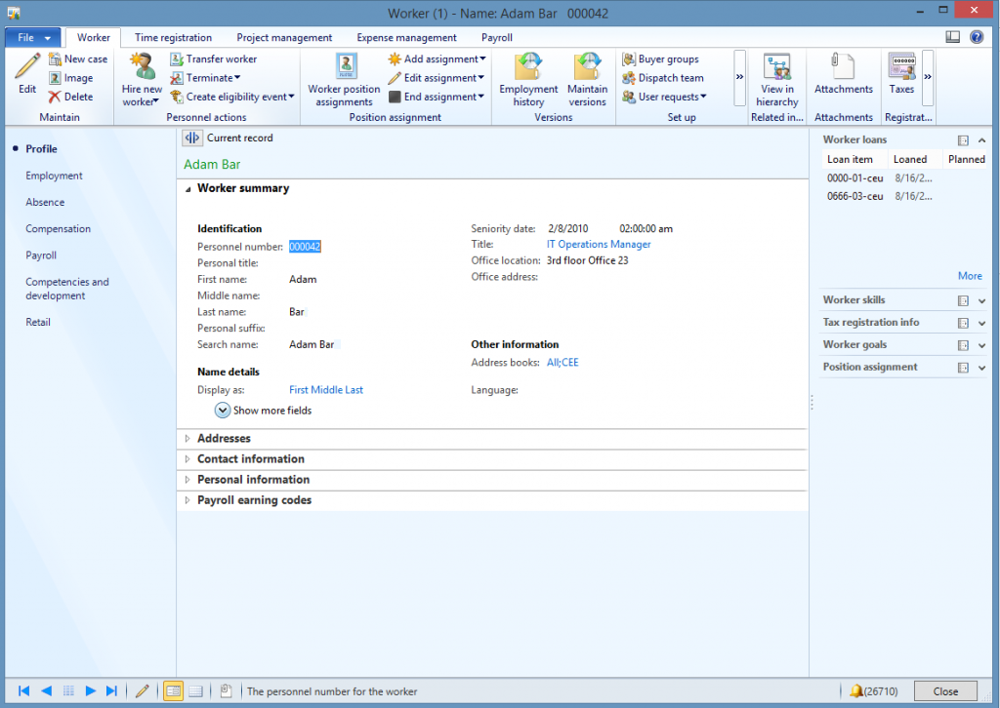

# Details Master form pattern

[!include [banner](../includes/banner.md)]

This article provides information about the Details Master form pattern. A details form is the primary method for entering data.

## Usage

A details form is the primary method for entering data. These forms let the user view, edit, and act upon data. All content on these form types is structured into FastTabs that can be expanded and collapsed, so that multiple FastTabs can be open at the same time. The FastTabs can contain fields or a grid, and each FastTab can have a local toolbar. Two patterns are described in this document:

-   **Detail Master** – This is the basic Detail Master pattern. This is the pattern that you should use by default.
-   **Detail Master w/ Tabs** – You should use this pattern when an entity requires many FastTabs (more than 15) that can be grouped into categories.

In both cases, the grid view is structured the same.

## Wireframe
### Details Master

#### Details view

#### Grid view

### Details Master with Standard Tabs

#### Details view

#### Grid view

## Pattern changes
Here are the main changes to this pattern since Microsoft Dynamics AX 2012:

-   Added a List style grid to the left of the Details view content.
-   Merged List Page and Details Master into a single form.
    -   Improves performance when moving between a list and details.
    -   Enables bulk editing in the initial list.
    -   Allows for elimination of the list page preview pane.
-   View/Edit, New, Delete, Save, Refresh, Attachments, and Export to Excel actions are all provided by the foundation and should not have explicit app buttons unless the foundation-provided button is removed.
-   Master Details forms that previously used the TOC extension should now use the Master Details w/Standard Tabs pattern.

## Model
### Details Master (basic) – High-level structure

- Design

    - ActionPane (ActionPane)
    - SidePanel (Group)

        - QuickFilter
        - *CustomFilters (Group) \[Optional\]*
        - NavigationList (Grid, Style=List)

    - MainTab (Tab ShowTabs=No)

        - DetailsTabPage (TabPage)

            - TitleGroup (Group)

                - HeaderTitle (String)
                - *EntityStatus (Group) \[Optional\]*

                    StatusFields (1..N)

            - DetailsTab (Tab Style=FastTabs)

                - DetailsTabPage (TabPages *repeats 1..N*)

        - GridTabPage (TabPage)

            - CustomFilterGroup (Group)

                - QuickFilter
                - *OtherFilters ($Field) \[0..N\]*

            - MainGrid (Grid)
            - MainGridDefaultAction (CommandButton)

### Details Master with Standard Tabs – High-level structure

- Design

    - ActionPane (ActionPane)
    - SidePanel (Group)

        - QuickFilter
        - *CustomFilters (Group) \[Optional\]*
        - NavigationList (Grid, Style=List)

    - MainTab (Tab ShowTabs=No)

        - DetailsTabPage (TabPage)

            - TitleGroup (Group)

                - HeaderTitle (String)
                - *EntityStatus (Group) \[Optional\]*

                    - StatusFields (1…N)

            - CategoryTab (Tab Style=Tabs)

                - CategoryTabPage (TabPages *repeats 3..N*)

                    - TabHeader (Group)
                    - DetailsTab (Tab Style=FastTabs)

                        - DetailsTabPage (TabPages *repeats 1..N*)

        - GridTabPage (TabPage)

            - CustomFilterGroup (Group)

                - QuickFilter
                - *OtherFilters ($Field) \[0..N\]*

            - MainGrid (Grid)
            - MainGridDefaultAction (CommandButton)

### Core components

1.  Apply the DetailsMaster pattern on **Form.Design**.
2.  Address BP Warnings:
    1.  **Design.Caption** isn't empty.
    2.  Form must be referenced by at least one menu item.
    3.  **TabPage.Caption** isn't empty.

### Related patterns

-   [Details Transaction](details-transaction-form-pattern.md)
-   [Simple List and Details](simple-list-details-form-pattern.md)

### Commonly used subpatterns

-   [Fields and Field Groups](fields-field-groups-subpattern.md)
-   [Toolbar and List](toolbar-list-subpattern.md)
-   [Toolbar and Fields](toolbar-fields-subpattern.md)
-   [Nested Simple List and Details](nested-simple-list-details-subpattern.md)
-   [Custom Filter Group](custom-filter-group-subpattern.md)

## UX guidelines
The verification checklist shows the steps for manually verifying that the form complies with UX guidelines. This checklist doesn't include any guidelines that will be enforced automatically through the development environment. Open the form in a browser, and walk through these steps. **Standard form guidelines:**

-   Standard form guidelines have been consolidated into the Microsoft Dynamics AX [General Form Guidelines](general-form-guidelines.md) document.

**Detail Master guidelines:**

-   There should not be any duplicate **New** and **Delete** buttons.
-   Should use FastTabs to group the fields instead of traditional tabs. The Details Master w/Standard Tabs pattern groups these related FastTabs into traditional tabs.
    -   In its **default** state, the content of the first FastTab should be fully visible without scrolling.
    -   **FastTabs** guidelines have been consolidated into the [General Form Guidelines ](general-form-guidelines.md) document.
-   **ActionPane** guidelines have been consolidated into the [General Form Guidelines ](general-form-guidelines.md) document, in the ActionPane guidelines section.
-   **Page title area:**
    -   The following format should be used: "&lt;ID&gt; : &lt;Description&gt;"
    -   A link to the Details page should be provided in the Main Menu when the List page has been merged into the Details page.
    -   The page title should be in a plural form.
-   **FactBox** guidelines have been consolidated into the [FactBox Form Patterns](factbox-form-patterns.md) document.
-   **Navigation list grid:**
    -   The list style grid should not have fields within a grid row that cause the row to span more than three lines.
        -   Typically, just the ID and Description are sufficient.
        -   There should be at least two fields.
-   **Grid view:**
    -   The grid has 2 to 15 fields. Typically, all mandatory fields are included, so that records can be created in the grid.
    -   A linked field lets the user open the details for the selected record.
    -   The Quick filter should default to the most likely field for a filter scenario.
    -   **Grid:**
        -   The **ID** field should be the first column (if it's needed in the grid). Otherwise, the **Name** field should be the first column.
        -   Additional grid guidelines have been consolidated into the [General Form Guidelines ](general-form-guidelines.md) document, in the Grid guidelines section.

## Examples
### Details Master (basic)

Form: **CustTable**

#### Details view (navigation list off)

#### Details view (navigation list on)

#### Grid view

### Details Master with Standard Tabs

Form: **HcmWorker**

#### Details view (navigation list off)

#### Details view (navigation list on)

#### Grid view

## Appendix
### Frequently asked questions

This section will have answers to frequently asked questions that are related to this guideline/pattern.

### Open issues

None.

### AX 2012 content

#### AX 2012 links
-   [AX 2012 MSDN Details Forms](/dynamicsax-2012/developer/details-forms)

#### AX 2012 example

##### Details Master (basic)

 

##### Details Master with Standard Tabs

 

[!INCLUDE[footer-include](../../../includes/footer-banner.md)]
