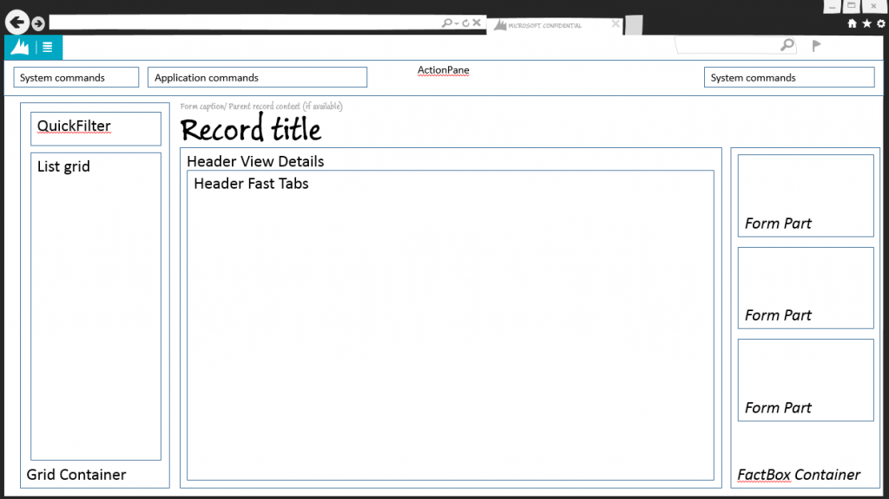
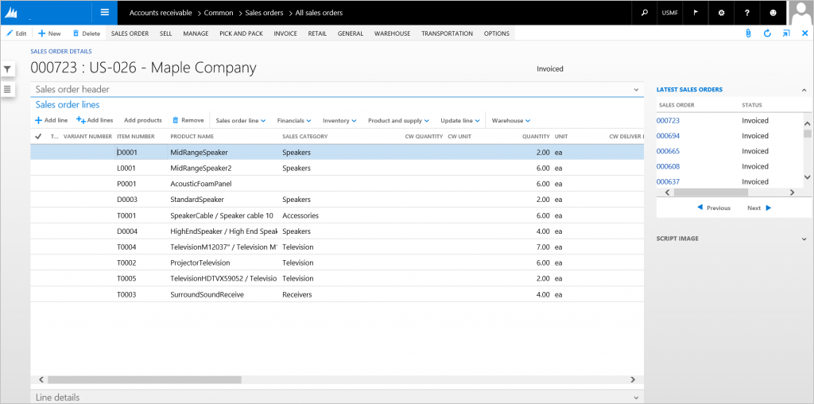
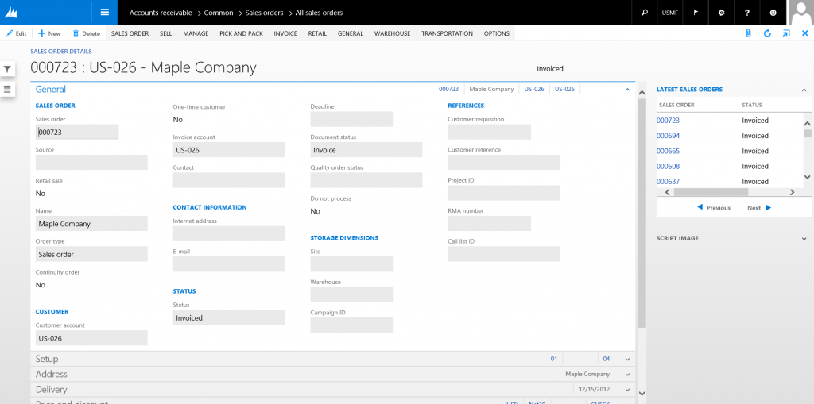
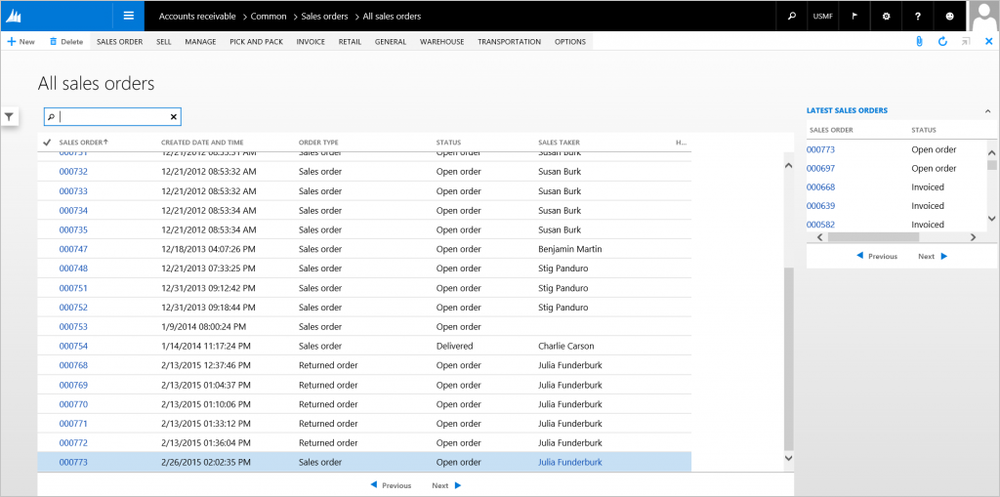

# Details Transaction form pattern

[!include [banner](../includes/banner.md)]

This article provides information about the Details Transaction form pattern. Forms that use this pattern can have two details views that the user can switch between - a Header view and a Line view.

## Usage

A details form with lines (Details Transaction form) consists of one form that can have two details views that the user can switch between. The Header view contains all fields that are related to or part of the header. The Line view contains the lines grid, line details, and a section that contains a collection of the most important header fields.

## Wireframe
### Line view

### Header view

### Grid view

## Pattern changes
Here are the main changes to this pattern since Microsoft Dynamics AX 2012:

-   A List style grid has been added to the left of the Details view content, which is shown in either Header view or Line view.
-   List Page and Details Master have been merged into a single form. This change has the following benefits:
    -   It improves performance when users move between the list and details.
    -   It enables bulk editing in the initial list.
    -   It allows for elimination of the list page preview pane.
-   View/Edit, New, Delete, Save, Refresh, Attachments, and Export to Excel actions are all provided by the foundation and should not have explicit app buttons unless the foundation-provided button is removed.

## Model
### High-level structure

- Design

    - ActionPane (ActionPane)
    - SidePanel (Group)

        - QuickFilter
        - *CustomFilters (Group\] \[Optional\]*
        - NavigationList (Grid, Style=List)

    - PanelTab (Tab ShowTabs=No)

        - DetailsPanel (TabPage)

            - TitleGroup (Group)

                - HeaderTitle (String)
                - *EntityStatus (Group) \[Optional\]*

                    - StatusFields (1..N)

            - HeaderLinePanels (Tab ShowTabs=No)

                - LinePanel (TabPage PanelStyle=Line)

                    - LineViewTab (Tab Style=FastTabs)

                        - LineViewHeader (TabPage)
                        - LineViewLines (TabPage)
                        - LineViewLineDetails (TabPage)

                            - LineDetailsTab (Tab Style=Standard)

                                - LineDetailsTabPages (TabPages 1..N)

                - HeaderPanel (TabPage PanelStyle=Header)

                    - HeaderViewTab (Tab Style=FastTabs)

                        - HeaderViewTabPages (TabPages 1..N)

        - GridPanel (TabPage PanelStyle=Grid)

            - CustomFilterGroup (Group)

                - QuickFilter
                - *OtherFilters ($Field) \[0..N\]*

            - MainGrid (Grid)
            - MainGridDefaultAction (CommandButton)

### Core components

1.  Apply the DetailsTransaction pattern on **Form.Design**.
2.  Address BP Warnings:
    1.  **Design.Caption** isn't empty.
    2.  The form must be referenced by at least one menu item.
    3.  **TabPage.Caption** isn't empty.
    4.  **TabPage.DataSource** isn't empty.

### Related patterns

-   [Details Master](details-master-form-pattern.md)
-   [Simple List and Details](simple-list-details-form-pattern.md)

### Commonly used subpatterns

-   [Fields and Field Groups](fields-field-groups-subpattern.md)
-   [Toolbar and List](toolbar-list-subpattern.md)
-   [Toolbar and Fields](toolbar-fields-subpattern.md)
-   [Nested Simple List and Details](nested-simple-list-details-subpattern.md)
-   [Custom Filter Group](custom-filter-group-subpattern.md)

## UX guidelines
The verification checklist shows the steps for manually verifying that the form complies with UX guidelines. This checklist doesn't include any guidelines that will be enforced automatically through the development environment. Open the form in the browser, and walk through these steps. **Standard form guidelines:**

-   Standard form guidelines have been consolidated into the Microsoft Dynamics AX [General Form Guidelines](general-form-guidelines.md) document.

**Detail Transaction guidelines:**

-   There should not be any duplicate **New** and **Delete** buttons.
-   **ActionPane** guidelines have been consolidated into the [General Form Guidelines](general-form-guidelines.md) document, in the ActionPane guidelines section.
-   In its **default** state, the content of the first FastTab should be fully visible without scrolling.
-   **FastTabs** guidelines have been consolidated into the [General Form Guidelines](general-form-guidelines.md) document.
-   **Page title area**:
    -   The following format should be used: **&lt;ID&gt; : &lt;Description&gt;**
    -   A link to the Details page should be provided on the Main Menu after the List page has been merged into the Details page.
    -   The page title should be in a plural form.
-   **Navigation list grid**:
    -   The list style grid should not have fields within a grid row that spans more than three lines.
        -   Typically, just the ID and Description are sufficient.
        -   There should be at least two fields.
    -   The last field should be the total of the transaction.
-   **Grid view**:
    -   The grid has 2 to 15 fields. Typically, all mandatory fields are included, so that records can be created in the grid.
    -   A linked field lets the user open the details for the selected record.
    -   By default, the Quick Filter should use the most likely field for a filter scenario.
    -   Focus should be in the Quick Filter when the list page is opened.
    -   **Grid**:
        -   The **ID** field should be the first column, followed by the master entity **ID** and **Name** fields.
        -   Additional grid guidelines have been consolidated into the [General Form Guidelines](general-form-guidelines.md) document, in the Grid guidelines section.
    -   **FactBox** guidelines have been consolidated into the [FactBox Form Patterns](factbox-form-patterns.md) document.

## Example
Form: **SalesTable**

#### Line view

#### Header view

#### Grid view

## Appendix
### Frequently asked questions

This section will have answers to frequently asked questions that are related to this guideline/pattern.
 
- **Why is the Header view compulsory?**
    - The Header view is compulsory for the Details Transaction pattern. Initially, the Header view might not have more than the Line view header summary information. However, over time, it will be extended by application teams, internationalization teams, partners, and customers. It's important that the Header view be available for future modifications. In addition, a consistent and dependable form structure has benefits for usability and upgrade reasons.

- **Why are the Header/Lines buttons no longer to the right of the record title at the top of the page?** 
    - The Header/Lines buttons in the header portion of the page were radio buttons restyled to mimic tabs. For improved accessibility on these pages, the **Removal of header/lines proxy buttons** feature removes these radio buttons and instead surfaces the native tab controls that are under the record title to allow you to switch between header lines. Before enabling this feature, you should evaluate the impact of this feature on test assets and task recordings.

        > [!NOTE]
        > This feature is included in the platform updates for version 10.0.23 of finance and operations apps.

### Open issues

None currently.

### AX 2012 content

#### AX 2012 links

-   [MSDN Details Form with Lines User Experience Guidelines \[AX 2012\]](/dynamicsax-2012/developer/details-form-with-lines-user-experience-guidelines)
-   [MSDN Details Form \[AX 2012\]](/dynamicsax-2012/developer/details-forms)

#### AX 2012 example

##### Line view

##### Header view

##### Grid view

[!INCLUDE[footer-include](../../../includes/footer-banner.md)]

