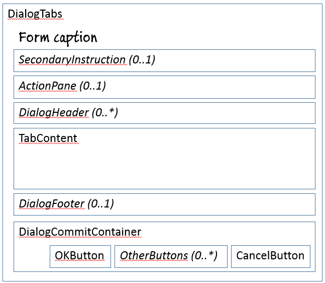
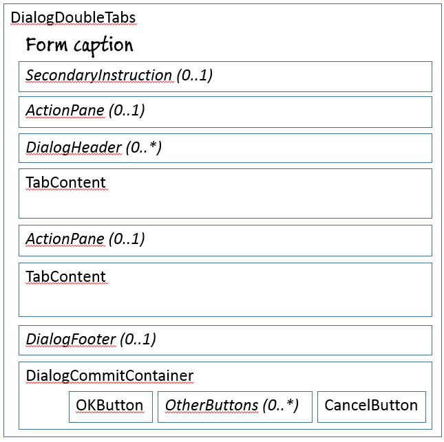
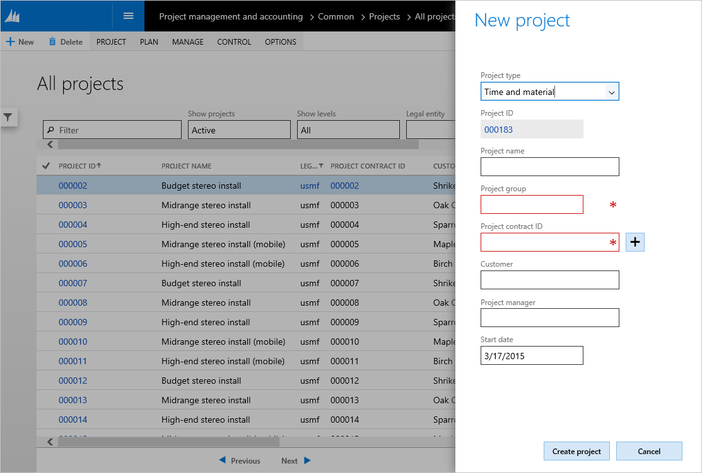
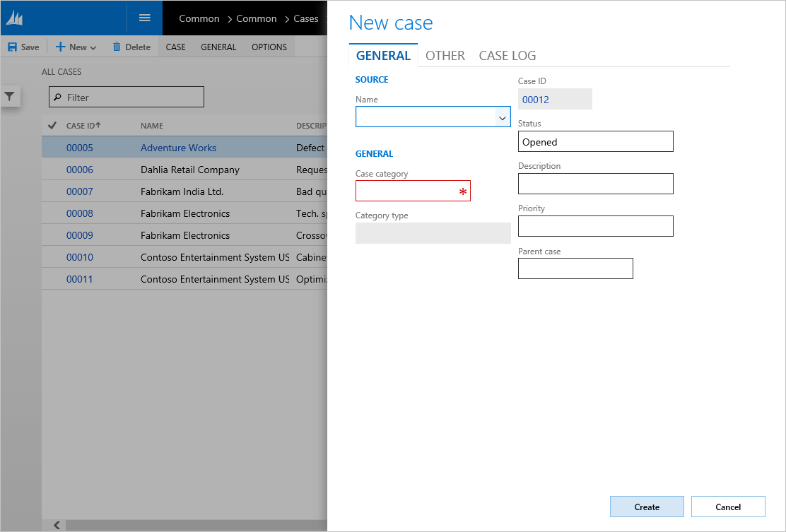
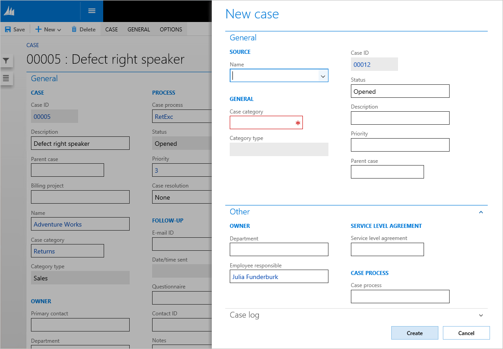
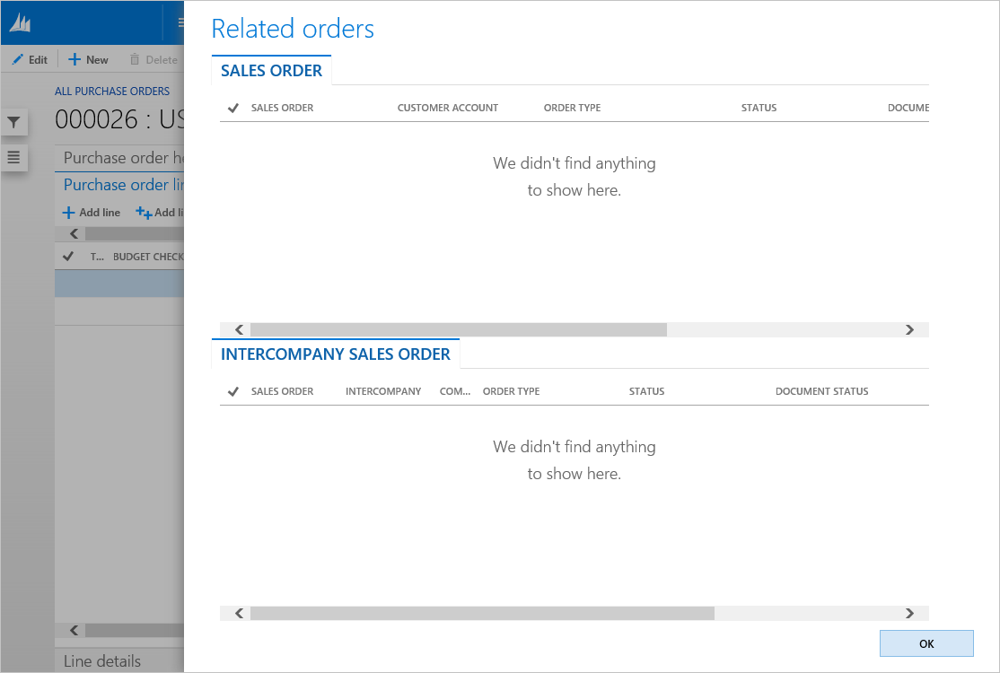
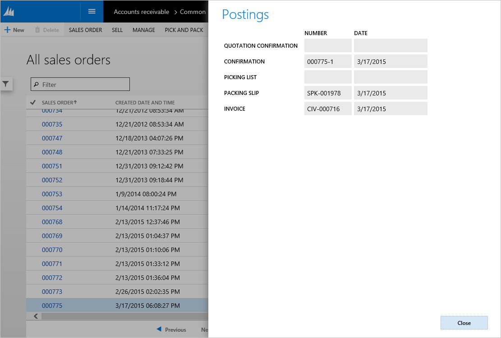

# Dialog form pattern

[!include [banner](../includes/banner.md)]

This article provides information about the Dialog form pattern. A dialog box represents an action or activity that users can explicitly commit or cancel. It's used when a user initiates a specific task or process, and the system requires user input about how or whether to proceed.

## Usage

A dialog box represents an action or activity that users can explicitly commit or cancel. It's used when a user initiates a specific task or process, and the system requires user input about how or whether to proceed. Dialogs are modal and require that users interact with the controls in the dialog before they can return to the parent page. Dialogs also can have multiple sizes. Selection of a dialog size is subjective, and will vary, depending on the form elements that you've modeled on the dialog. The sizes are as follows:

-   **Small** – This size is a one-column-wide dialog. If your dialog contains a relatively small amount of content (all simple fields, and no wide tables or other wide elements), you can probably use this size.
-   **Medium** – This size is a two-column-wide dialog. If your dialog contains more content than can comfortably fit within a small dialog, but a full-width dialog isn’t required, you should use this size.
-   **Large** – This size is a three-column-wide dialog. If your dialog contains more content than can comfortably fit within a medium dialog, but a full-width dialog isn’t required, you should use this size.
-   **Full** – A large dialog is nearly the full width of the browser viewport. Its size varies, depending on the viewport width, and it will always be the largest dialog size option. Use this size if your dialog has a lot of wide elements, or if it requires an unusually large amount of horizontal space.

For more detail about the various dialog sizes, see the table in the appendix of this article, under “Selecting the correct dialog size.” We strongly recommend that you review that table. Five patterns are described in this document:

-   **Dialog** – This is the basic dialog pattern. Use this dialog if you don't have a reason to use one of the other Dialog patterns.
-   **Dialog w/tabs** – This is a more specific version of the Dialog pattern. It incorporates a Tab control in the dialog. You can also optionally provide a header for the Tab, and also a footer.
-   **Dialog w/FastTabs** – This closely resembles the Dialog w/tabs pattern but uses FastTabs instead of regular tabs to organize the information.
-   **Dialog w/double tabs** – This closely resembles the Dialog w/tabs pattern but has a second Tab control immediately after the first one.
-   **Dialog (read only)** – This pattern is for informational forms that aren't editable. The user can still switch between tabs or a view selector, but direct manipulation of input fields isn't allowed. This dialog variation also includes a **Close** button instead of **OK** and **Cancel** buttons.

## Wireframe
The following sections show the wireframes for the four dialog types that are included in this article.

### Dialog

### Dialog w/tabs and Dialog w/FastTabs

### Dialog w/double tabs

### Dialog (read only)

## Pattern changes
Here are the main changes to this pattern since Microsoft Dynamics AX 2012:

-   The form caption serves as the MainInstruction. Therefore, a modeled MainInstruction control is no longer required.
-   Manual handling of error messages is no longer required.
-   In some cases, buttons will scroll off the bottom of the slider if the form content exceeds the available height.
-   Slider dialogs have their own message bar (because the main message bar is obscured when a slider is open).

## Model
### Dialog (basic) – High-level structure

- Design

    - *SecondaryInstruction (StaticText) \[Optional\]*

        - *ActionPane (ActionPane) \[Optional\]*
        - *DialogHeader (Group, can repeat) \[Optional\]*
        - DialogContent (Group, repeats 1..N)
        - DialogCommitContainer (ButtonGroup)

            - OKButton ($Button)
            - *OtherButton ($Button, can repeat) \[Optional\]*
            - CancelButton ($Button)

###  Dialog w/Tabs and Dialog w/FastTabs – High-level structure

- Design

    - *SecondaryInstruction (StaticText) \[Optional\]*
    - *ActionPane (ActionPane) \[Optional\]*
    - *DialogHeader (Group, can repeat) \[Optional\]*
    - TabContent (Tab)

        - TabPage (TabPage, repeats 1..N)

    - *DialogFooter (Group) \[Optional\]*
    - DialogCommitContainer (ButtonGroup)

        - OKButton ($Button)
        - *OtherButton ($Button, can repeat) \[Optional\]*
        - CancelButton ($Button)

### Dialog w/double tabs – High-level structure

- Design

    - *SecondaryInstruction (StaticText) \[Optional\]*
    - *ActionPane (ActionPane) \[Optional\]*
    - *DialogHeader (Group, can repeat) \[Optional\]*
    - TabContent (Tab)

        - TabPage (TabPage) \[1..\*\]

    - TabContent (Tab)

        - TabPage (TabPage) \[1..\*\]

    - *DialogFooter (Group) \[Optional\]*
    - DialogCommitContainer (ButtonGroup)

        - OKButton ($Button)
        - *OtherButton ($Button, can repeat) \[Optional\]*
        - CancelButton ($Button)

### Dialog (read only) – High-level structure

- Design

    - *SecondaryInstruction (StaticText) \[Optional\]*
    - *ActionPane (ActionPane) \[Optional\]*
    - *DialogHeader (Group, can repeat) \[Optional\]*
    - DialogContent (Group, repeats 1..N)
    - DialogCommitContainer (ButtonGroup)

        CloseButton ($Button)

### Core components

-   Apply the Dialog pattern on **Form.Design**.
-   Address BP Warnings:
    -   **Design.Caption** isn't empty.
    -   The form must be referenced by at least one menu item.
    -   **StaticText.Text** isn't empty.

### Related patterns

-   [Drop Dialog](drop-dialog-form-pattern.md)

### Commonly used subpatterns

-   [Fields and Field Groups](fields-field-groups-subpattern.md)
-   [Toolbar and List](toolbar-list-subpattern.md)
-   [Toolbar and Fields](toolbar-fields-subpattern.md)
-   [Fill Text](fill-text-subpattern.md)

## UX guidelines
The verification checklist shows the steps for manually verifying that the form complies with UX guidelines. This checklist doesn't include any guidelines that will be enforced automatically through the development environment. Open the form in the browser, and walk through these steps. **Standard form** **guidelines:**

-   Standard form guidelines have been consolidated into the [General Form Guidelines](general-form-guidelines.md) document.

**Dialog guidelines:**

-   Focus should be in the first editable field in the dialog box when the dialog box is first opened.
    -   **Exception:** If the dialog is read-only, focus should be on the **Close** button.
-   A dialog must have a **main instruction** at the top.
    -   A final period should not be included if the instruction is a statement. If the instruction is a question, a question mark should be included.
-   A secondary instruction to the user can optionally be included, and it should present additional information that will help the user understand or use the dialog box. The secondary instruction should consist of a complete sentence in sentence case and should have end punctuation.
-   A dialog must have a **content** area.
-   For editable dialogs:
    -   The content area should contain only the controls that are required in order to complete the task.
    -   Constrained input controls, such as selection lists, check boxes, radio buttons, and command links, should be used to avoid validation errors.
    -   Reasonable default values for each input should be provided whenever possible.
    -   Controls should not cause another dialog to appear during validation.
        -   Warning messages for validation issues should be displayed in a message bar as soon as possible.
-   For read-only dialogs:
    -   The content area should only contain controls that are non-editable or only allow the user to switch the data is displayed, such as a view selector.
    -   Programmatically changing the value of a field should not cause validation errors.
    -   If your dialog has multiple tabs, the tab that has the most content must define the selection of the dialog width.
-   A dialog must have a **commit** button area:
    -   For an editable dialog only, there is a commit button that starts the action that is implied by the main instruction.
    -   The labels should make sense on their own and should be a response to the main instruction.
    -   For both editable and read-only dialogs, the right-most button is a **Cancel** button that cancels the operation without side-effects.
    -   There is a button that is marked as the default button for the dialog.
    -   The button that is selected as the default button should be the safest, most secure response to the task that the user is performing, such as the main instruction of a Dialog or Drop Dialog.
        -   If safety and security aren't factors, the button that is most likely to be clicked or that is most convenient for the user should be selected as the default button.
        -   **Exception:** Don't select a destructive response as the default unless there is an easy, obvious way to undo the command.

A dialog should **not** have these elements:

-   FactBoxes

## Examples
### Dialog (basic)

Form: **ProjTableCreate** (Click **Project management and accounting** &gt; **Common** &gt; **Projects** &gt; **All projects**, and then click **New**.) 

### Dialog w/tabs

Form: **CaseDetailCreate** (Click **Common** &gt; **Common** &gt; **Cases** &gt; **All cases**, and then click **New**.) 

### Dialog w/FastTabs

This example shows a modified version of the **CaseDetailCreate** form, because the product currently includes no examples of forms that use this pattern. 

### Dialog w/double tabs

Form: **PurchTableReferences** (Click **Accounts payable** &gt; **Common** &gt; **Purchase orders** &gt; **All purchase orders**, and then click **General** &gt; **Related information** &gt; **Related orders**.) 

### Dialog (read only)

Form: **SalesTablePostings** (Click **Accounts receivable** &gt; **Common** &gt; **Sales orders** &gt; **All sales orders**, and then click **General** &gt; **Related information** &gt; **Postings**.) 

## Appendix
### Frequently asked questions

This section will have answers to frequently asked questions that are related to this guideline/pattern.

### Open issues

-   **How does this pattern handle the More info link in dialogs?**
    -   **More info** usage is assumed to be a custom pattern unless we have enough cases to justify the addition of a new pattern.
-   **Should the pattern be modified to force OK/Cancel buttons to use CommandButtons instead of any button type?**
    -   We will be looking at making this change in the future.

### Selecting the correct dialog width

| Type of content     | Small dialog                                                                                                           | Medium dialog                           | Large dialog                              | Full dialog                                                          | Notes                                                                                                                                                                                                    |
|---------------------|------------------------------------------------------------------------------------------------------------------------|-----------------------------------------|-------------------------------------------|----------------------------------------------------------------------|----------------------------------------------------------------------------------------------------------------------------------------------------------------------------------------------------------|
| Columns of content  | The slider fits one column of content.                                                                                 | The slider fits two columns of contents | The slider fits three columns of content. | The slider fits the viewport width minus peek.                       | The maximum number of columns depends on the width of the fields in the column. Therefore, the width is defined as *x* × 100% field size.                                                                |
| Horizontal scroll   | No horizontal scrolling                                                                                                | Avoid horizontal scrolling.             | Avoid horizontal scrolling.               | OK, provided that the control buttons and commit buttons are visible |                                                                                                                                                                                                          |
| Vertical scroll     | No vertical scroll for typical scenarios (FastTabs can be expanded for special cases). Otherwise, use a Medium dialog. | Yes                                     | Yes                                       | Yes                                                                  | Avoid putting so much content in the dialog that you cause vertical scrolling of the contents. If your dialog is vertically scrolling at a typical screen resolution, you should make the dialog larger. |
| FastTabs            | Strongly discouraged                                                                                                   | OK but discouraged                      | Yes                                       | Yes                                                                  |                                                                                                                                                                                                          |
| Tabs                | Yes                                                                                                                    | Yes                                     | Yes                                       | Yes                                                                  | Switching tabs or expanding FastTabs should never cause jumps in the dialog size. The largest tab content must define the choice of the dialog size.                                                     |
| List/hierarchy      | Yes                                                                                                                    | Yes                                     | Yes                                       | Yes                                                                  |                                                                                                                                                                                                          |
| Field groups        | Yes                                                                                                                    | Yes                                     | Yes                                       | Yes                                                                  |                                                                                                                                                                                                          |
| Nested field groups | No nested field groups that have a mixed layout direction (matrix or tabular layout)                                   | Multiple-column layout                  | Multiple-column layout                    | Yes                                                                  |                                                                                                                                                                                                          |
| Custom controls     | Yes                                                                                                                    | Yes                                     | Yes                                       | Yes                                                                  |                                                                                                                                                                                                          |
| Grid                | Yes, but no horizontal scrolling                                                                                       | Yes, but no horizontal scrolling        | Yes, but no horizontal scrolling          | Yes                                                                  | The maximum number of columns depends on the width of the fields in the column. Therefore, the width is defined by *x* × 100% field size.                                                                |

### AX 2012 content

[!INCLUDE[footer-include](../../../includes/footer-banner.md)]
