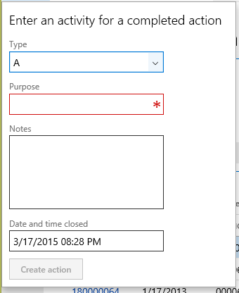

# Drop Dialog form pattern

[!include [banner](../includes/banner.md)]

This article provides information about the Drop Dialog form pattern. This pattern is used to initiate actions when the number of fields is seven or fewer. 

## Usage

The Drop Dialog pattern is used to initiate actions when the number of fields is seven or fewer. Drop dialogs are quick and easy for users to use, and are more lightweight than a full dialog that is presented as a slider. Drop dialogs should feel as lightweight to use as a menu. Two patterns are described in this document:

-   **Drop dialog** – This is the basic Drop dialog pattern. If your Drop dialog is editable, this is the correct pattern to use.
-   **Drop dialog (read only)** – This Drop dialog pattern is for informational forms that aren't editable. This variation doesn't have an **OK** button.

## Wireframe
### Drop dialog (basic)

### Drop dialog (read only)

## Pattern changes
Here are the main changes to this pattern since Microsoft Dynamics AX 2012:

-   Manual handling of error messages is no longer required.

## Model
### Drop dialog (basic) – High-level structure

- Design

    - *SecondaryInstruction (StaticText) \[optional\]*
    - DialogContent (Group)
    - DialogCommitContainer (ButtonGroup)

        - OKButton ($Button)

### Drop dialog (read only) – High-level structure

- Design

    - *SecondaryInstruction (StaticText) \[optional\]*
    - DialogContent (Group)

### Core components

-   Apply the Drop Dialog pattern on **Form.Design**.
-   Address BP Warnings:
    -   **Design.Caption** isn't empty.
    -   The form must be referenced by at least one menu item.
    -   **StaticText.Text** isn't empty.

### Related patterns

-   [Dialog](dialog-form-pattern.md)

### Commonly used subpatterns

-   [Fields and Field Groups](fields-field-groups-subpattern.md)
-   [Toolbar and List](toolbar-list-subpattern.md)

## UX guidelines
The verification checklist shows you the steps for manually verifying that the form complies with UX guidelines. This checklist doesn't include any guidelines that will be enforced automatically through the development environment. Open the form in the browser, and walk through these steps. **Standard form guidelines:**

-   Standard form guidelines have been consolidated into the [General Form Guidelines](general-form-guidelines.md) document.

**Drop dialog guidelines:**

-   A Drop dialog should be used if the following conditions exist:
    -   There are seven or fewer fields.
    -   The user can enter the information quickly.
    -   Minimal field validation is required.
    -   There are no buttons that open additional child forms.
        -   **Exceptions:** Lookups, Enhanced preview, and View details navigation
    -   There is no editable grid (select-only grids are allowed).
-   Focus should be in the first editable field on the Drop dialog when it is first opened.
-   A Drop dialog should have a **main instruction** (form caption) at the top.
    -   The main instruction should be used to explain concisely what the user should do in the Drop dialog. The instruction should be a specific statement, an imperative direction, or a question. Good instructions communicate the user’s objective with the Drop dialog rather than focusing purely on the mechanics of manipulating it.
    -   A final period should not be included if the main instruction is a statement. If the instruction is a question, a question mark should be included.
    -   Besides the main instruction, a secondary instruction to the user should be displayed, and it should present additional information that will help the user understand or use the Drop dialog. The secondary instruction should consist of a complete sentence in sentence case and should have end punctuation.
        -   **Exception:** If the additional instruction merely repeats the main instruction with slightly different wording, don't include it.
-   A Drop dialog should have a **content** area.
    -   Constrained input controls should be used to avoid validation errors. Examples include selection lists, check boxes, radio buttons, and command links.
    -   Reasonable defaults for each input should be provided whenever possible.
-   A Drop dialog should have a **commit** button area that:
    -   Does **not** have a **Cancel** button.
    -   Has a button that is marked as the default button of the Drop dialog (if a button exists).
    -   The label of the default button should be a verb that implements the action that is described in the main instruction. For example, if the main instruction is “Create new product,” the button label should be **Create**. If there is no appropriate verb for the button, use **OK**.
    -   The commit button area should have specific commit button labels that make sense on their own and are a response to the main instruction.

A Drop dialog should **not** have the following:

-   A toolbar or ActionPane anywhere in the Drop dialog.
-   Buttons that navigate to another page or open other dialogs. (Enhanced previews are allowed.)
-   Field groups. There are exceptions, such as a radio button or check box group.
-   A tab control.
-   FactBoxes.
-   FastTabs.

## Examples
### Drop dialog (basic)

Form: **CustCollectionsNewActivityAction** (Click **Accounts receivable** &gt; **Common** &gt; **Collections** &gt; **Collections**, select a row to move to details, and then click **Action**.) 

### Drop dialog (read only)

This pattern isn't currently used in the product.

## Appendix
### Frequently asked questions

This section will have answers to frequently asked questions that are related to this guideline/pattern.

### Open issues

-   **Should a vertical Fields and Field Groups subpattern be added for Drop dialogs?**
    -   No, you should use the normal Fields and Field Groups pattern.
-   **Should buttons be left-aligned or right-aligned?**
    -   Right-aligned. The pattern is currently enforcing this.

### AX 2012 content

[!INCLUDE[footer-include](../../../includes/footer-banner.md)]
