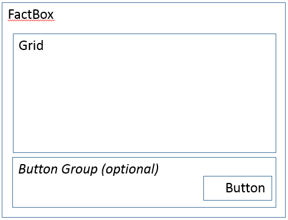
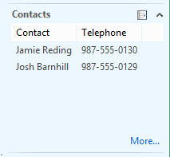

# FactBox form patterns

[!include [banner](../includes/banner.md)]

This article provides information about the FactBox form patterns. FactBoxes are used to provide related information for a record.

## Usage

In general, FactBoxes are used to provide “related information” for a record. They help guarantee that the user doesn't have to open additional forms to get important information, such as totals, balances, overdue orders, and email addresses. The Factbox Grid pattern should be used when there is a child collection (potential for multiple rows) of related information. Two patterns are described in this document:

-   **Form Part FactBox Grid** – This FactBox pattern is used when there is a child collection (potential for multiple rows) of related information.

<!-- -->

-   **Form Part FactBox Card** – This FactBox pattern is used when there is just a set of related fields that must be shown.

## Wireframe
### Form Part FactBox Grid

[](./media/factbox1.png)

### Form Part FactBox Card

[](./media/factbox2.png)

## Pattern changes
Here are the main changes to this pattern since Microsoft Dynamics AX 2012:

-   A group has been added around the optional button to make it easier to position the button.

## Model
### Form Part FactBox Grid – High-level structure

- Design

    - Grid
    - *GridDefaultAction (Button) \[Optional\]*
    - *ButtonGroup (ButtonGroup) \[Optional\]*

        - Button

###  Form Part FactBox Card – High-level structure

- Design

    - *FieldGroups (Group) \[0..N\]*

        - Fields ($Fields, 1..N)

    - *Fields ($Field) \[0..N\]*
    - *ButtonGroup (ButtonGroup) \[Optional\]*

        - Button

### Core components

-   Apply the FactBox pattern on **Form.Design**.
-   Address BP Warnings:
    -   **Design.Caption** isn't empty.
    -   **Grid.DataSource** isn't empty.

## UX guidelines
The verification checklist shows the steps for manually verifying that the form complies with UX guidelines. This checklist doesn't include any guidelines that will be enforced automatically through the development environment. Open the form in the browser, and walk through these steps. **Standard form guidelines:**

-   Standard form guidelines have been consolidated into the [General Form Guidelines](general-form-guidelines.md) document.

**FactBox** **general guidelines:**

-   If a backing form exists, the FactBox should have a **(More…)** link defined that goes to the appropriate backing form. The names of the FactBox and backing form should be similar.
-   The title should not be a verb or a verb phrase.
-   The title should not contain a label to a specific record.
-   FactBoxes should not display fields that let a user enter data by typing with the keyboard.
-   The title should accurately describe the content and should not be truncated when the FactBox area is at its default size.

**FactBox grid guidelines:**

-   One to four columns should be displayed.

**FactBox card guidelines:**

-   Each field should have a label.
-   The ID and name of the header or the line that content is displayed for in the FactBox should not be displayed.
-   Two to ten fields should be displayed.
-   Currency indicator fields should be displayed as the last field in the FactBox.

## Examples
### Form Part FactBox Grid

Form: **CustTable** &gt; **ContactsInfoPart** 

[](./media/factbox3.png)

### Form Part FactBox Card

Form: **CustTable** &gt; **CustStatisticsStatistics** 

[](./media/factbox4.png)

## Appendix
### Frequently asked questions

This section will have answers to frequently asked questions that are related to this guideline/pattern.

-   **How do I make the More button work?**
    -   The **More** button at the bottom of the FactBox takes the user to a backing form that contains the full list of related records. This button should be implemented by using a regular Button control that overrides the **clicked** method as shown in the following example. Be sure to fill in the **TableRef** and **ListPageRef** properties on the table that provides data for the grid.

        ```xpp
        [Control("Button")]
        class More
        {
        public void clicked()
            {    
                super();  
                FormPartUtil::openShowMoreForm(element, <TableName>);     
            }
        }
        ```

### Open issues

-   **Should field labels be on the left side in FactBoxes to support a more compact visual?**
    -   We plan to allow **LabelPosition**=**Left** inside FactBoxes.

### AX 2012 content

#### AX 2012 links

-   [AX 2012 MSDN List Page Guidelines (including FactBoxes)](/dynamicsax-2012/developer/list-page-user-experience-guidelines)

#### AX 2012 example

**CustTable** &gt; **ContactsInfoPart** 

[](./media/factbox5.png)


[!INCLUDE[footer-include](../../../includes/footer-banner.md)]
