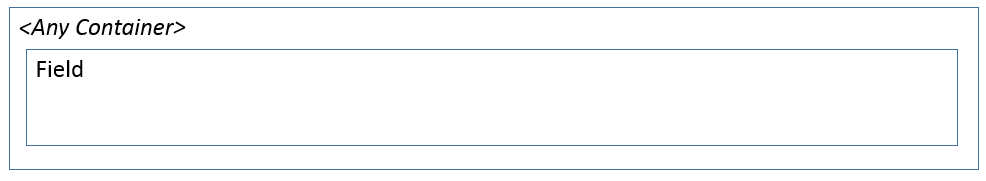

# Fill Text subpattern

[!include [banner](../includes/banner.md)]

This article provides information about the Fill Text subpattern. This subpattern is used when a single String or StaticText control must stretch to the full width of the container, so that users have more space to enter information.

## Usage

Fill Text is used when you need a single String or StaticText control to stretch to the full width of the container. This subpattern is typically used for multi-line string controls that require more space for users to enter information.

## Wireframe

## Model
### High-level structure

[Container]

String | StaticText

### Core components

-   Apply the Fill Text subpattern to the container control.

### Related container patterns

-   [Fields and Field Groups](fields-field-groups-subpattern.md)

## UX guidelines
None

## Examples
Form: **FmRental (Notes)** 

## Resources
### Typically used by patterns

-   [Details Master](details-master-form-pattern.md)
-   [Details Transaction](details-transaction-form-pattern.md)
-   [Simple Details](simple-details-form-pattern.md)
-   [Simple List and Details](simple-list-details-form-pattern.md)
-   [Table Of Contents](table-of-contents-form-pattern.md)
-   [Wizard](wizard-form-pattern.md)

## Appendix
### Frequently asked questions

This section will have answers to frequently asked questions that are related to this guideline/pattern.

### Open issues

-   The pattern currently sets the **HeightMode** property of the control to **SizeToAvailable**. This can produce very tall string controls if the pattern is used in a **SizeToAvailable** container. We’re investigating whether this control should use **SizeToContent** height, or whether it should not set the property at all and should instead let the developer decide the appropriate control height.

[!INCLUDE[footer-include](../../../includes/footer-banner.md)]
