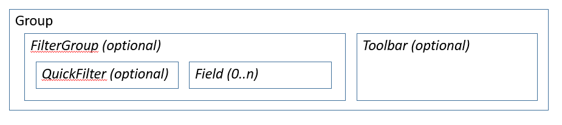
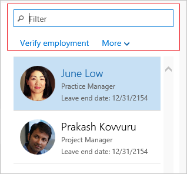

# Filters and Toolbar subpatterns

[!include [banner](../includes/banner.md)]

This article provides information about the Filters and Toolbar subpatterns. These workspace-specific subpatterns have been developed to show filters and/or actions inside panorama sections that host lists and charts.

## Usage

The Filters and Toolbar subpatterns are workspace-specific subpatterns that have been developed to show filters and/or actions inside panorama sections that host lists and charts. Fields in the filtering parts of these subpatterns should be limited to the following field types. All these field types have constrained inputs and can be applied to the query.

-   StringEdits with Lookups
-   Date fields
-   ReferenceGroup
-   Comboboxes
-   Checkboxes
-   Quick Filter

Two subpatterns are described in this article:

-   **Filters and Toolbar - Inline** – In this subpattern, any defined actions appear on the same line as the filter fields.
-   **Filters and Toolbar - Stacked** – In this subpattern, any defined actions appear on a separate line below the filter fields.

## Wireframe
### Filters and Toolbar - Inline

### Filters and Toolbar - Stacked

## Model
### Filters and Toolbar - Inline: High-level structure

- Group (ArrangeMethod=HorizontalLeft)

    - *FilterGroup (Group) \[Optional\]*

        - *QuickFilter (QuickFilter) \[Optional\]*
        - *FilterFIelds ($Field) \[0..N\]*

    - *Toolbar (ActionPane) \[Optional\]*

### Filters and Toolbar - Stacked: High-level structure

- Group (ArrangeMethod=Vertical)

    - *FilterGroup (Group) \[Optional\]*

        - *QuickFilter (QuickFilter) \[Optional\]*
        - *FilterField1 ($Field) \[Optional\]*
        - *FilterField2 ($Field) \[Optional\]*

    - *Toolbar (ActionPane) \[Optional\]*

### Core components

Apply the correct Filters and Toolbar subpattern to the container control.

### Related container patterns

-   [Form Part Section List](section-list-form-pattern.md)
-   [Section Chart](section-chart-form-pattern.md)

## UX guidelines
The verification checklist shows the steps for manually verifying that the form complies with UX guidelines. This checklist doesn't include any guidelines that will be enforced automatically through the development environment. Open the form in the browser, and walk through these steps.

-   **Filters and Toolbar guidelines**
    -   The **Stacked** variant should be used over narrow lists and charts.
    -   The **Inline** variant should be used over wider lists and charts.
-   **Filters**
    -   No more than two filter fields should be used in a Filter group. If you require more than two filter fields, an action on the Toolbar can be used to open a Drop Dialog that has more filter fields.
    -   The filter fields should not have labels. The context should be obvious from the field value.
    -   The combined width of filter fields should not cause the section to become larger than the grid or chart in the section, and should not cause an extra scrollbar on the filters.
-   **Actions**
    -   Include only frequently used commands that help users complete tasks in the workspace.
    -   No more than three actions should appear on the Toolbar. One action on the Toolbar can be used as a drop-down list of up to three additional actions.

## Examples
### Filters and Toolbar - Inline

Form: **HcmWorkforceManagement**  &gt; **HcmOpenPositionsPart** (**All workspaces** &gt; **Workforce management**) 

### Filters and Toolbar - Stacked

Form: **HcmWorkforceManagement** &gt; **HcmWorkerOnLeaveListPart** (**All workspaces** &gt; **Workforce management**) 

## Appendix
### Frequently asked questions

This section will have answers to frequently asked questions that are related to this guideline/pattern.

### Open issues

**Why does the Inline variant allow for an arbitrary number of filter fields, but the Stacked variant allows a maximum of three (a QuickFilter and two custom filters)?**

Two factors contribute to this discrepancy:

-   A UX guideline specifies a maximum of two filters in these sections (and one of those filters could be a QuickFilter). Therefore, the Stacked variant more closely complies with the guideline.
-   The number of fields in the Stacked variant is limited for aesthetic reasons. The filter fields in this variant are intended to take up the full width of the list/chart that appears below them, and their width is therefore **SizeToAvailable**. When this variant is used above narrow lists, as it's intended to be used, that setting can cause very narrow filter fields when more than two filter fields are used. The Inline variant is intended to be used above wider charts/lists. Therefore, the original pattern definition allowed for an arbitrary number of fields. Nevertheless, we do plan to address this discrepancy in the number of allowed filter fields between the two variations in the future.

[!INCLUDE[footer-include](../../../includes/footer-banner.md)]
