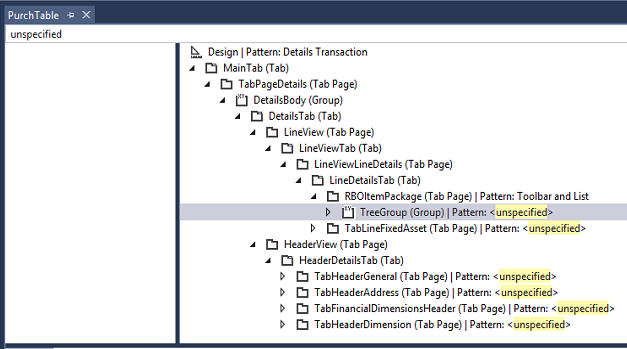

# Form styles and patterns

[!include [banner](../includes/banner.md)]

This article describes the concept of form patterns and discusses the process for applying and removing patterns. A list of frequent questions are also answered in this article. 

## Dynamics AX 2012: Form styles and templates

In Microsoft Dynamics AX 2012, several form styles were introduced and formalized. Primary data types are represented by the List Page and Details Form styles. Secondary data types are represented by the Simple List and Details Form and Simple List Form styles. In addition to these core form types, other form styles exist for supporting forms, such as Table of Contents for settings and Drop Dialog for dialog forms, and Lookup for lookup forms. Other less formal form patterns, such as Wizard, also exist. Developers who wanted to build a new form of a specific style in Dynamics AX 2012 often used the corresponding template form as a starting point. After they included form content and made any modifications that were required, developers could then run the Form Style Checker add-in to validate their form in terms of structure and property values against that form style's template form.

## Finance and operations: Form patterns

Form patterns (a new concept that is the evolution of the Dynamics AX 2012 form templates, style, and Form Style Checker) are now an integrated part of the form development experience. These patterns provide form structure, based on a particular style (including required and optional controls), and also provide many default control properties. In addition to top-level form patterns, subpatterns can be applied to container controls, and that provide guidance and consistency for subcontent on a form (for example, on a FastTab). Patterns have made form development easier by providing a guided experience for applying patterns to forms to guarantee that they are correct and consistent. Patterns help validate form and control structures, and also the use of controls in some places. Patterns also help guarantee that each new form that a user encounters is immediately recognizable in appearance and function. Form patterns can provide many default control properties, and these also contribute to a more guided development experience. Because patterns provide many default layout properties, they help guarantee that forms have a responsive layout. Finally, patterns also help guarantee better compatibility with upgrades. Many of the existing form styles and templates from Dynamics AX 2012 continue to be supported. However, legacy form styles and templates that aren't supported have a migration path. Because the foundational elements are built based on those legacy form styles and patterns, the transition is as easy as possible.

## Applying patterns
Applying a pattern is a straightforward process that can modify properties on multiple containers and controls on a form. Here is the standard flow for applying patterns:

1.  Acquire the target.
2.  Determine the pattern.
3.  Apply the pattern.
4.  Handle errors.

### Acquire the target

First, you must identify a target form and add it to your project. The **Form Patterns** report that is generated by using a Microsoft Visual Studio add-in can help you find forms that don't have patterns. For information on running the report, see [Form pattern add-ins](form-pattern-add-ins.md). Open the report file in Microsoft Excel, and filter to a form that has no pattern. Then, in Visual Studio, open Application Explorer, and find the form. Right-click the form, and then select **Add to project**. When you open the form in the designer, it should have the **Pattern: &lt;unselected&gt;** designation on the design node.

### Determine the pattern

Decide which pattern to apply. The available patterns include those that are based on Dynamics AX 2012 form templates, and also patterns that are designed for finance and operations scenarios. If you require help selecting a pattern, see the [Selecting a Pattern](select-form-pattern.md) article. For more detailed information about specific patterns, see the individual pattern guideline documents. For more information about applying a pattern, see [Select a form pattern](select-form-pattern.md).

### Apply the pattern
You can apply a pattern in three ways:
- Using metadata
- Using visuals
- Using the designer
For more information about applying a pattern, see [Select a form pattern](select-form-pattern.md).

### Handle errors
Information about the pattern appears on the **Pattern** tab. To learn about the pattern structure, click the control names on the **Pattern** tab to navigate the pattern structure. When you save or build the form, the pattern errors appear in the error list in Visual Studio.

-   Double-click an error to go to the control that the error was reported for, if the control exists.
-   If a control is missing, follow one of these steps:
    -   If the control already exists on the form but is in a different place, move the control to the correct place, as indicated by the pattern.
    -   If the control doesn't exist, create the control.

## Subpatterns

After you apply a pattern to a form, you might have to apply subpatterns to the form's container controls. The process is similar to applying a pattern to a form: acquire the target, determine the subpattern, apply the subpattern, and handle any errors. To find container controls on the form that require subpatterns, search for "unspecified" in the search box at the top of the form designer in Visual Studio. These controls should have the **Pattern: &lt;select&gt;** designation in the form designer. For each container, you should examine the contents and select the most appropriate subpattern. Like form patterns, the available subpatterns cover common container layouts from Dynamics AX 2012 but also include several new subpatterns. If you require help selecting a subpattern, see [Selecting a Pattern](select-form-pattern.md). For more detailed information about specific subpatterns, see the individual subpattern guideline documents. After you've selected a subpattern, right-click the control in the form designer, select **Apply pattern**, and then click the subpattern to apply.

## Frequently asked questions
### What does applying a pattern do?

By applying a pattern, you can change multiple properties on multiple nodes in one quick action. Therefore, it's important that you understand what is happening.

### Where do I find information about a pattern?

The **Patterns Information** panel (the **Patterns** tab under the form designer), the error list (**View** &gt; **Error List**), and the form statistics add-in (right-click the form name in the form designer, and then select **Add-ins** &gt; **Form Statistics**) all provide valuable information when you're trying to apply patterns. When you apply patterns, it's important that you have patience, read, and proceed at a steady pace. Pattern guideline documents are also available for each pattern and subpattern. These documents contain a lot of additional information, such as information about when to use a particular pattern, what is included in the pattern, and UX guidelines to beware of when you use a pattern.

### What do I do if I make a mistake when I am applying a pattern?

If you make a mistake, there are several actions that you can take:

-   **Undo** – The Undo command (Ctrl+Z) is usually available for all actions, even for applying and removing a pattern.
-   **Remove the pattern** – If you applied the wrong pattern, remove the pattern by right-clicking and then selecting **Remove pattern**. Note that properties are applied to nodes after a pattern is successfully applied without errors. Therefore, even after a pattern is removed, any properties that were changed by the pattern will still be set to the new values.
-   **Revert** – When all else fails, take advantage of the source control system, and revert the changes that were made to a form.

### Why are some properties hidden when the pattern has been applied?

Patterns enforce properties after the pattern structure has been successfully met. A property that is controlled by the pattern is hidden from developers because developers don't have to worry about that detail. This makes the development experience cleaner by reducing the "noise" in the Property Pane from properties whose values have been set by the patter and thus cannot be modified by a developer while the pattern is applied. Developers who are interested in the properties that a pattern is setting can remove the pattern. All the property values will then be visible on all the controls that are covered by the pattern.

### How do I identify the set of forms that I should be doing more pattern work on?

To identify the set of forms that still have remaining patterns work, you should generate and consult the **Form Patterns** report. For information on running the report, see [Form pattern add-ins](form-pattern-add-ins.md). 

-   **Filter the "Pattern" column to only show "(Blanks)"** -  This will show all the forms with no form pattern applied (no pattern specified on Form.Design).
-   **Filter the "Unspecific count" column to only those values "greater than 0"** - This will show all forms where a pattern is expected on either Form.Design or a container control somewhere on the form.  You can combine this filter with the previously mentioned filter on the "Pattern" column to show only forms with subpattern work remaining.

Note that there are no remaining patterns work left in your models if there are no rows after the filters described previously are applied. If you want to make sure that all your forms are fully covered by patterns (meaning no unspecified nodes and no Custom nodes), filter the report down to those rows that have "Percent covered controls" less than 100 percent.

### How do I find places in a form where a pattern can be applied?

To find container controls in the form that must still have a pattern applied, search for “unspecified” in the form designer. This search will highlight all the nodes in the form that have the **Pattern: &lt;unspecified&gt;** designation. You can then examine each container individually to apply the most appropriate subpattern. 

### How do I check whether more pattern work must still be done on a form?

To determine whether more pattern work must be done on an open form, right-click the form in the designer, and then select **Addins** &gt; **Form statistics**. If the **Pattern=Unspecified** count is more than 0 (zero), the form still has containers that must have a pattern applied. Ideally, every form should also have a **Pattern=Custom** count of 0 (zero) and a **Pattern coverage** value of 100 percent. These values indicate that the form is fully covered by patterns. 

### Why isn’t static text allowed inside the Fields and Field Groups subpattern? Isn’t static text allowed in forms any longer? What do I do with the static text that the Fields and Field Groups subpattern doesn’t accept? How can I show user Help instead of static text?

Static text in a form is often used as a highly visible mechanism for providing form help. Many patterns, such as the Toolbar and List subpattern and the Fields and Field Groups subpattern, don't allow static text to be placed directly on a form.  Although user assistance is a good idea, it can often be provided in other ways. At a high level, the goal is to provide better labels and a more understandable user interface, so that explicit Help content isn’t required. However, when explicit Help content is required, it should be provided as field HelpText or form-level Help content. If the static text explains the meaning of an image in a grid, consider using a tooltip to provide assistance when the user hovers over (for a mouse) or touches and holds (for touch) that image. Follow these steps to deal with static text on the form:

1.  Determine a replacement for the static text on the form:
    -   Consider whether the user information that is provided via static text is still required.
    -   Consider whether field labels can be made more descriptive.
    -   Consider whether field HelpText would be appropriate.
    -   Consider whether form-level Help content would be appropriate.

2.  After a replacement has been determined and implemented, remove the static text, and then apply the pattern.
3.  If a replacement can’t be implemented yet, leave the static text, and continue to use **Pattern:Custom**.

### Why can't I change WidthMode on fields in the Fields and Field Groups subpattern? Why can't I specify a manual width on fields in the Fields and Field Groups subpattern?

Both the HeightMode and WidthMode properties are not available on controls inside the Fields and Field Groups subpattern because that subpattern intentionally sets the HeightMode and WidthMode properties to be SizeToContent on input controls. An input control with a SizeToContent width is sized based on a mapping of DisplayLength to one of four pre-defined discrete sizes (extra small, small, medium, or large). This discretization of input control widths was done in an attempt to provide a fresh, clean user experience that is simple and consistent (minimizing the jagged edges caused by arbitrarily wide fields). The discrete sizes were also chosen in a way that allows these fields to be combined together to form organized and visually appealing sets of fields (since the larger field sizes are multiples of the smallest field size in terms of width).

In general, there are two other width options available for fields that are not currently allowed in the Fields and Field Groups subpattern:

-   **SizeToAvailable** - We cannot allow SizeToAvailable width controls inside of this subpattern because this sizing option does not work with the ColumnsMode=Fill layout algorithm (nor does it make sense when trying to decide how to best lay out controls into columns)
-   **Manual** - Controls with manual widths should be rare; the vast majority of controls should be SizeToAvailable or SizeToContent.  Manual-width controls introduce inconsistency into the discrete set of field widths and column widths, especially given the fact that these controls do not adapt their size based on the user-selected density.  Manual-width controls may also present difficulties in ensuring a responsive design, as they may be set to sizes that are larger than can be accommodated by a particular viewport. In an effort to preserve the desired responsive field layout and clean interface and since manually-sized controls should be extremely rare, we have opted to not allow them in the Fields and Field Groups subpattern.

Your current options for scenarios where a manually sized control is needed include using a Custom pattern (which is reasonable given the field requires a "custom" size) as well as potentially using the Fill Text subpattern for a wider field (which allows a single full-width field per container, though we plan to extend the Fill Text subpattern to allow an arbitrary number of full-width fields).

### Why do I have “unmatched” groups when I try to apply the Fields and Field Groups subpattern?

Groups and controls appear as “unmatched” in the **Pattern Information** panel if they, or any controls inside them, aren’t allowed by the pattern. 

There are two typical reasons why groups appear as "unmatched" in the Fields and Field Groups subpattern:

-   There is more than one level of group depth. **Solution:** Refactor the groups so that they have only one level of depth inside the container that you’re trying to apply the Fields and Field Groups subpattern on.
-   There is an image or static text inside the group. **Solution:** Remove or relocate that control, if you can.

### What do I do if my form is close to a form pattern but deviates in some way that makes it Custom?

Some forms are structurally close to a defined form pattern, but because some aspects don’t fit the pattern, a Custom pattern is applied to the form. In this case, you might still be able to get some benefits of the form pattern (for example, the layout properties can be set automatically) by following these steps.

1.  Modify your form so that it fully fits the pattern (for example, move or temporarily remove any controls that deviate from the pattern).
2.  Apply the desired pattern.
3.  Save the form, so that the property values are set by the pattern.
4.  Remove the pattern.
5.  Move the controls that deviate from the pattern back to their original location.

[!INCLUDE[footer-include](../../../includes/footer-banner.md)]
