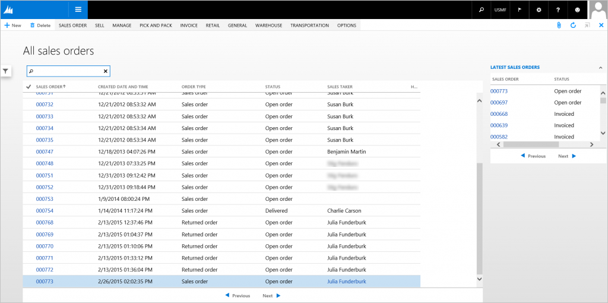
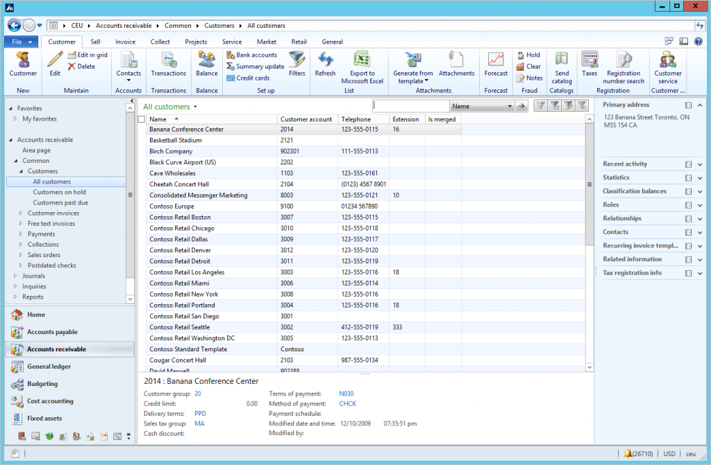

# List Page form pattern

[!include [banner](../includes/banner.md)]

This article provides information about the List Page form pattern. A list page presents a set of data on a UI that is optimized for browsing records, so that you can find and work with a specific record. 

## Usage

A list page presents a set of data on a user interface that is optimized so that you can browse records, find the right record, and then take an action upon that record. The list page lets the user search, filter, and sort the data. FactBoxes on the right side of the grid show related data for the active record. Actions that are relevant to the record are located on the ActionPane at the top of the page. The use of this pattern is now discouraged when there is a 1:1 correspondence between the List Page and Details page. Current guidance is to use this pattern only in other situations, such as when list pages have no backing details pages or have multiple backing details page (for example, when project quotations and sales quotations are shown together in the same List Page).

## Wireframe

## Pattern changes
Here are the main changes to this pattern since Microsoft Dynamics AX 2012:

-   FormTemplate/InteractionClass is now optional when you build new pages.
-   List Page and Details Master/Details Transaction are merged into a single form when there is a 1:1 correspondence between the List Page and Details Page.
    -   Improves performance when the user moves between the list and details.
    -   Allows for bulk editing in the initial list.
-   The **Preview** pane has been eliminated.

## Model
### High-level structure

- Design

    - ActionPane (ActionPane)
    - Custom Filter (Group)

        - Quick Filter (Quick Filter)
        - *OtherFilters ($Field) \[0..N\]*

    - Grid (Grid)

### Core components

1.  Apply the ListPage pattern on **Form.Design**.
2.  Address BP Warnings:
    1.  **Design.Caption** isn't empty.
    2.  The form must be referenced by at least one menu item.
    3.  **TabPage.Caption** isn't empty.
    4.  **TabPage.DataSource** isn't empty.
    5.  The primary data source has **AllowEdit**=**No**, **AllowCreate**=**No**, and **AllowDelete**=**Yes**.
    6.  **Grid.DefaultAction** references the button that opens the child form.
    7.  **Grid.DefaultLabelAction** references a label to show in the grid context menu.

### Related patterns

-   [Details Master](details-master-form-pattern.md)
-   [Details Transaction](details-transaction-form-pattern.md)
-   [Simple List](simple-list-form-pattern.md)

### Commonly used subpatterns

-   [Custom Filter Group](custom-filter-group-subpattern.md)

## UX guidelines
The verification checklist shows the steps for manually verifying that the form complies with UX guidelines. This checklist doesn't include any guidelines that will be enforced automatically through the development environment. Open the form in the browser, and walk through these steps. **Standard form guidelines:**

-   Standard form guidelines have been consolidated into the [General Form Guidelines](general-form-guidelines.md) document.

**List Page guidelines:**

-   Have fewer than 15 fields in the grid.
-   The first textual/data column should be displayed as a link that goes to the appropriate details form. To do this, make sure that the grid has a default action to enable the hyperlink for the first column.
-   A Quick Filter should appear above the list. By default, the QuickFilter should use the most likely field for a filter scenario.
-   There should not be any duplicate **New** and **Delete** buttons.
-   A link to the List page should be provided in the Main Menu.
-   Focus should be in the Quick Filter when the list page is opened.
-   **Page title area**:
    -   The page title should be in a plural form.
    -   For primary list pages, the title should be the name of the entity.
    -   For secondary list pages, the title should reflect an activity or status.
-   **Grid**:
    -   For transactional entities, the **ID** field should be the first column, followed by the master entity **ID** and **Name** fields.
    -   For master entities, the **Name** field should be the first column, followed by the **ID** field.
-   **ActionPane** guidelines have been consolidated into the Dynamics AX [General Form Guidelines ](general-form-guidelines.md) document in the ActionPane guidelines section.
-   **FactBox** guidelines have been consolidated into the [FactBox Form Patterns](factbox-form-patterns.md) document.

## Examples
Form: **SalesTableListPage** 

## Appendix
### Frequently asked questions

This section will have answers to frequently asked questions that are related to this guideline/pattern.

-   **What do I do with the Preview pane when I migrate the form?**

    You can do one of the following:

    -   Remove the **Preview** pane altogether if it no longer makes sense.
    -   Remove the large header, and leave the **Preview** pane as is.
    -   Split the **Preview** pane into multiple logical FactBoxes if the current one is too tall.
        -   For a transaction preview, the lines would go into their own FactBox and should be limited to five lines.
        -   For a transaction preview, rework the lines into a FactBox card pattern, where the lines are summarized into a count and a lines grid is shown in an enhanced preview when the user hovers over the count value.

### Open issues

-   **How to handle secondary list pages**
    -   Stay in navigation (no app changes needed).
    -   Create role-tailored views (after future framework support is added).

### AX 2012 content

#### AX 2012 links

-   [MSDN AX 2012 List Page User Experience Guidelines](/dynamicsax-2012/developer/list-page-user-experience-guidelines)
-   [MSDN AX 2012 List Page Forms](/dynamicsax-2012/developer/list-page-forms)

#### AX 2012 example

[!INCLUDE[footer-include](../../../includes/footer-banner.md)]
