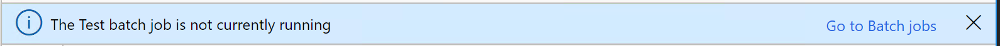
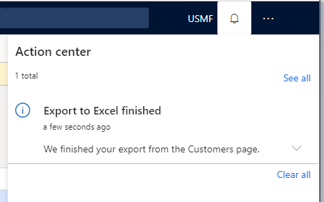

# Messaging APIs - Action center, message bar, and message details

[!include [banner](../includes/banner.md)]

This article describes the messaging system in finance and operations apps, specifically in terms of the application programming interfaces (APIs) that are used to create and route messages to end users.  

## Introduction

A new messaging system was created for finance and operations apps to improve this experience. Compared to earlier versions, the messaging system for finance and operations apps includes the following features:

+ Improved association of a message with its context (form versus global).
+ Improved level of interruption (none, subtle, and interrupting).
+ Improved clarity between types of messages and their use.
+ The control that is used to display messages is deterministic and based on form context.

## Backwards compatibility of info(), warning()/checkfailed(), and error() 
The **info()**, **warning()**, and **error()** application programming interfaces (APIs) from earlier versions of finance and operations apps are still supported; however, these APIs now sit upon the framework's new messaging system. Messages are routed deterministically to the message or Action center (in a non-interrupting manner) by using the context of the API call to determine the best way to present the message to the user. In general, if the use of the API originated from a form, the message appears in a message bar on that same form. (Drop dialogs and slider dialogs are both considered forms.) 

The following illustration shows **info**, **warning**/**checkfailed**, and **error** message bars that correspond to page actions, or synchronous-authored messages that come from **info()**, **warning()**, and **error()**. 

[](./media/cli-legacyMessages.png)

> [!NOTE]
> If these APIs are called from a slider dialog, but that slider dialog is closed before the message appears, the message is shown in a message bar on the slider dialog's parent page. If that slider dialog is closed before the message appears, and there is no parent page, the message is routed to the Action center. The messaging API never fails to show a message. If an appropriate host page isn't found, the message is sent to the Action center.

If **info()**, **warning()**/**checkfailed()**, or **error()** is called from an asynchronous process (for example, a batch), there is no form context to consider, and the messages are sent to the Action center. (To open the Action center, click the **Show messages** button on the navigation bar.) The following illustration shows examples of each type of message in the Action center. 

[](./media/2_api.png)

> [!NOTE]
> Use the **Box()** API to express an interrupting error to the user.                                                               

## Backwards compatibility of SetPrefix() 
Finance and operations apps also support the **SetPrefix()** API for backwards compatibility. However, in the messaging system, the results of **SetPrefix()** don't actively interrupt the user; instead, the results are collected and stored (as in previous versions), and a message bar or Action center notification is presented to the user. This notification indicates that the related task has been completed, and that it might have messages that the user should review. The "Notification of results" message actually uses the task's first call to **SetPrefix()** to frame the message. This behavior is similar to the behavior in previous versions, where the first call was the "title" of the results. In this example, "Posting Results" comes from the application's first call to **SetPrefix()**.

[](./media/3_api.png) 

The user can then click **Message details** to open the new **Message details** pane. 

[](./media/4_api.png)

## Message() 
The **Message** API provides some useful messaging capabilities. The **Message()** API gives you more control over the lifecycle of a message by allowing you to explicitly add and remove messages. This API can be useful when validation messages need to be removed at times other than when a save boundary has been crossed, or for displaying informational messages about aspects of the user's experience that aren't necessarily related to data validation. In this example, the message is shown when the current record is displayed.


```xpp
messageId = Message::Add(MessageSeverity::Informational, "The customer is marked as inactive");
```

The message can then be cleared when a new record is shown on the page.

```xpp
Message::Remove(messageId);
```

Starting in version 10.0.10 / Platform update 34, you can use the **Message::AddAction()** method to embed an action within a message. This method supports adding a single action that is associated with a display or action menu item, which is then visualized as a link button. The actions are only supported in messages that are routed to the message bar until version 10.0.16 / Platform update 40, at which time these actions can be seen in messages that are routed to the Action center or the Message details pane.

In this example, a message is triggered for a system administrator indicating a particular required batch job is not running and exposes an action to go directly to the **Batch jobs** page.  



```xpp
MenuItemMessageAction actionData = new MenuItemMessageAction();
actionData.MenuItemName("BatchJob");
str jsonData = FormJsonSerializer::serializeClass(actionData);

int64 messageId = Message::AddAction(MessageSeverity::Informational, "The Test batch job is not currently running", "Go to Batch jobs", MessageActionType::DisplayMenuItem, jsonData);

```

The following messaging types are supported: **MessageSeverity::Info**, **MessageSeverity::Warning**, and **MessageSeverity::Error**. Messages that use the **Message()** API are also deterministic. They can be routed to a message bar or the Action center.

## SystemNotificationsManager() 
The **SystemNotificationsManager()** class allows you to send notifications to the Action center. This class provides the following features: 

+ Associating one or more actions to the notification. 
+ Routing a notification to a set of users, or to all the users in one or more security roles.
+ Defining an expiration date for the notification.
+ Tracking the state of the notification (such as, you can mark a notification as "Completed").  
+ Defining what rule or process is raising the notification by RuleID.  

In this example, a notification is raised after an export to Excel is completed by a user. The message will be available in the Action center for the next 48 hours, after which the link to the exported file is no longer available.   

> [!NOTE]
> The **AddNotification()** API was previously used in this example. As of version 10.0.23, that API is deprecated and is replaced by the **AddSystemNotification()** API. The new API rquires that you set RuleID and ExpirationDateTime. 



```xpp
// Set up the notification 
SystemNotificationDataContract notification = new SystemNotificationDataContract();
notification.Users().value(1, curUserId());
notification.Title("Export to Excel finished");
notification.RuleId('ExcelStaticExport');
notification.Message("We finished your export from the Customers page");
notification.ExpirationDateTime(DateTimeUtil::addHours(DateTimeUtil::utcNow(), 48));

// Set up the action associated with the notification
SystemNotificationActionDataContract action = new SystemNotificationActionDataContract();
action.Message("Click to download");
action.Type(SystemNotificationActionType::AxActionMenuFunction);

SystemNotificationMenuFunctionDataContract actionData = new SystemNotificationMenuFunctionDataContract();
actionData.MenuItemName(menuItemActionStr(ExportToExcelStaticOpenFileAction));
actionData.Data(fileName);
action.Data(FormJsonSerializer::serializeClass(actionData));
notification.Actions().value(1, action);

SystemNotificationsManager::AddSystemNotification(notification);
```

## Additional resources

[User interface development home page](user-interface-development-home-page.md)


[!INCLUDE[footer-include](../../../includes/footer-banner.md)]

