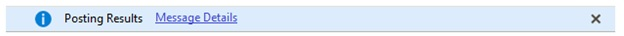

# Messaging system for finance and operations apps

[!include [banner](../includes/banner.md)]

This article describes the rich, powerful messaging system in finance and operations apps.

A new messaging system was created for finance and operations apps to improve this experience. Compared to earlier versions, the messaging system for finance and operations apps includes the following features:

+ Improved association of a message with its context (form versus global).
+ Improved level of interruption (none, subtle, and interrupting).
+ Improved clarity between types of messages and their use.
+ The control that is used to display messages is deterministic and based on form context.

## Where can messages be surfaced to users? 
Messages in finance and operations apps are generally shown in one of these places: message bars, the Action center, or message boxes.  

### Message bars – Messages for synchronous tasks on the current page
Message bars are available on primary pages, and in drop dialogs and slider dialogs. Message bars are used primarily for data validation. They can also be used to communicate messages about the state of a page or data, such as messages that are used for date effectivity. Message bars can express **info**, **warning**, and **error** statuses. Message bars should not be used for messages that require the user's immediate attention. A message bar appears when a message is first received and must be used to communicate messages only about the current page. Messages that are sent to message bars are associated with the current page. Therefore, when the user navigates away from a page that includes message bars, those messages won't appear on the new page. However, if the user navigates back to the original page, the page's messages will once again appear. Include the following information in messages:

-   The condition that generated the message.
-   The result if the user continues without resolving the condition that generated the message.

### Examples

```Console
This customer is marked as inactive.
```

```Console
Customer validation has failed.
```

```Console
The transaction on voucher do not balance.
```

### Presentation


### Action center – Messages from asynchronous tasks
The Action center is located in the navigation bar. It contains messages that don't require any immediate action by the user and aren't required for the current task to continue. Typical examples include feedback from background processes such as a batch job or report completion. The Action center can express **info**, **warning**, and **error** statuses. Before it's opened, the Action center indicates the number of messages that have been received since last time that it was opened.

The Action center can hold up to 500 messages. Messages are then cycled on a first in, first out basis.

### Message boxes – Errors and immediate notifications (completed synchronous operations)
Use message boxes to alert users about issues that require immediate attention. Because message boxes interrupt users and prevent them from continuing until the message is read and dismissed, they should be used only for messages that users can't handle later. Include the following information in error messages that appear in message boxes:

-   The error that occurred.
-   The cause of the error.
-   Information about how to resolve the error.

An error message should include the following two components:

-   **The main instruction** – This text appears in bold.
-   **The message details** – This text appears below the main instruction.

### Examples

-   You can’t delete the reference number because the reference number is used in version %1.
-   You have insufficient rights to perform this export.
-   The root folder for catalog import processing is not configured. Configure the root folder using the Vendor catalog import parameters form.

### Presentation

 

Messages of the **error** type block the user’s interaction by overlaying the current page with a modal “light box” that contains the message.

## Should I show the user a notification, a warning, or an error?
In earlier versions of finance and operations apps, the **info**, **warning** (**checkFailed**), and **error** statuses weren't always used consistently across scenarios. A message might be reported as a warning in one scenario but as an error in another scenario. When you're deciding which status to express, use these definitions:

-   **Notification** – A notification informs the user about events that might or might not be related to the current user activity. A notification can be caused by a user action or a system event, or it can provide information from the program that might be useful. Typically, a notification doesn't require immediate user action. You notify the user by using the **info()** application programming interface (API).
-   **Warning** – A warning alerts the user about a condition that might cause an issue in the future. Specifically, a warning is used for data that is in an incorrect state. Although any attempt to use this invalid data might produce an error, the fact that the current state of the data is incorrect isn't an error condition, and *the user should only be warned about the incorrect state of the data*. You express data validation issues by using the **warning()** or **checkFailed()** API.

    > [!NOTE]
    > Because of the way that the system handles the cleanup of validation messages, when the **warning()** or **checkFailed()** API is used, the return value of **validate()** should *always* be set to **false**. Otherwise, warning messages might not be shown to the user.

-   **Error** – An error alerts the user about a problem that has already occurred. A user action that has failed is an error condition. Errors can be *non-interrupting* (*passive*) or *interrupting*. In a non-interrupting error, users can perform other activities before they try to correct the issue. In an interrupting error, users can't proceed or complete the task until they correct the error condition. You express a passive (non-interrupting) error by using the **error()** API. You express an interrupting error by using the **box::** API.

## Should this message interrupt the user?
If a task (batch job or other operation) fails, it's often appropriate to notify the user passively. Because the user can correct the issue and retry the operation at any time, the user doesn't have to be notified immediately. In these cases, the **error()** API is appropriate, and the user doesn't receive an interrupting dialog. However, in other cases, the user can't proceed until the issue is corrected. For example, if the user tries to save a page that still has invalid data, the client interrupts the user by presenting an error dialog. In these cases where it's more appropriate to interrupt the user by presenting a dialog, the **box::** API should be used. 


## Will my message end up in a message bar or in the Action center? 
The messaging system is *deterministic*. In other words, the messaging system uses the context of the call to determine the best way to show the message to the user. Messages are shown either in a message bar that appears at the top of pages or in the Action center, which appears in the navigation bar. The location of the message depends on where in code the message is sent from.

In general:
-   If the message is caused by a page action that is synchronous (that is, the user must wait for the result), the result is shown in a message bar on the current page. (The exception is a slider dialog that was closed immediately after the action was started. Messages for slider dialogs "bubble up" to the parent page.)
-   If the message is caused by an action (for example, a batch job) that is asynchronous (disconnected) and the user can continue to perform other tasks or even navigate to another page while that action is being processed, the message is routed to the Action center.

### Messaging from asynchronous or long-running background tasks 
A (potentially) long-running task should not present a message bar to the user, because message bars at the top of a page are used to present information about the current page, not some background task that might have started hours earlier. In some cases, a user who has many background tasks running continues to navigate between pages while the tasks are being completed. Therefore, messages that are presented on the current page to notify the user about background tasks are easily overlooked or ignored. Therefore, by design, background tasks send their messages to the Action center. When a new message appears in the Action center, a notification informs the user, who might be waiting for the results of an asynchronous task.

### Messaging from dialogs and slider dialogs
The deterministic messaging system tries to send messages to the current page. However, not every call from a dialog or slider dialog is routed to that dialog or slider. In some cases, the messaging system sends the message to the parent page instead. This behavior can occur when the messaging system is called while the dialog or slider is being closed. In some cases, the messaging system can be called when the close process for the dialog or slider is started, but the client interrupts the close process for valid reasons. Therefore, there is a "point of no return," after which the messaging system no longer tries to send a message to the dialog or slider, and instead sends the message to the parent page. When the user clicks the **OK** button on the form is entering its closing sequence, shown in the code example that follows.

```xpp
closeOK()
{
    // current form
    super(); // calls close()
    // parent or message center
}
Close()
{
    // current form
    super();// point of no return
    // parent or message center
}
```

If the client calls **closeOK()** or **close()** directly, then the final result might be the page or the parent page.

## When are validation messages cleaned up? 
With the messaging system in use for finance and operations apps, the validation message (called using the same APIs) appears in a message bar on the page itself in a passive manner. The invalid value remains but is flagged as invalid. The user can continue to enter data and can correct the validation issue at any point before the data is saved.

When a validation issue has been corrected so that the corresponding message in the message bar is no longer valid, the messaging system removes the message. The timing of message removal depends on the level where the validation logic is defined.

-   If the validation logic is defined at the control or field level, the message is removed when a valid value is entered in the control or field.
-   If the validation logic is defined at the table level, the message is removed the next time that the user crosses a save boundary.

If the developer needs more control over when a message needs to be removed from the UI, the **Message()** API can be utilized. See the [Messaging APIs](messaging-api-center-bar-details.md) article for more details.  

## I'm migrating from an older version. How do I change my existing code to use the new messaging system?
*In many cases, no changes are required.* The messaging framework was designed to innovate and maintain backward compatibility for many common scenarios. In some cases, the program might improve the wording of messages. Alternatively, the program might use **error()** instead of **warning()**, or **warning()** instead of **error()**, to better align with the usage guidance (warnings are for data that isn't valid, whereas errors are for failed actions). In other cases, you might decide that messages that appear on a slider dialog are more appropriate for the parent page.

## How to create a collection of related messages?  
You use **SetPrefix()** to create collections of related messages [See the [Messaging APIs](messaging-api-center-bar-details.md) for more details on **SetPrefix()**. This API is largely backward compatible but is presented in a non-interrupting manner. A results window isn't opened directly; instead, the user is passively notified by either an Action center message or a message bar on the page that started the task that used the **SetPrefix()** API to group the result messages into a collection. The message severity shown to the user reflects the severity of the most critical message in the collection. For example, if the collection contains no errors or warnings, the message bar is of the **info** type. 

 

If the collection contains one or more calls to **warning()**, the message bar is of the **warning** type. 

 

If the collection contains one or more calls to **error()**, the message bar is of the **error** type. 

 

The use of **SetPrefix()** is also deterministic. In other words, if you use **SetPrefix()**, and there is no page context (for example, an asynchronous batch operation), the notification of results is sent to the Action center, which isn't associated with any page.


[!INCLUDE[footer-include](../../../includes/footer-banner.md)]
