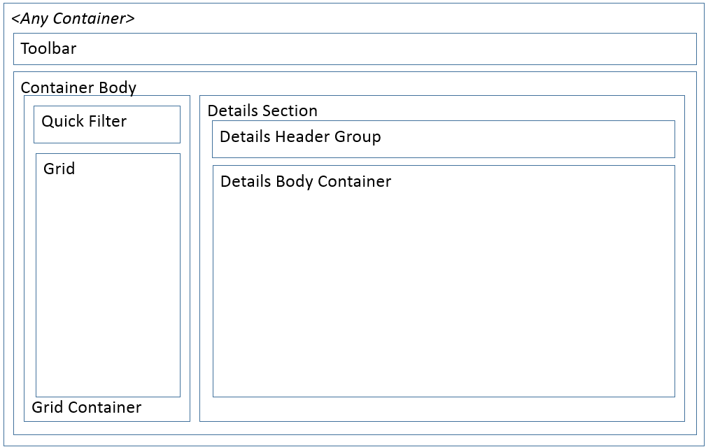
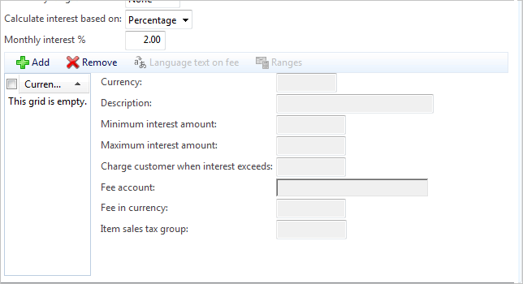

# Nested Simple List and Details subpattern

[!include [banner](../includes/banner.md)]

This article provides information about the Nested Simple List and Details (NSL+D) subpattern. This subpattern is used to display information about a secondary or child entity when that child entity is presented within another form type.

## Usage

This article describes a variant of the Simple List and Details (SL+D) pattern that is named the Nested Simple List and Details (NSL+D) subpattern. Whereas the SL&D form pattern is used to display information about the primary entity on the form, the NSL+D subpattern is used to display information about a secondary or child entity when that child entity is presented within another form type. The amount of information that is related to the child entity should be too much for a grid (10 or more fields) but not enough for the child entity to deserve its own form. The NSL+D subpattern has a few differences from the SL+D form pattern:

-   You may not nest an NSL+D subpattern within another NSL+D subpattern.
-   The NSL+D subpattern uses a Toolbar for contextual actions.
-   The details portion of the NSL+D subpattern is simpler than the SL+D pattern. The NSL+D subpattern uses only groups, whereas the SL+D pattern organizes content into FastTabs.

## Wireframe

## Pattern changes
Here are the main changes to this pattern since Microsoft Dynamics AX 2012:

-   This pattern is new. Any pattern changes to the SL+D pattern can be found in the [Simple List and Details](simple-list-details-form-pattern.md) pattern document.

## Model
### High-level structure

- &lt;Container&gt;

    - ActionPane (ActionPane Style=Strip)
    - ContainerBody (Group Columns=2)

        - ListContainer (Group)

            - Grid | Tree | ListView

        - DetailsContainer (Group)

            - DetailsHeader (Group)
            - *DetailsGroup (Group) \[Optional\]*

### Core components

1.  Apply the NestedSimpleListDetails subpattern to the container control.
2.  Resolve the required BP checks:
    1.  Set **Grid.Datasource=&lt;secondary data source&gt;**.
    2.  Set grid data source **InsertIfEmpty**=**No**.
    3.  Set **ActionPane.DataSource**=**&lt;same data source as grid&gt;**.
    4.  Set Toolbar Command Add properties.
    5.  Set Toolbar Command Remove properties.
    6.  If the grid data source is read-only, make sure that there are no **Add**/**Remove** buttons on the Toolbar.

## UX guidelines
The verification checklist shows the steps for manually verifying that the form complies with the UX guidelines. This checklist doesn't include any guidelines that will be enforced automatically through the development environment. Open the form in a browser, and walk through these steps.

**Standard form guidelines**

-   Standard form guidelines have been consolidated into the [General Form Guidelines](general-form-guidelines.md) document.

**Nested simple list & detail guidelines**

-   There should not be duplicate **New** or **Delete** buttons.
-   If a **grid** is used for the list portion of the pattern:
    -   The grid should be a **list-style** grid.
    -   List-style grids should display no more than three rows (lines) for each record in the List style grid. Typically, just the ID and Description are sufficient.
    -   When there is no data, the grid control should not automatically add a new record.
-   A **details** section that is displayed on the right of the Container Body:
    -   Display the grid columns as the first fields in the Details Header Group, in the same order that they are displayed in the grid.
    -   When a record is added, focus should go to the first field in the details section.

## Examples
Form: **HcmJob** (**TaskTabPage**) 

## Resources
### Typically used by patterns

-   [Simple List and Details](simple-list-details-form-pattern.md)
-   [Table of Contents](table-of-contents-form-pattern.md)
-   [Details Master](details-master-form-pattern.md)
-   [Details Transaction](details-transaction-form-pattern.md)

## Appendix
### Frequently asked questions

This section will have answers to frequently asked questions that are related to this guideline/pattern.

### Open issues

-   **The details area of the nested pattern should not have FastTabs. The framework should verify/enforce this.**
    -   Currently we aren't allowing tabs of any kind inside this pattern.

### AX 2012 content

[!INCLUDE[footer-include](../../../includes/footer-banner.md)]
