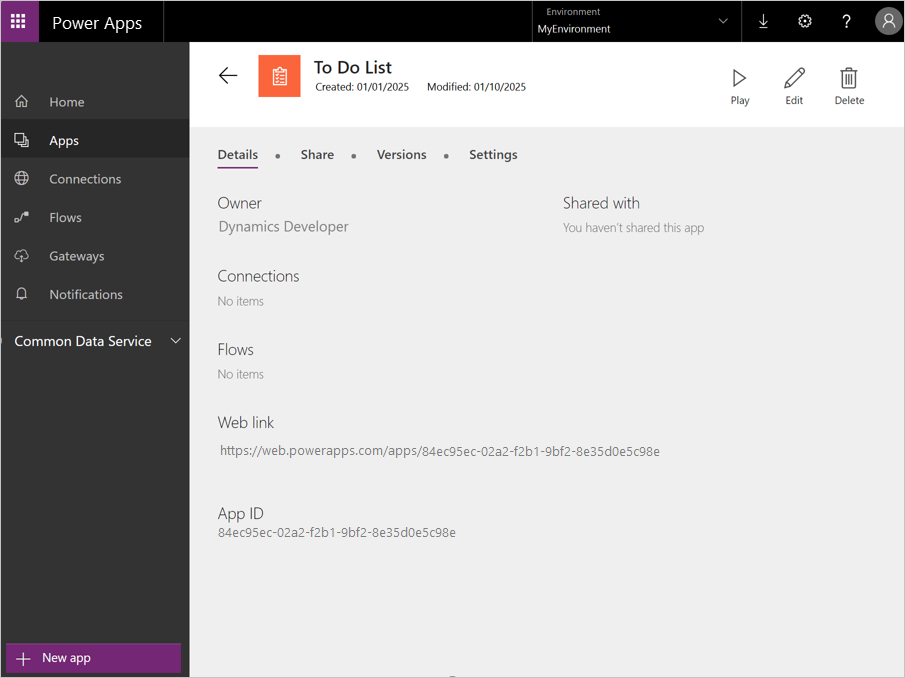

# Power Apps Host control

[!include [banner](../includes/banner.md)]

In Microsoft Power Apps, you can manage organizational data through apps that you created, or apps that someone else created and shared with you. Apps run on [mobile devices such as phones](https://powerapps.microsoft.com/tutorials/run-app-client/) or [in a browser](https://powerapps.microsoft.com/tutorials/run-app-browser/). Apps can also be embedded in finance and operations apps by developers using the Microsoft Visual Studio developer experience. To learn more about Power Apps, see [https://powerapps.microsoft.com](https://powerapps.microsoft.com/).

## Host an app from Power Apps on a page

1.  In Power Apps, find the web-based app that you want to host, and record or copy the **App ID** value.
  
    
  
2.  In Visual Studio, open your project, and then, in the form designer, add an instance of a Power Apps Host control to your page.
3.  In the **Properties** pane, enter the **App ID** value.
4.  If your app shares or is linked to the current data source on your page, you can pass the ID of the primary or linked key field for the data that you want your app to show. In this case, provide the ID as the value of the **Entity ID**, **Entity ID Data Source/Field**, or **DataMethod** property. This value will then be passed to your app as a parmeter value, and your app must use that value to obtain the linked data. 
    
    
    
5.  In some cases, your app might be hosted in a development or sandbox Power Apps environment that is provided by Microsoft. In this case, you must supply that override URL as the value of the **Power Apps Environment Override** property.

Sizing is determined by the container that you put your control in. If you put your control in a form pattern that has limited available space, and your app has been designed to be larger than the available space, your embedded app will have scroll bars.

[!INCLUDE[footer-include](../../../includes/footer-banner.md)]
